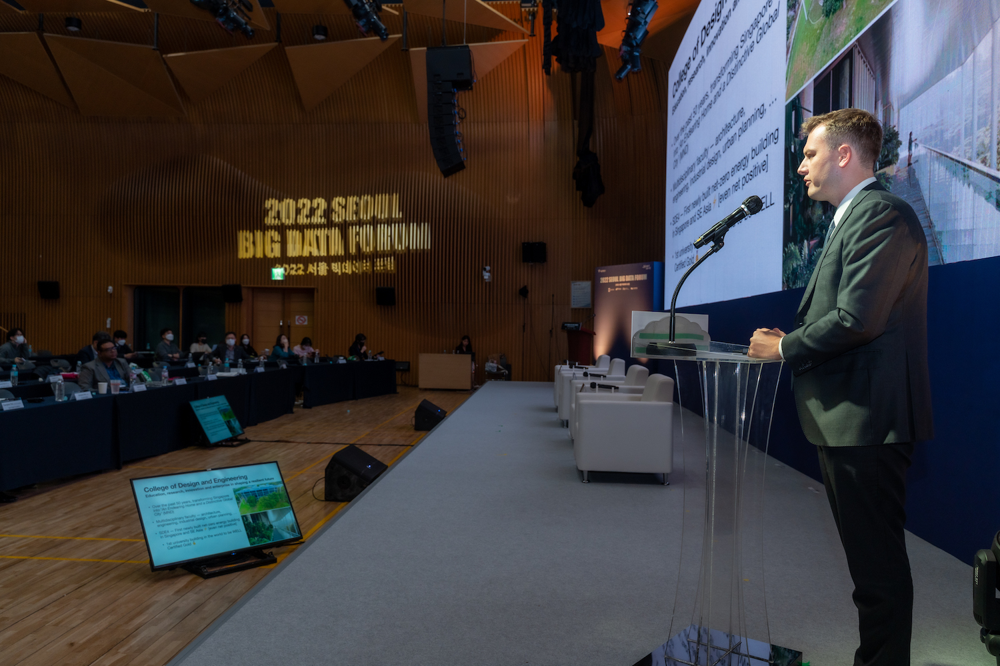
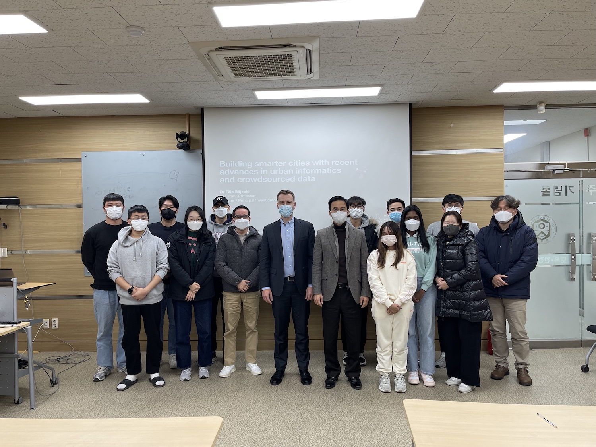
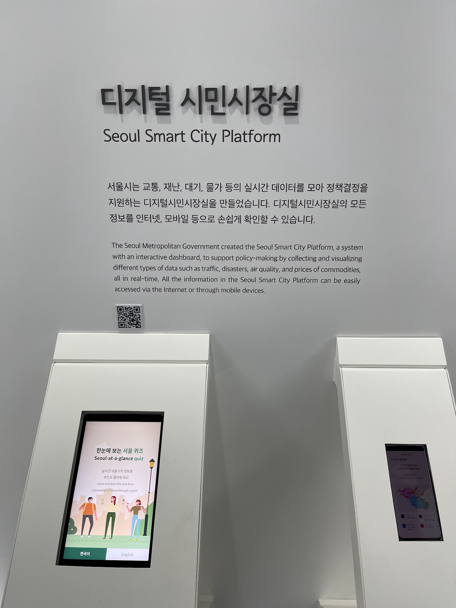

The PI of the Lab, , represented the research group during a recent visit to Korea and participated in the following activities:

+ Keynote at the [Seoul Big Data Forum 2022](https://seoulbigdataforum.kr/)
+ Lecture at the Seoul Metropolitan Government / Spatial Information Policy Division
+ Lecture at the Chung-Ang University / [Department of Urban Planning and Real Estate](http://planning.cau.ac.kr/eng/)
+ Lecture at the Yonsei University / [Department of Civil and Environmental Engineering](https://civil.yonsei.ac.kr/civil_en/index.do) & [Spatial Computing for Sustainable Infrastructure Lab](http://scsi.yonsei.ac.kr/)
+ Lecture at the Seoul National University / [Graduate School of Environmental Studies](https://gses.snu.ac.kr/en) & [City Energy Lab](http://cityenergylab.cafe24.com/)
+ Visit to [Gaia3D](https://gaia3d.com/en/), a leading Korean company on digital twins & 3D modelling

