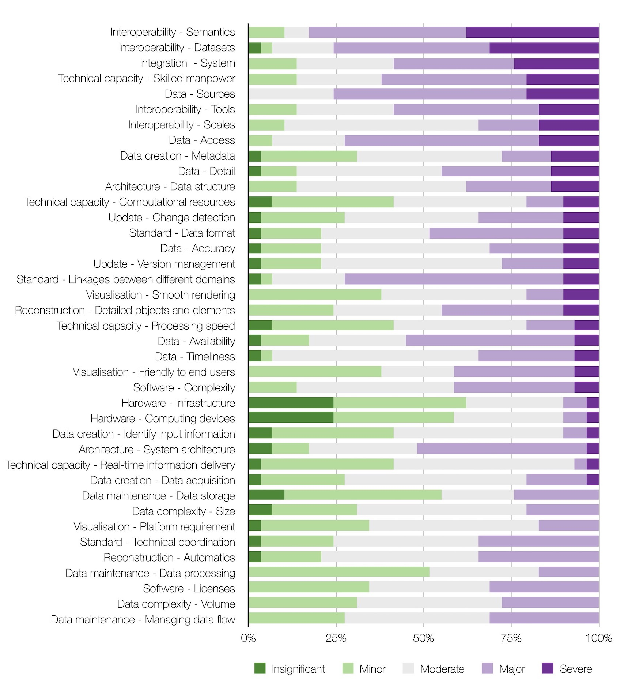
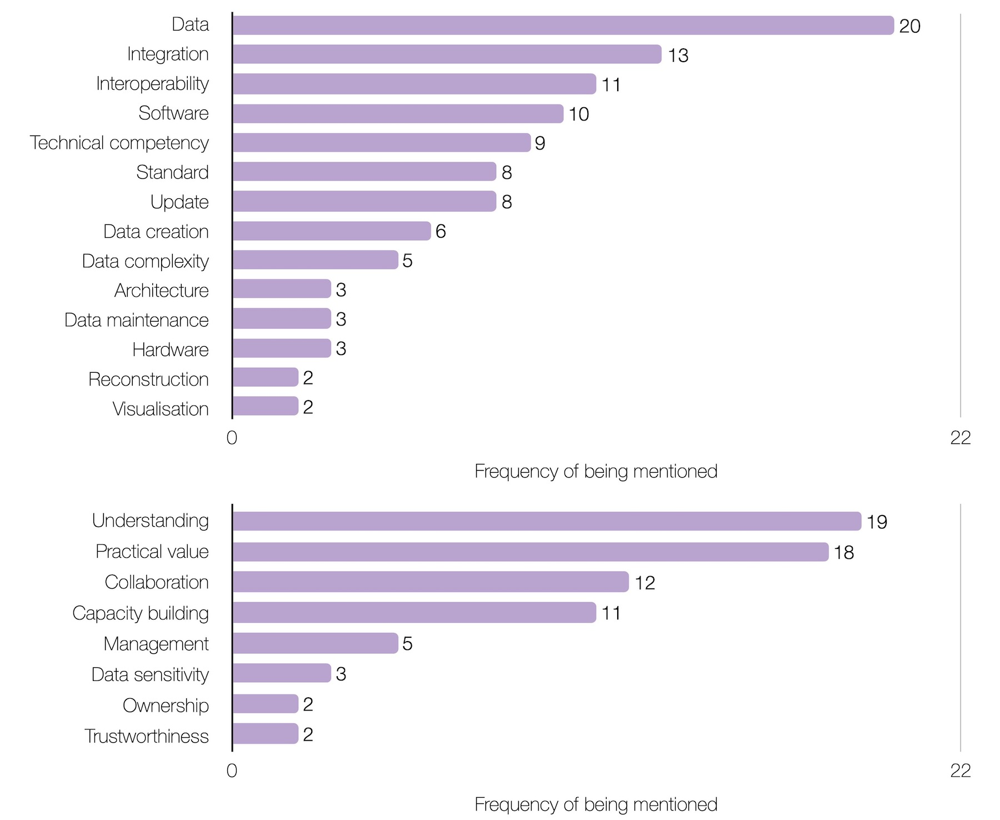
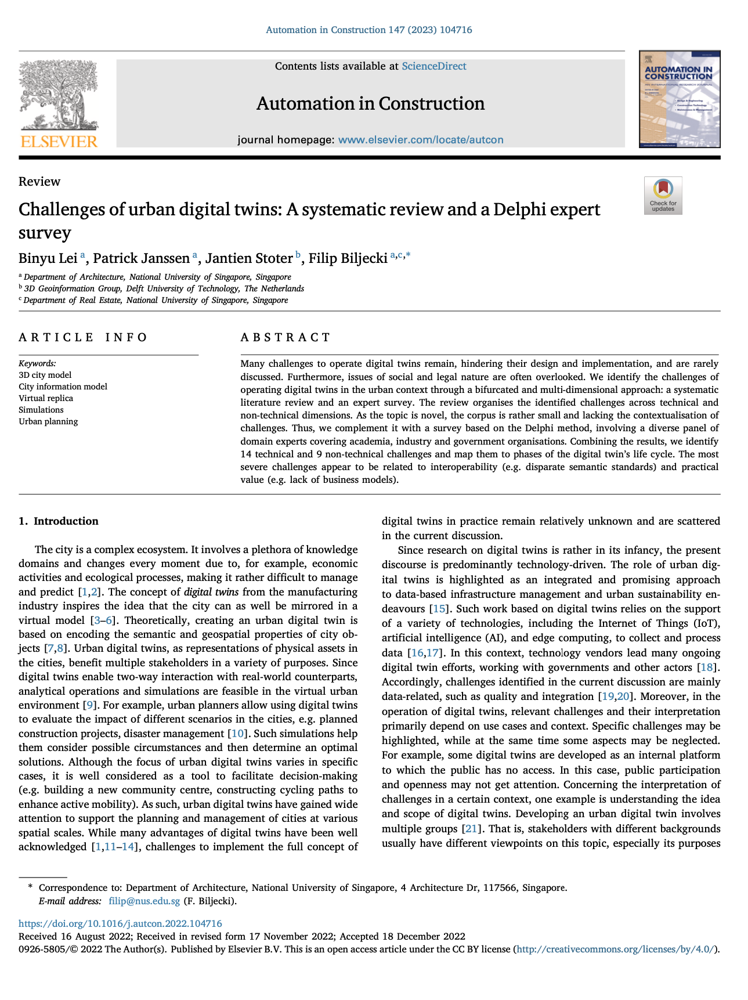

We are glad to share our new paper:

> Lei B, Janssen P, Stoter J, Biljecki F (2023): Challenges of Urban Digital Twins: A Systematic Review and a Delphi Expert Survey. _Automation in Construction_ 147: 104716. [<i class="ai ai-doi-square ai"></i> 10.1016/j.autcon.2022.104716](https://doi.org/10.1016/j.autcon.2022.104716) [<i class="far fa-file-pdf"></i> PDF](/publication/2023-autcon-dt-challenges/2023-autcon-dt-challenges.pdf)</i> <i class="ai ai-open-access-square ai"></i>

This research was led by {}.
Congratulations on her continued successes and great work! :raised_hands: :clap:

This publication is the latest one from her line of research on digital twins, following her recently published work on [assessing and benchmarking 3D city models](/publication/2022-ijgis-3-d-city-index/) (in [IJGIS](https://doi.org/10.1080/13658816.2022.2140808)).

The paper presents a comprehensive overview of challenges to the adoption of digital twins at the urban scale.
The review was achieved with a dual method: a systematic literature review (primarily covering academia) and an expert survey (mainly focused on government and industry stakeholders) conducted according to the stringent Delphi method involving dozens of experts around the world.
About two dozen challenges, both technical and non-technical, have been identified, and a consensus on their severity has been reached.

The research was conducted in collaboration with the [3D Geoinformation group at TU Delft](https://3d.bk.tudelft.nl).





### Highlights

+ Digital twins have gained growing popularity in the urban and geospatial context.
+ The adoption of digital twins is hindered by a variety of challenges.
+ Identification and elaboration of challenges with a dual and rigorous approach.
+ Structured list of 23 challenges to the operation of digital twins.
+ Consensus among academic, industry, and government parties.


### Abstract

> Many challenges to operate digital twins remain, hindering their design and implementation, and are rarely discussed. Furthermore, issues of social and legal nature are often overlooked. We identify the challenges of operating digital twins in the urban context through a bifurcated and multi-dimensional approach: a systematic literature review and an expert survey. The review organises the identified challenges across technical and non-technical dimensions. As the topic is novel, the corpus is rather small and lacking the contextualisation of challenges. Thus, we complement it with a survey based on the Delphi method, involving a diverse panel of domain experts covering academia, industry and government organisations. Combining the results, we identify 14 technical and 9 non-technical challenges and map them to phases of the digital twin’s life cycle. The most severe challenges appear to be related to interoperability (e.g. disparate semantic standards) and practical value (e.g. lack of business models).

### Paper 

For more information, please see the [paper](/publication/2023-autcon-dt-challenges/), published open access. <i class="ai ai-open-access-square ai"></i>



BibTeX citation:
```bibtex
@article{2023_autcon_dt_challenges, 
  year = {2023}, 
  title = {{Challenges of Urban Digital Twins: A Systematic Review and a Delphi Expert Survey}}, 
  author = {Lei, Binyu and Janssen, Patrick and Stoter, Jantien and Biljecki, Filip}, 
  journal = {Automation in Construction}, 
  doi = {10.1016/j.autcon.2022.104716}, 
  pages = {104716}, 
  volume = {147}
}
```
