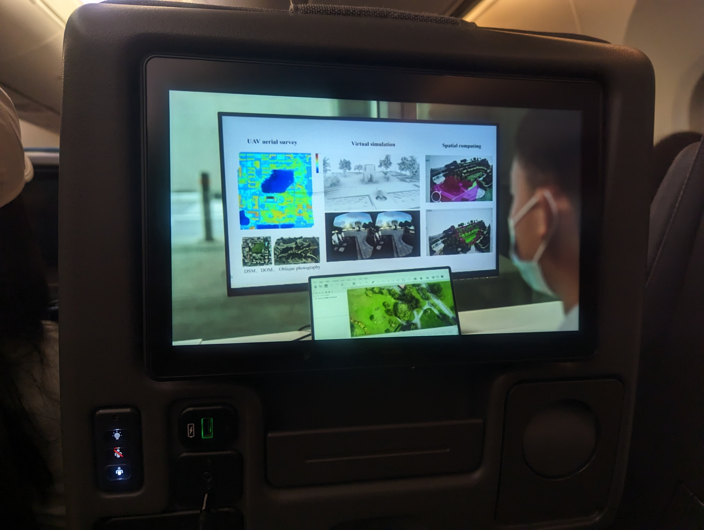
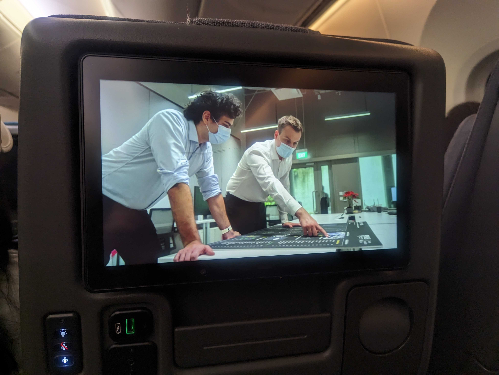
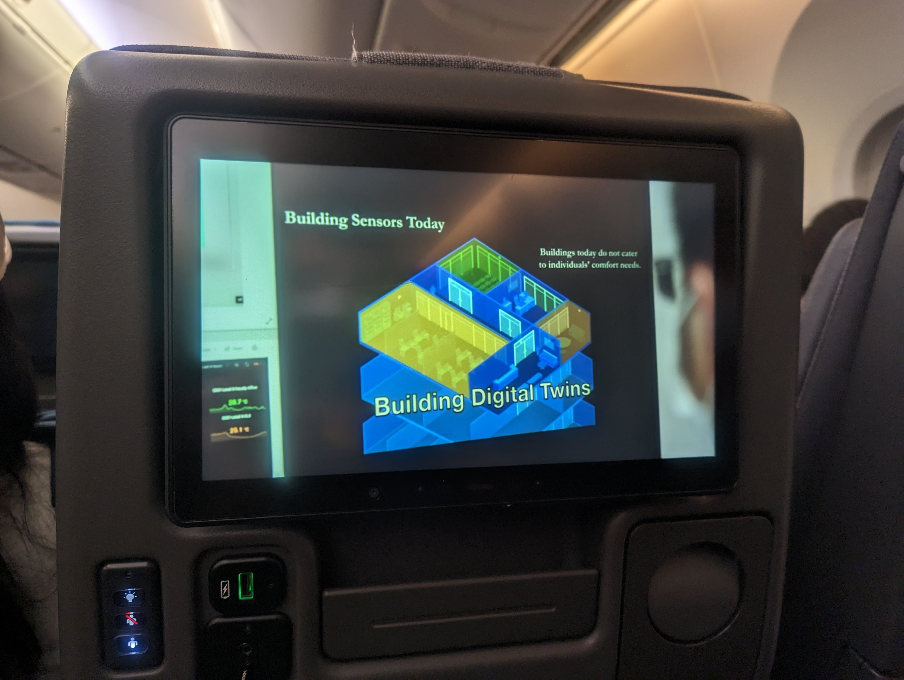

Spot us high in the sky! :airplane:

If you fly on Singapore Airlines, you may see us being featured in the CNA Documentary Series Innovating For The Future. :blush:

One of the episodes includes a variety of research done by [us and our sister labs at NUS](/about/).

The documentary, which was developed in collaboration with NUS, looks at how diverse talents in the university community – each leaders and luminaries in their own areas of expertise – are catalysing positive change in Singapore and beyond.

Catch this 10-part series – delving into topics like ageing, finance and food – to find out how NUS faculty, students and alumni are jointly creating a better world for the future.

Photo credit: 

