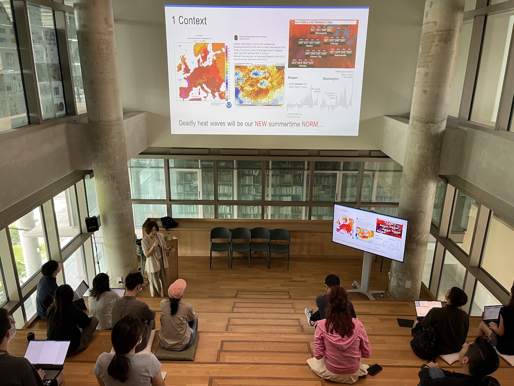
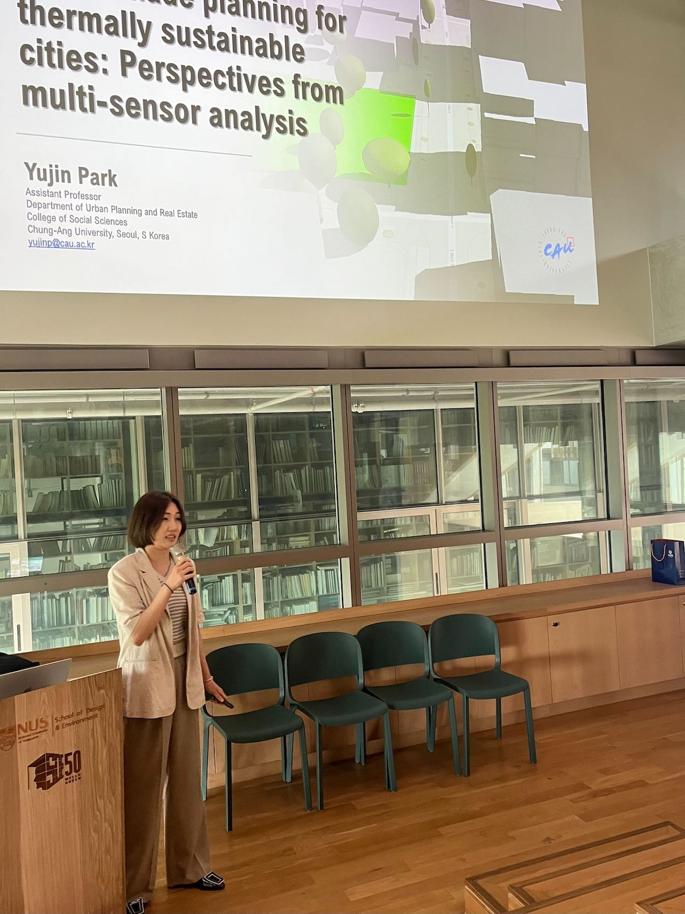

Our Lab and department hosted Dr [Park Yujin](http://planning.cau.ac.kr/01_info/sub02_view.php?gubun=1&seq=600), assistant professor at the [Department of Urban Planning and Real Estate](http://planning.cau.ac.kr), 
at the [Chung-Ang University](https://www.cau.ac.kr/) (Seoul, South Korea).

Yujin's research focuses on Environmental Planning, Green Infrastructure, 3D City Modeling & Big Data, and Urban Sustainability.
Her research was published in journals such as Computers, Environment and Urban Systems and Landscape and Urban Planning.

During her stay, she delivered the lecture _Urban shade planning for thermally sustainable cities: perspectives from multi-sensor analysis_ (poster and abstract below).

Thanks, and looking forward to future collaborations!

### Abstract of the lecture

> Devising a nature- and design-based solution to combat climate challenges is a very important issue in urban planning to step up urban sustainability. Recent technological advances and the proliferation of big geospatial data allow for a more sophisticated digital representation of urban geometry in 3D. One underexplored but critical aspect is the impact of vertical urban features and their shading. Shading objects, including trees and buildings, are generally omnipresent in cities and can be utilized by urban planners to create effective local and regional plans for urban cooling. This talk addresses the interface of 3D land-use design and heat mitigation via diurnal shading, integrating geospatial analytics (3D GIS, spatial simulation and statistics) and remotely-sensed multi-resolution thermal data as a methodological tool. Based on a fine-resolution 3D model derived mainly from LiDAR, the relationship among land surface temperature, land cover composition, and shade characteristics are analyzed using statistical inference. The talk proposes challenges and research agendas that call for collaboration across domains (e.g. GIScience, energy, economics) to create sustainable land-use designs.
