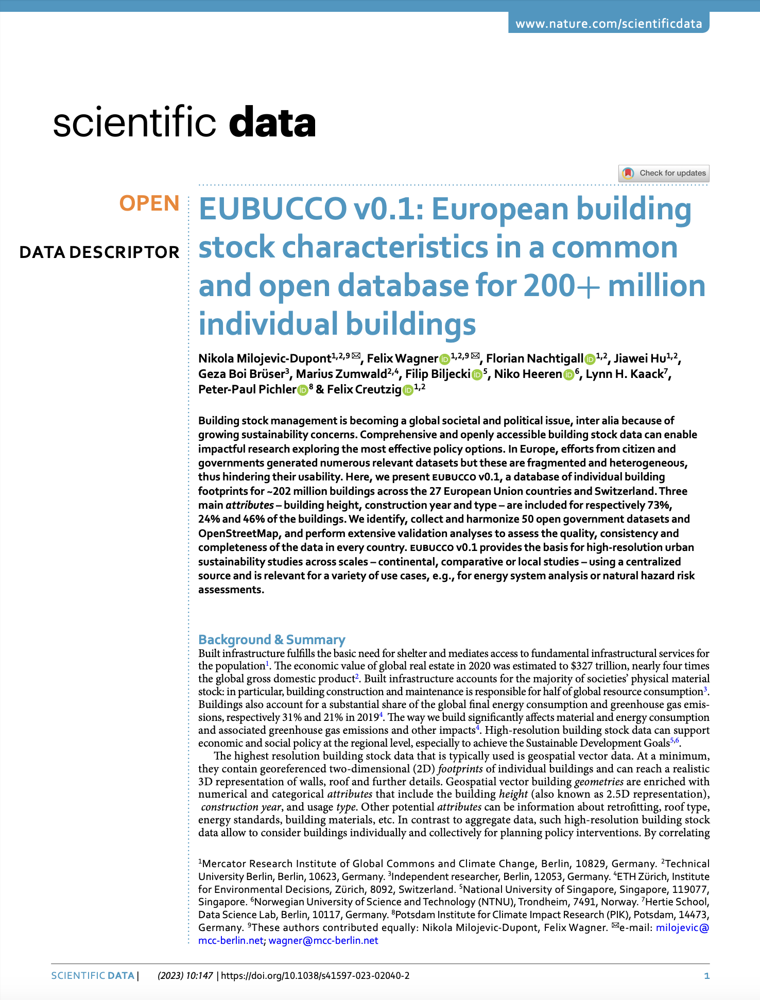

We are glad to share our new paper:

> Milojevic-Dupont N, Wagner F, Nachtigall F, Hu J, Brüser GB, Zumwald M, Biljecki F, Heeren N, Kaack LH, Pichler PP, Creutzig F (2023): EUBUCCO v0.1: European building stock characteristics in a common and open database for 200+ million individual buildings. _Scientific Data_ 10: 147. [<i class="ai ai-doi-square ai"></i> 10.1038/s41597-023-02040-2](https://doi.org/10.1038/s41597-023-02040-2) [<i class="far fa-file-pdf"></i> PDF](/publication/2023-sd-eubucco/2023-sd-eubucco.pdf)</i>  <i class="ai ai-open-access-square ai"></i>


EUBUCCO (EUropean BUilding stock Characteristics in a Common and Open database for 206 million individual buildings) is a scientific database of individual building footprints for 200+ million buildings across the 27 European Union countries and Switzerland, together with three main attributes -- building type, height and construction year -- included for respectively 45%, 74%, 24% of the buildings.
EUBUCCO is composed of 50 open government datasets and OpenStreetMap that have been collected, harmonized and partly validated.

EUBUCCO provides the basis for high-resolution urban sustainability studies across scales – continental, comparative or local studies – using a centralized source and is relevant for a variety of use cases, e.g. for energy system analysis or natural hazard risk assessments.



The project was led by [Nikola Milojevic-Dupont](https://milojevicdupontnikola.github.io) and [Felix Wagner](https://www.mcc-berlin.net/en/about/team/wagner-felix.html) from [Mercator Research Institute for Global Commons and Climate Change](https://www.mcc-berlin.net/) and the Technical University Berlin ([Chair of Sustainability Economics of Human Settlements](https://www.susturbecon.tu-berlin.de/sustainability_economics_of_human_settlements/)).
It encompassed a large team including us (the only collaborator from outside Europe).
We look forward to more collaborations with Nikola and the rest of the team in Berlin and others.



Check out the website [here](https://eubucco.com) where you can find more information about the project and links to download the data.
The data is also archived on the scientific repository [Zenodo](https://zenodo.org/record/7225259). 
All the code used to generate this data is openly available on the [Github repository of the project](https://github.com/ai4up/eubucco).




The project is funded by the Climate Change Center Berlin Brandenburg, and CircEUlar project of the European Union’s Horizon Europe research and innovation program under grant agreement 101056810.


### Abstract

The abstract follows.

> Building stock management is becoming a global societal and political issue, inter alia because of growing sustainability concerns. Comprehensive and openly accessible building stock data can enable impactful research exploring the most effective policy options. In Europe, efforts from citizen and governments generated numerous relevant datasets but these are fragmented and heterogeneous, thus hindering their usability. Here, we present eubucco v0.1, a database of individual building footprints for ~202 million buildings across the 27 European Union countries and Switzerland. Three main attributes – building height, construction year and type – are included for respectively 73%,
24% and 46% of the buildings. We identify, collect and harmonize 50 open government datasets and OpenStreetMap, and perform extensive validation analyses to assess the quality, consistency and completeness of the data in every country. eubucco v0.1 provides the basis for high-resolution urban sustainability studies across scales – continental, comparative or local studies – using a centralized source and is relevant for a variety of use cases, e.g., for energy system analysis or natural hazard risk assessments.

### Paper 

For more information, please see the [paper](/publication/2023-sd-eubucco/) (open access <i class="ai ai-open-access-square ai"></i>).

[](/publication/2023-sd-eubucco/)

BibTeX citation:
```bibtex
@article{2023_sd_eubucco,
  author = {{Milojevic-Dupont, Nikola and Wagner, Felix} and Nachtigall, Florian and Hu, Jiawei and Br{\"u}ser, Geza Boi and Zumwald, Marius and Biljecki, Filip and Heeren, Niko and Kaack, Lynn H. and Pichler, Peter-Paul and Creutzig, Felix},
  doi = {10.1038/s41597-023-02040-2},
  journal = {Scientific Data},
  number = {1},
  pages = {147},
  title = {EUBUCCO v0.1: European building stock characteristics in a common and open database for 200+ million individual buildings},
  volume = {10},
  year = {2023}
}
```
