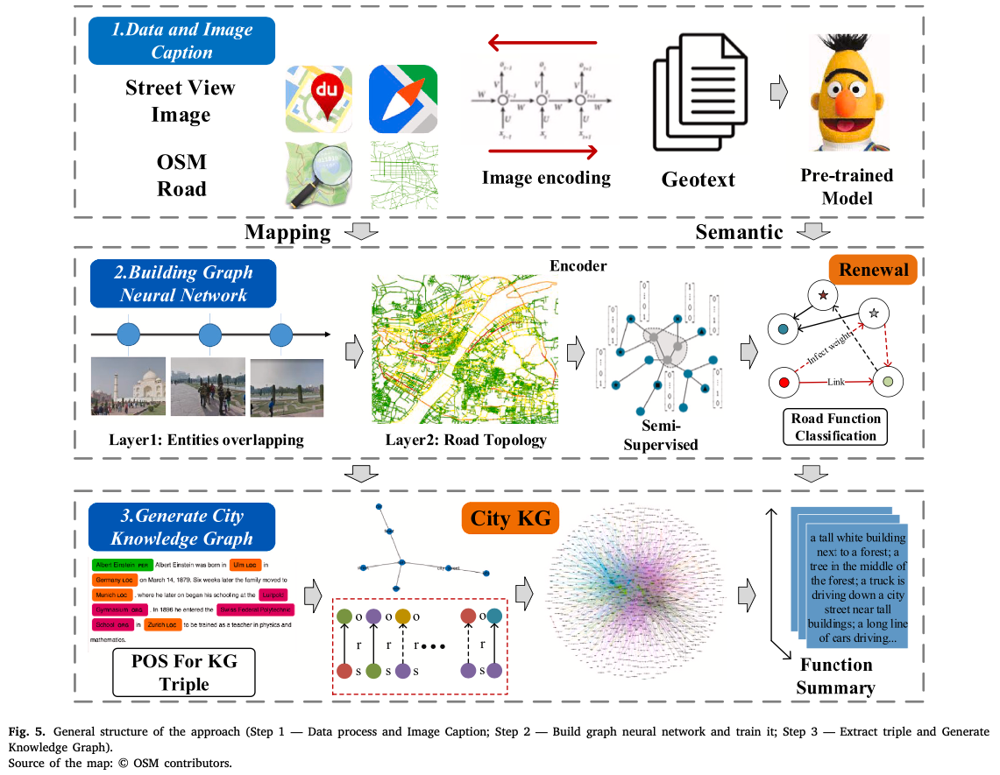
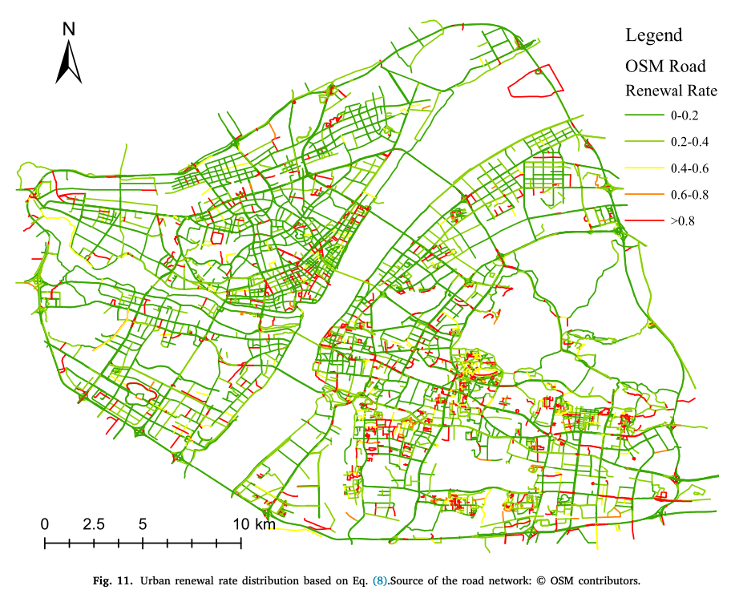
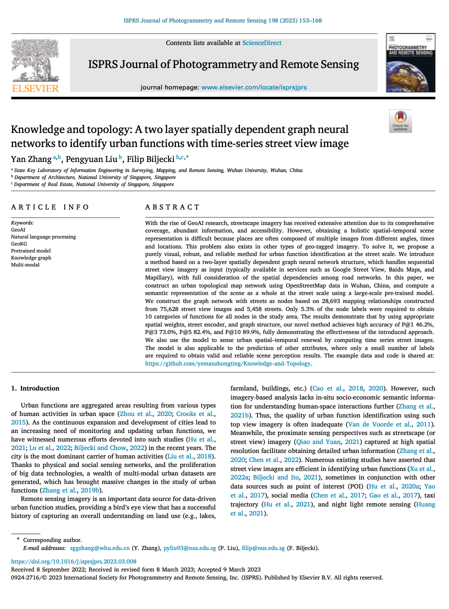

We are glad to share our new paper:

> Zhang Y, Liu P, Biljecki F (2023): Knowledge and topology: A two layer spatially dependent graph neural networks to identify urban functions with time-series street view image. _ISPRS Journal of Photogrammetry and Remote Sensing_ 198: 153-168. [<i class="ai ai-doi-square ai"></i> 10.1016/j.isprsjprs.2023.03.008](https://doi.org/10.1016/j.isprsjprs.2023.03.008) [<i class="far fa-file-pdf"></i> PDF](/publication/2023-ijprs-knowledge-topology/2023-ijprs-knowledge-topology.pdf)</i>

This research was led by {}.
Congratulations on his great work! :raised_hands: :clap:
Yan had been with us for a year as a visiting scholar from Wuhan University, and [he was awarded a prestigious scholarship]().

Urban geo-tagged proximate sensing images are generated continuously in cities.
For example, they include street view imagery and photos shared on social media.
They may be considered as twin mappings of the city’s operational state, constantly 'refreshing' for sensing urban areas.
Faced with a large volume of geo-tagged images, capturing the rich semantic information and the spatio-temporal location relationship is crucial to understanding and interpreting urban space.
In this paper, we propose a purely visual scheme for the functional perception of urban streets, which incorporates urban knowledge and road network topology and can fuse multiple source images to generate a holistic representation of a spatial unit.
We also incorporate temporal information and integrate historical street images to calculate urban spatial–temporal changes, renewal rates, and urban function transition matrix.
Using historical SVI data is a rarity in urban analytics, thus, the temporal aspect to sense urban changes and renewal is another major contribution of this work. 

The implementation has been open-sourced [on Github](https://github.com/yemanzhongting/Knowledge-and-Topology).

Until 2023-05-05, the article is available for free via [this link](https://authors.elsevier.com/a/1glkC3I9x1mz9e).





### Abstract

The abstract follows.

> With the rise of GeoAI research, streetscape imagery has received extensive attention due to its comprehensive coverage, abundant information, and accessibility. However, obtaining a holistic spatial–temporal scene representation is difficult because places are often composed of multiple images from different angles, times and locations. This problem also exists in other types of geo-tagged imagery. To solve it, we propose a purely visual, robust, and reliable method for urban function identification at the street scale. We introduce a method based on a two-layer spatially dependent graph neural network structure, which handles sequential street view imagery as input (typically available in services such as Google Street View, Baidu Maps, and Mapillary), with full consideration of the spatial dependencies among road networks. In this paper, we construct an urban topological map network using OpenStreetMap data in Wuhan, China, and compute a semantic representation of the scene as a whole at the street scale using a large-scale pre-trained model. We construct the graph network with streets as nodes based on 28,693 mapping relationships constructed from 75,628 street view images and 5,458 streets. Only 5.3% of the node labels were required to obtain 10 categories of functions for all nodes in the study area. The results demonstrate that by using appropriate spatial weights, street encoder, and graph structure, our novel method achieves high accuracy of P@1 46.2%, P@3 73.0%, P@5 82.4%, and P@10 89.9%, fully demonstrating the effectiveness of the introduced approach. We also use the model to sense urban spatial–temporal renewal by computing time series street images. The model is also applicable to the prediction of other attributes, where only a small number of labels are required to obtain valid and reliable scene perception results. The example data and code is shared at: https://github.com/yemanzhongting/Knowledge-and-Topology.

### Paper 

For more information, please see the [paper](/publication/2023-ijprs-knowledge-topology/).

[](/publication/2023-ijprs-knowledge-topology/)

BibTeX citation:
```bibtex
@article{2023_ijprs_knowledge_topology,
  title = {{Knowledge and topology: A two layer spatially dependent graph neural networks to identify urban functions with time-series street view image}},
  journal = {ISPRS Journal of Photogrammetry and Remote Sensing},
  volume = {198},
  pages = {153-168},
  year = {2023},
  doi = {10.1016/j.isprsjprs.2023.03.008},
  author = {Yan Zhang and Pengyuan Liu and Filip Biljecki},
}
```
