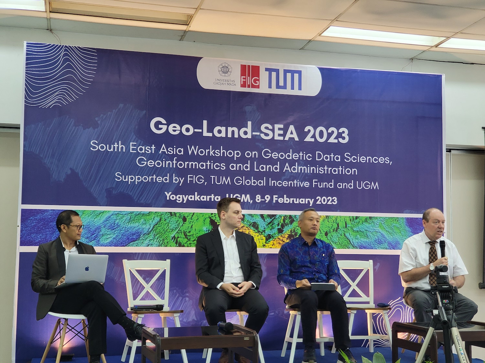
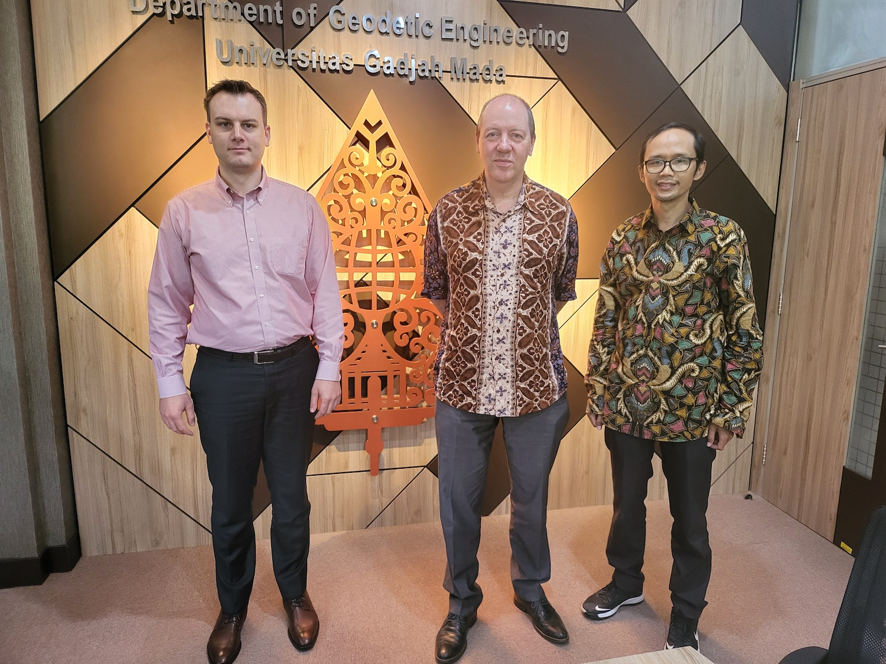
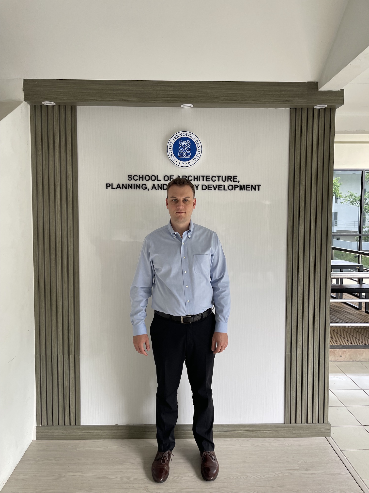
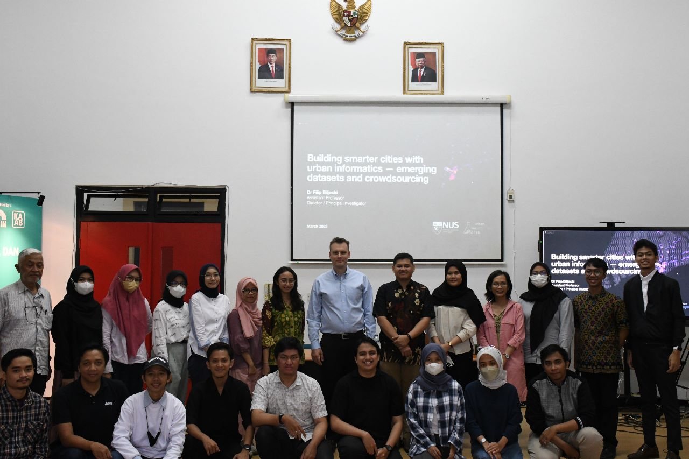
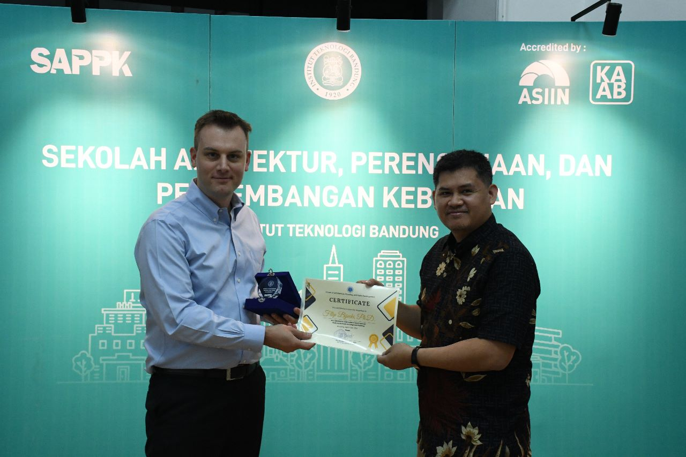

The PI of the Lab, , represented the research group during two recent visits to Indonesia where he gave lectures and participated in a variety of activities to further our network in Indonesia and Southeast Asia:

+ Universitas Gadjah Mada (UGM)
+ Institut Teknologi Bandung (ITB)

These institutions are premier Indonesian universities in our domain.

UGM, situated in Yogyakarta, is home to the [Department of Geodetic Engineering](https://geodesi.ugm.ac.id/en/home/), and the visit was arranged by Prof [Trias Aditya](https://acadstaff.ugm.ac.id/triasaditya), head of the department.
This visit coincided with the [South East Asia Workshop on Geodetic Data Sciences, Geoinformatics and Land Administration 2023](https://geodesi.ugm.ac.id/geolandsea2023/), which was supported by FIG, TUM Global Incentive Fund and UGM, and co-organised by Prof [Walter Timo de Vries](https://www.professoren.tum.de/en/de-vries-walter-timo) from TU Munich. 

During the visit to ITB, Filip was hosted by [Adiwan Aritenang](https://www.itb.ac.id/staf/profil/adiwan-fahlan-aritenang), programme director and his team at the [School of Architecture, Planning, and Policy Development](https://www.itb.ac.id/school-of-architecture-planning-and-policy-development).

Both visits included guest lectures and discussions on collaboration, including education activities.

The hospitality is very much appreciated, and we look forward to collaboration.

