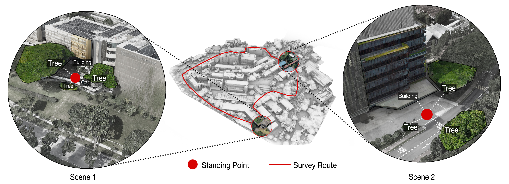
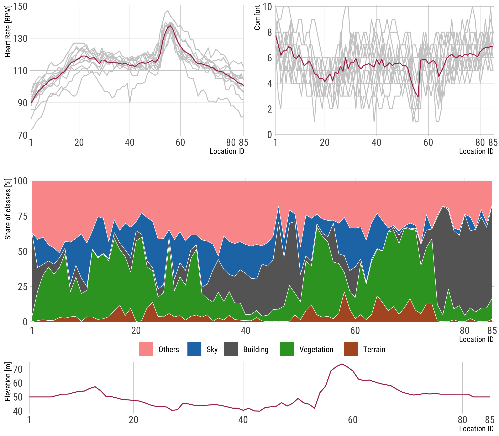
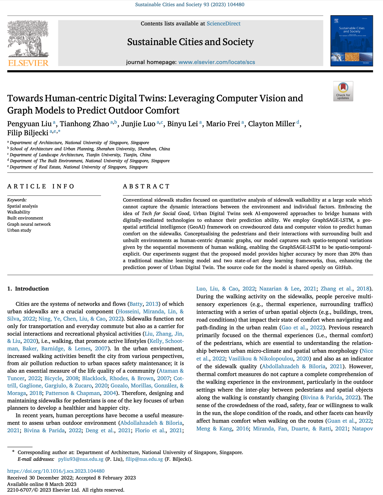

We are glad to share our new paper:

> Liu P, Zhao T, Luo J, Lei B, Frei M, Miller C, and Biljecki F (2023): Towards Human-centric Digital Twins: Leveraging Computer Vision and Graph Models to Predict Outdoor Comfort. _Sustainable Cities and Society_ 93: 104480. [<i class="ai ai-doi-square ai"></i> 10.1016/j.scs.2023.104480](https://doi.org/10.1016/j.scs.2023.104480) [<i class="far fa-file-pdf"></i> PDF](/publication/2023-scs-human-dt/2023-scs-human-dt.pdf)</i>

This research was led by {}.
Congratulations on his continued successes and great work! :raised_hands: :clap:

In this paper, we developed a spatio-temporal-explicit GeoAI to predict human outdoor comfort, introducing a human-centric computational model for urban sidewalks.
We conceptualised the pedestrians and their interactions with surrounding built and unbuilt environments as human-centric dynamic graphs.
Our model captures such spatio-temporal variations given by the sequential movements of human walking.

The implementation has been released as open-source software at [our Github](https://github.com/PengyuanLiu1993/GSL-sidewalk-comfort).

Until 2023-04-30, the article is available for free via [this link](https://authors.elsevier.com/a/1gjz57sfVZAEfI).





### Abstract

The abstract follows.

> Conventional sidewalk studies focused on quantitative analysis of sidewalk walkability at a large scale which cannot capture the dynamic interactions between the environment and individual factors. Embracing the idea of Tech for Social Good, Urban Digital Twins seek AI-empowered approaches to bridge humans with digitally-mediated technologies to enhance their prediction ability. We employ GraphSAGE-LSTM, a geo-spatial artificial intelligence (GeoAI) framework on crowdsourced data and computer vision to predict human comfort on the sidewalks. Conceptualising the pedestrians and their interactions with surrounding built and unbuilt environments as human-centric dynamic graphs, our model captures such spatio-temporal variations given by the sequential movements of human walking, enabling the GraphSAGE-LSTM to be spatio-temporal-explicit. Our experiments suggest that the proposed model provides higher accuracy by more than 20% than a traditional machine learning model and two state-of-art deep learning frameworks, thus, enhancing the prediction power of Urban Digital Twin. The source code for the model is shared openly on GitHub.

### Paper 

For more information, please see the [paper](/publication/2023-scs-human-dt/).

[](/publication/2023-scs-human-dt/)

BibTeX citation:
```bibtex
@article{2023_scs_human_dt,
  author = {Liu, Pengyuan and Zhao, Tianhong and Luo, Junjie and Lei, Binyu and Frei, Mario and Miller, Clayton and Biljecki, Filip},
  doi = {10.1016/j.scs.2023.104480},
  journal = {Sustainable Cities and Society},
  pages = {104480},
  title = {{Towards Human-centric Digital Twins: Leveraging Computer Vision and Graph Models to Predict Outdoor Comfort}},
  volume = {93},
  year = {2023}
}
```
