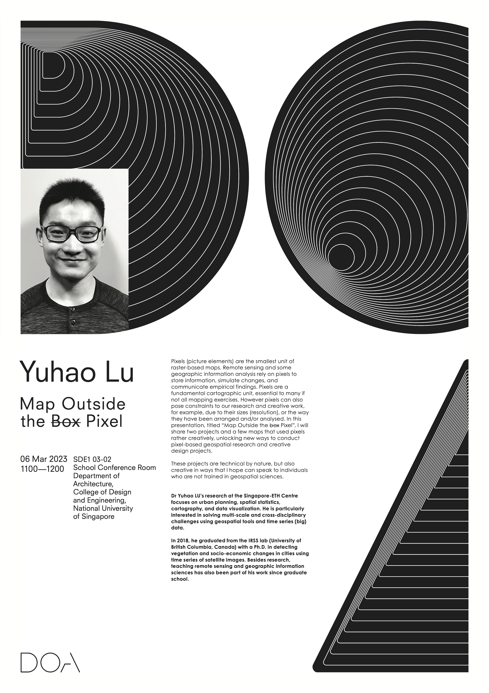

Our Lab and department hosted Dr [Yuhao Lu](https://fcl.ethz.ch/people/researchers/Yuhao-Lu.html), researcher and module coordinator at the [Future Cities Laboratory](https://fcl.ethz.ch), 
[Singapore-ETH Centre](https://sec.ethz.ch), in which our Lab is involved through a [new project](https://fcl.ethz.ch/research/integration-and-strategies/semantic-urban-elements.html).

We had the pleasure to have Yuhao in our [seminar series](/seminars) to give a talk titled 'Map Outside the ~~Box~~ Pixel'.

[Yuhao's research](https://scholar.google.com/citations?user=VbGGSfUAAAAJ&hl=en&oi=ao) was published in journals such as ISPRS Journal of Photogrammetry and Remote Sensing and Landscape and Urban Planning.

Thanks, and looking forward to future collaborations!

### Abstract of the lecture

> Pixels (picture elements) are the smallest unit of raster-based maps.
Remote sensing and some geographic information analysis rely on pixels to store information, simulate changes, and communicate empirical findings. Pixels are a fundamental cartographic unit, essential to many if not all mapping exercises. However pixels can also pose constraints to our research and creative work, for example, due to their sizes (resolution), or the way they have been arranged and/or analysed. In this presentation, titled "Map Outside the ~~box~~ Pixel", I will share two projects and a few maps that used pixels rather creatively, unlocking new ways to conduct pixel-based geospatial research and creative design projects. These projects are technical by nature, but also creative in ways that I hope can speak to individuals who are not trained in geospatial sciences.
