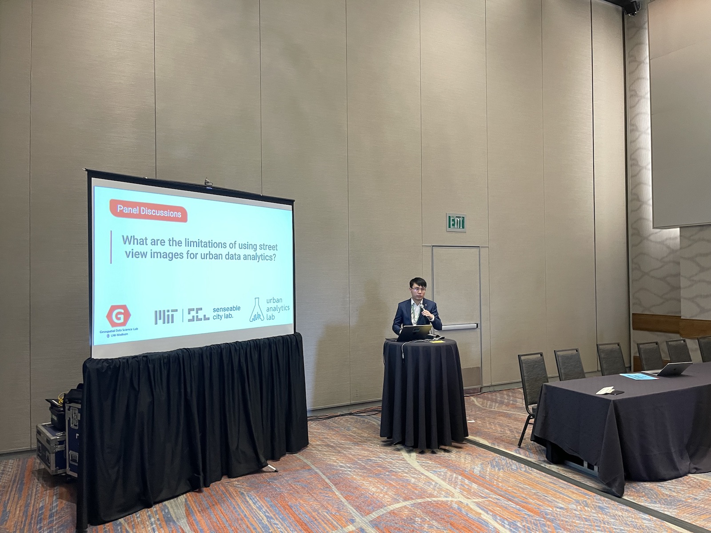
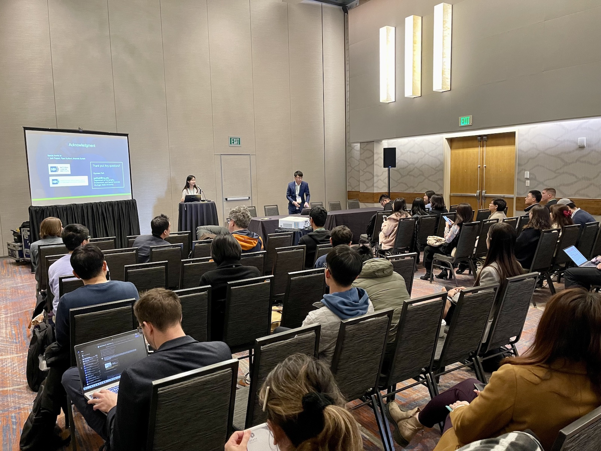
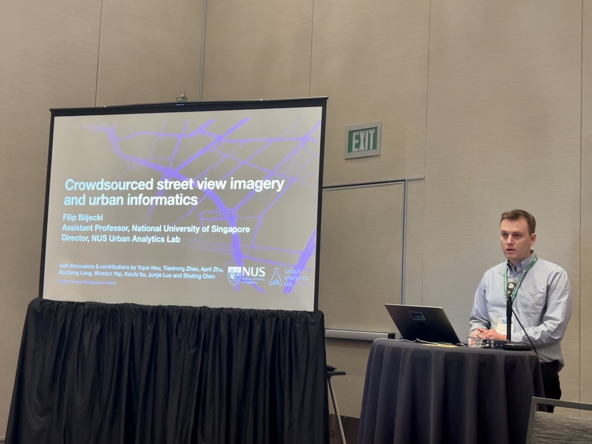
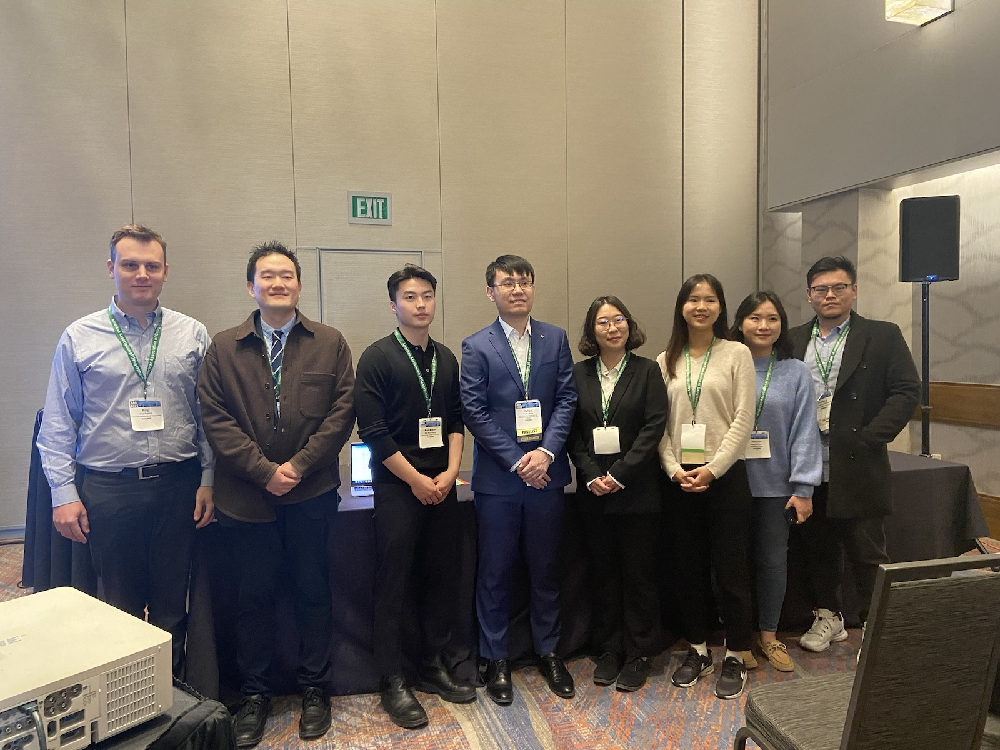
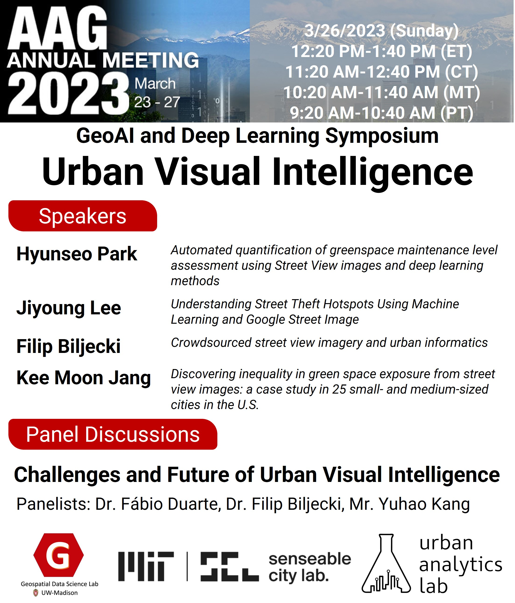
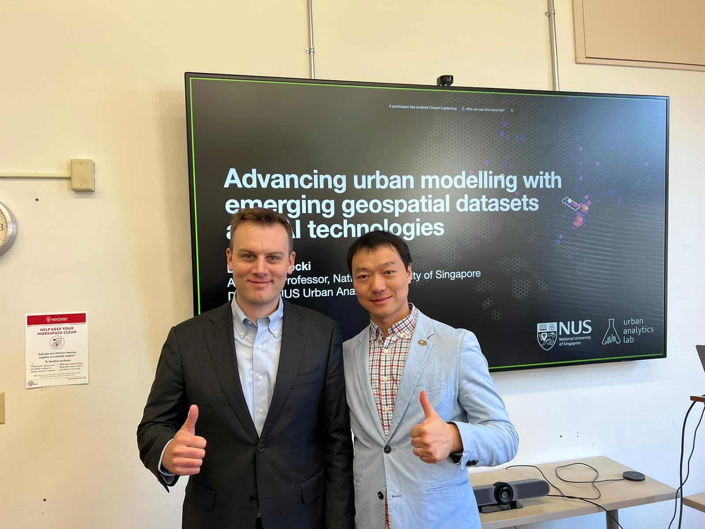
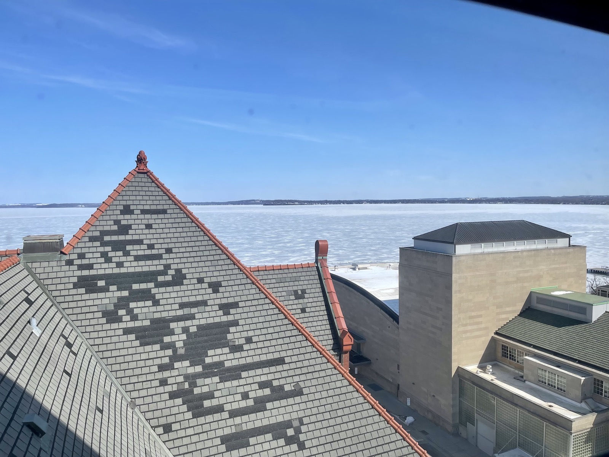
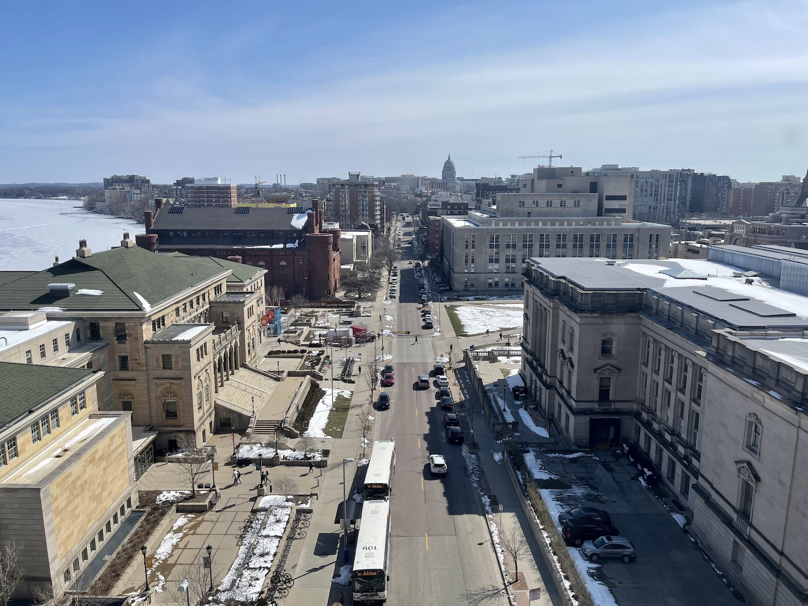
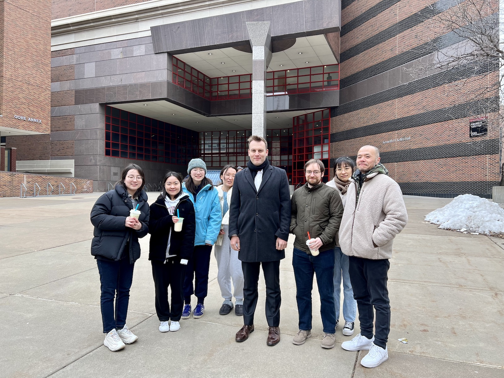

We participated and contributed to the [2023 AAG Annual Meeting](https://www.aag.org/events/aag2023/) in Denver, Colorado, USA.
This is the flagship event of [The American Association of Geographers (AAG)](https://www.aag.org).

{} has co-organised the GeoAI and Deep Learning Symposium: Urban Visual Intelligence and gave a talk on 'Crowdsourced street view imagery and urban informatics', while {} gave the talk 'Analyzing the Mass Rapid Transit (MRT) passengers' spatio-temporal characteristics during Covid-19 using Singapore smart card data' at the Symposium on Human Dynamics Research: Lessons Learned From the COVID-19 Pandemic - Evolving Geospatial Methods and Perspectives of Human Mobility and Urban Dynamics Research.

The NUS Urban Analytics Lab coorganised this session with [Yuhao Kang](http://www.kkyyhh96.site/) from the University of Wisconsin-Madison, [Fábio Duarte](https://dusp.mit.edu/people/fabio-duarte) from the Massachusetts Institute of Technology, and [Fan Zhang](https://www.ce.ust.hk/people/fan-zhang-zhangfan) from the Hong Kong University of Science and Technology.

We thank everyone for attending our session and thank the contributors ([Hyunseo Park](https://geo.msu.edu/directory/park-hyunseo.html), [Jiyoung Lee](https://www.linkedin.com/in/jiyoung-lee-698615200) and [Kee Moon Jang](https://www.keemoonjang.com)) for presenting their latest work.

After the AAG conference, Filip visited the following groups & departments, where he gave guest lectures:

+ University of Wisconsin -- Madison, Department of Geography, [Geospatial Data Science Lab](https://geography.wisc.edu/geods/) ([Prof Song Gao](https://geography.wisc.edu/staff/gao-song/))
+ University of Minnesota, Department of Computer Science and Engineering, [Knowledge Computing Lab](https://knowledge-computing.github.io) ([Prof Yao-Yi Chiang](https://cse.umn.edu/cs/yao-yi-chiang))

We look forward to collaborating with these wonderful research groups, and thank them for their hospitality.

