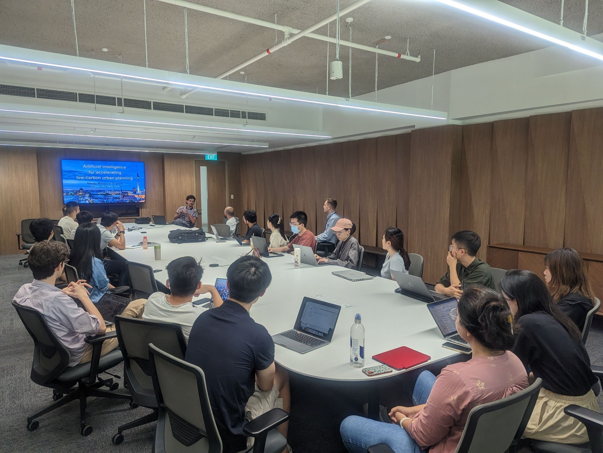
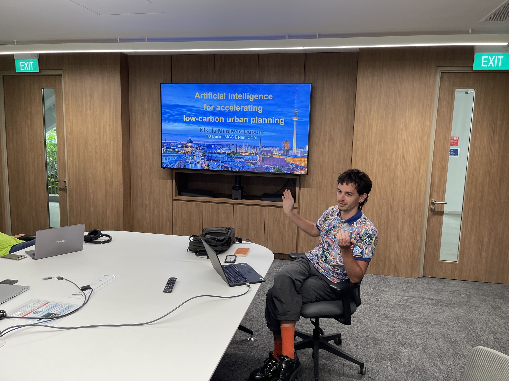
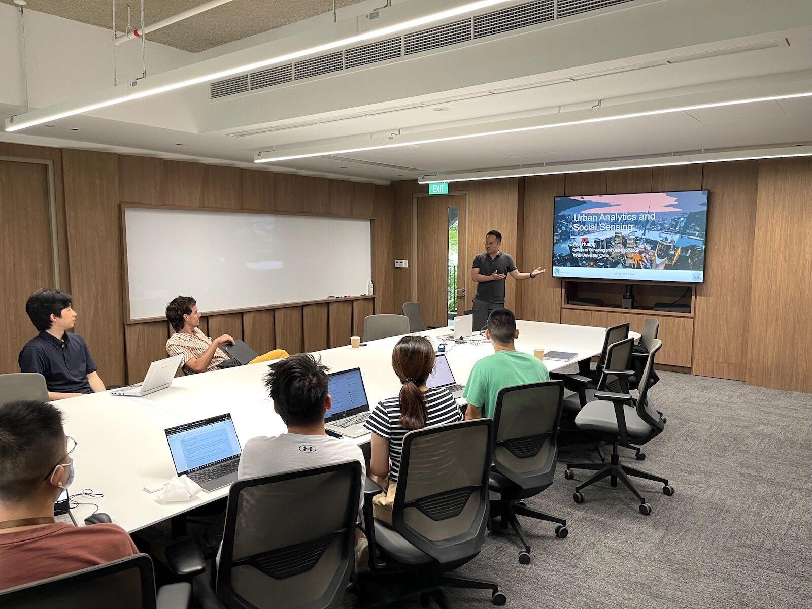
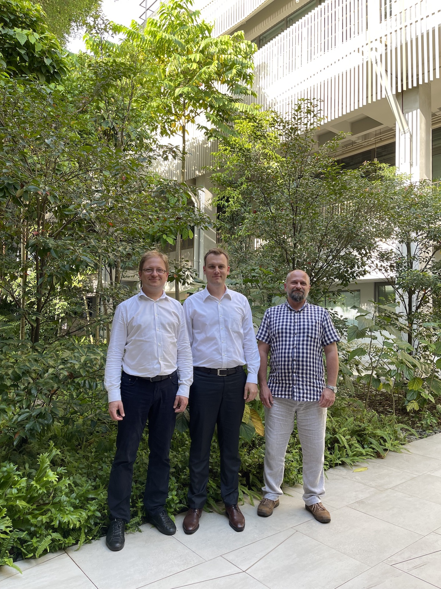

We are having a busy April -- we are happy to have hosted a few academic friends from overseas for short-term visits.

First, it was a pleasure to host [Nikola Milojevic-Dupont](https://milojevicdupontnikola.github.io) ([Mercator Research Institute for Global Commons and Climate Change](https://www.mcc-berlin.net/) and [Technical University Berlin](https://www.susturbecon.tu-berlin.de/sustainability_economics_of_human_settlements/)).
He gave a lecture on Artificial intelligence for accelerating low-carbon urban planning.
In particular, the highlight was [EUBUCCO](https://eubucco.com), the European building stock characteristics in a common and open database for 200+ million individual buildings (read the [paper](https://doi.org/10.1038/s41597-023-02040-2)), in which [we were involved]().

Second, we welcomed [Wei Huang](https://huangweibuct.github.io/weihuang.github.io/), Professor of GIScience at [Tongji University](https://celiang.tongji.edu.cn/info/1300/2388.htm). 
He gave a great lecture on Urban Analytics and Social Sensing, and presented several multidisciplinary research projects conducted at his group in Shanghai.
This visit was facilitated by [Yingwei Yan](https://profile.nus.edu.sg/fass/geoyy/), Lecturer and the Director of the [MSc in Applied GIS programme](https://fass.nus.edu.sg/geog/msc-in-applied-gis/) and our collaborator from the [NUS Department of Geography](https://fass.nus.edu.sg/geog/).
Both of them are leading the [ISPRS WG IV/6 Human Behaviour and Spatial Interactions](https://www2.isprs.org/commissions/comm4/wg6/), with which we are organising the workshop
[GeoHB 2023: Geo-Spatial Computing for Understanding Human Behaviours](https://gsw2023.com/index.php/project/geohb-2023-geo-spatial-computing-for-understanding-human-behaviours/).

Finally, we hosted professors [Witold Rohm](https://bazawiedzy.upwr.edu.pl/info.seam?id=UPWr4d682756bd1243c58f310f8e07f263af&lang=en) and 
[Pawel Boguslawski](https://scholar.google.com.my/citations?user=4mvcBXQAAAAJ&hl=en) from the [Institute of Geodesy and Geoinformatics](https://www.igig.up.wroc.pl/en/) at the [Wroclaw University of Environmental and Life Sciences](https://upwr.edu.pl).
Witold is the Head of the Institute, and his expertise is in GNSS meteorology, remote sensing, and satellite geodesy.
Pawel is an expert in geoinformatics, and he is co-chairing the [ISPRS WG IV/1 Spatial Data Representation and Interoperability](https://www2.isprs.org/commissions/comm4/wg1/), in which the PI of our Lab is involved as well (read more [here in a recent blog post]()).

Our visitors gave guest lectures, held a series of 1:1 meetings, and participated in discussions. 
Thanks for visiting us, and looking forward to future collaborations!
