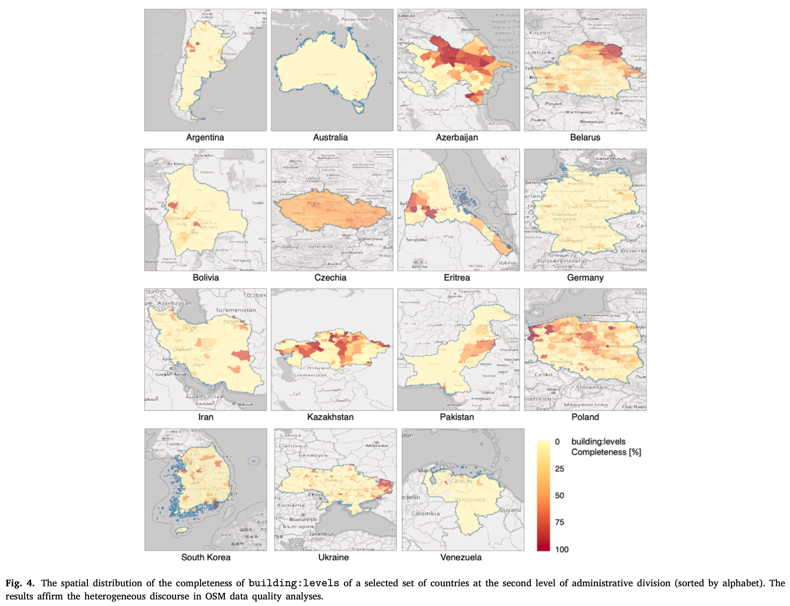
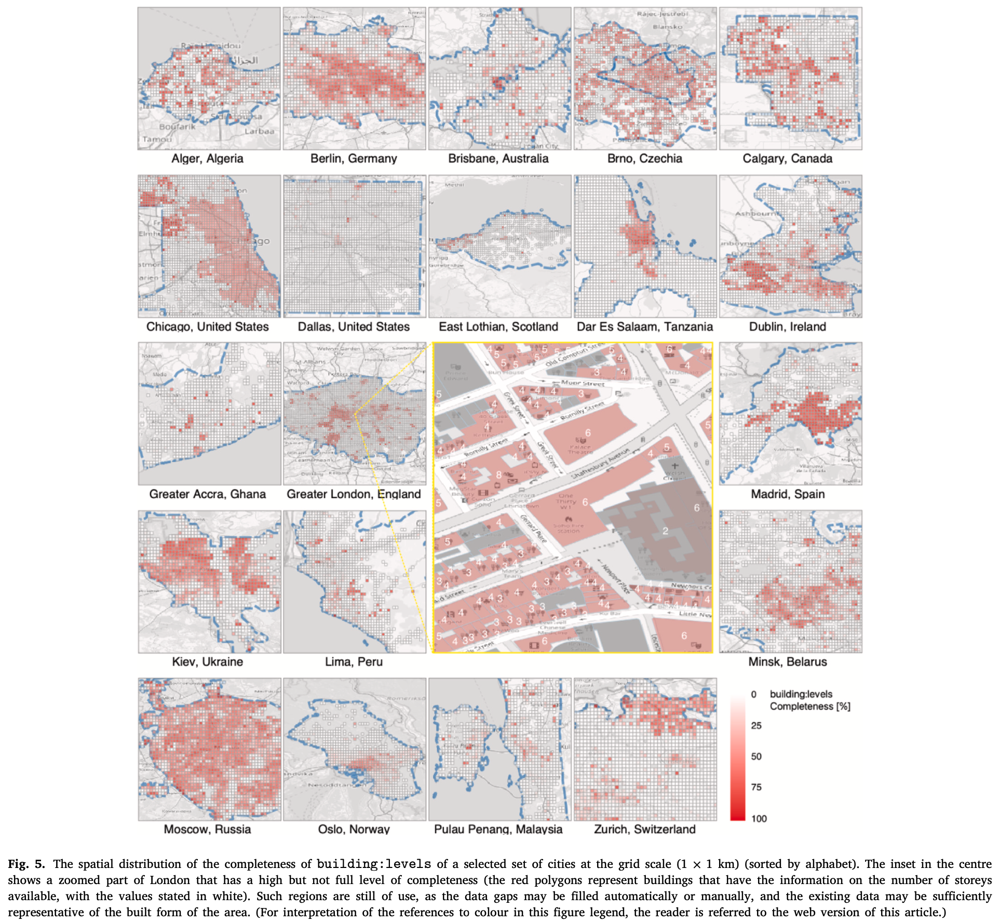
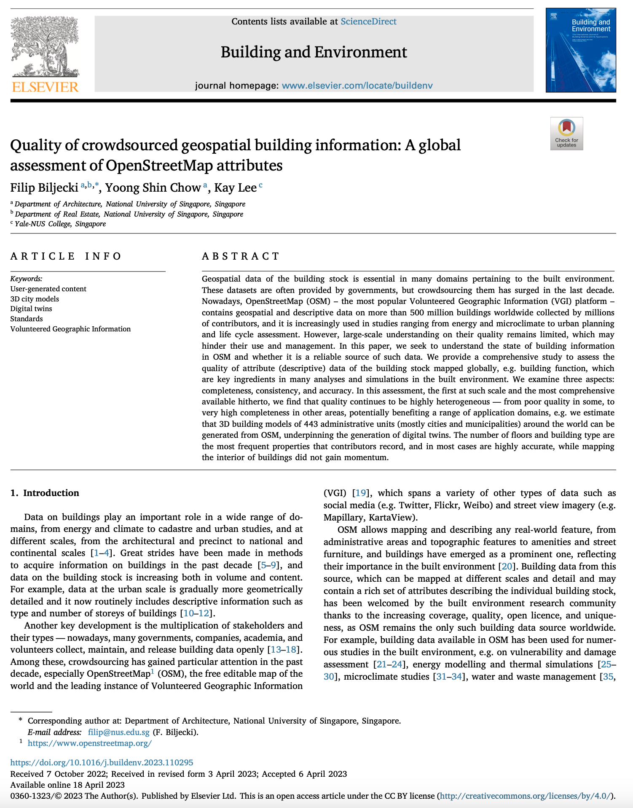

We are glad to share our new paper:

> Biljecki F, Chow YS, Lee K (2023): Quality of crowdsourced geospatial building information: A global assessment of OpenStreetMap attributes. _Building and Environment_ 237: 110295. [<i class="ai ai-doi-square ai"></i> 10.1016/j.buildenv.2023.110295](https://doi.org/10.1016/j.buildenv.2023.110295) [<i class="far fa-file-pdf"></i> PDF](/publication/2023_bae_osm_qa/2023_bae_osm_qa.pdf)</i>  <i class="ai ai-open-access-square ai"></i>

This research was led by {}, and contributed by {} and {}.

Today, with more than 500 million buildings mapped, OpenStreetMap is the largest open dataset on the building stock.
The paper presents the first global study on understanding the content and quality of attributes of buildings.





### Abstract

> Geospatial data of the building stock is essential in many domains pertaining to the built environment. These datasets are often provided by governments, but crowdsourcing them has surged in the last decade. Nowadays, OpenStreetMap (OSM) — the most popular Volunteered Geographic Information (VGI) platform — contains geospatial and descriptive data on more than 500 million buildings worldwide collected by millions of contributors, and it is increasingly used in studies ranging from energy and microclimate to urban planning and life cycle assessment. However, large-scale understanding on their quality remains limited, which may hinder their use and management. In this paper, we seek to understand the state of building information in OSM and whether it is a reliable source of such data. We provide a comprehensive study to assess the quality of attribute (descriptive) data of the building stock mapped globally, e.g. building function, which are key ingredients in many analyses and simulations in the built environment. We examine three aspects: completeness, consistency, and accuracy. In this assessment, the first at such scale and the most comprehensive available hitherto, we find that quality continues to be highly heterogeneous — from poor quality in some, to very high completeness in other areas, potentially benefiting a range of application domains, e.g. we estimate that 3D building models of 443 administrative units (mostly cities and municipalities) around the world can be generated from OSM, underpinning the generation of digital twins. The number of floors and building type are the most frequent properties that contributors record, and in most cases are highly accurate, while mapping the interior of buildings did not gain momentum.

### Highlights

+ OpenStreetMap is the principal global crowdsourced geospatial dataset.
+ More than half a billion buildings are mapped in OpenStreetMap.
+ Most comprehensive OpenStreetMap building attribute data quality assessment.
+ Our global analysis provides an understanding of the highly variable quality.
+ In thousands of districts, OSM building data may be sufficient for some use cases.

### Paper 

For more information, please see the [paper](/publication/2023_bae_osm_qa/) (open access <i class="ai ai-open-access-square ai"></i>).

[](/publication/2023_bae_osm_qa/)

BibTeX citation:
```bibtex
@article{2023_bae_osm_qa,
  author = {Filip Biljecki and Yoong Shin Chow and Kay Lee},
  doi = {10.1016/j.buildenv.2023.110295},
  journal = {Building and Environment},
  pages = {110295},
  title = {{Quality of crowdsourced geospatial building information: A global assessment of OpenStreetMap attributes}},
  volume = {237},
  year = {2023}
}
```
