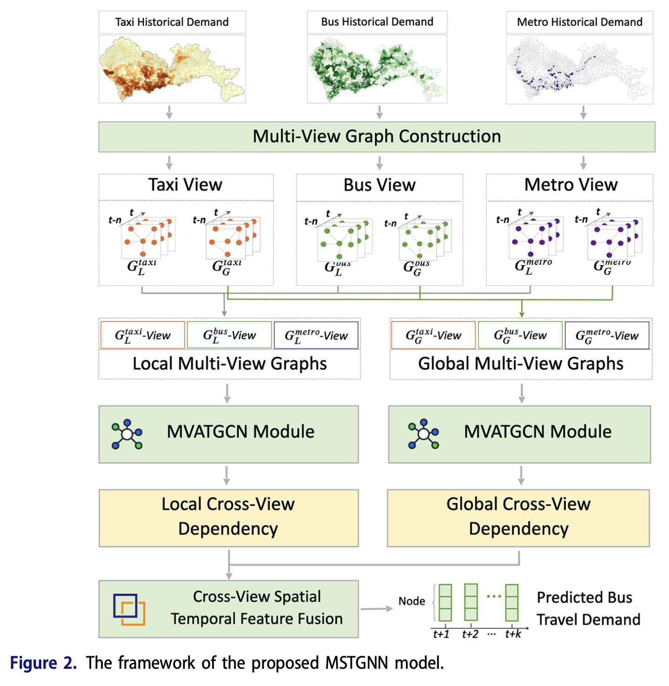
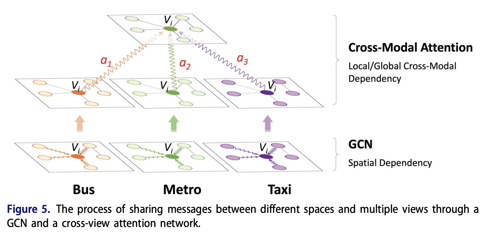
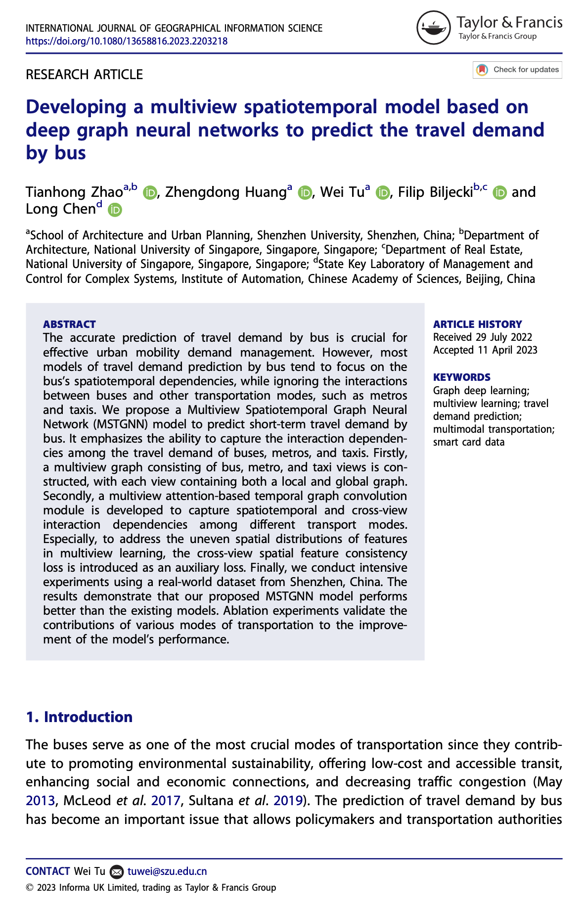

We are glad to share our new paper:

> Zhao T, Huang Z, Tu W, Biljecki F, Chen L (2023): Developing a multiview spatiotemporal model based on deep graph neural networks to predict the travel demand by bus. _International Journal of Geographical Information Science_: 1-27. [<i class="ai ai-doi-square ai"></i> 10.1080/13658816.2023.2203218](https://doi.org/10.1080/13658816.2023.2203218) [<i class="far fa-file-pdf"></i> PDF](/publication/2023-ijgis-bus-demand/2023-ijgis-bus-demand.pdf)</i>

This research was led by {}.
Congratulations on his great work! :raised_hands: :clap:
Tianhong had been with us for a year as a visiting scholar from Shenzhen University, and [he was awarded a prestigious scholarship]().

### Abstract

> The accurate prediction of travel demand by bus is crucial for effective urban mobility demand management. However, most models of travel demand prediction by bus tend to focus on the bus’s spatiotemporal dependencies, while ignoring the interactions between buses and other transportation modes, such as metros and taxis. We propose a Multiview Spatiotemporal Graph Neural Network (MSTGNN) model to predict short-term travel demand by bus. It emphasizes the ability to capture the interaction dependencies among the travel demand of buses, metros, and taxis. Firstly, a multiview graph consisting of bus, metro, and taxi views is constructed, with each view containing both a local and global graph. Secondly, a multiview attention-based temporal graph convolution module is developed to capture spatiotemporal and cross-view interaction dependencies among different transport modes. Especially, to address the uneven spatial distributions of features in multiview learning, the cross-view spatial feature consistency loss is introduced as an auxiliary loss. Finally, we conduct intensive experiments using a real-world dataset from Shenzhen, China. The results demonstrate that our proposed MSTGNN model performs better than the existing models. Ablation experiments validate the contributions of various modes of transportation to the improvement of the model’s performance.





### Paper 

For more information, please see the [paper](/publication/2023-ijgis-bus-demand/).

[](/publication/2023-ijgis-bus-demand/)

BibTeX citation:
```bibtex
@article{2023_ijgis_bus_demand,
  author = {Tianhong Zhao and Zhengdong Huang and Wei Tu and Filip Biljecki and Long Chen},
  doi = {10.1080/13658816.2023.2203218},
  journal = {International Journal of Geographical Information Science},
  pages = {1-27},
  title = {{Developing a multiview spatiotemporal model based on deep graph neural networks to predict the travel demand by bus}},
  volume = {},
  year = {2023}
}
```
