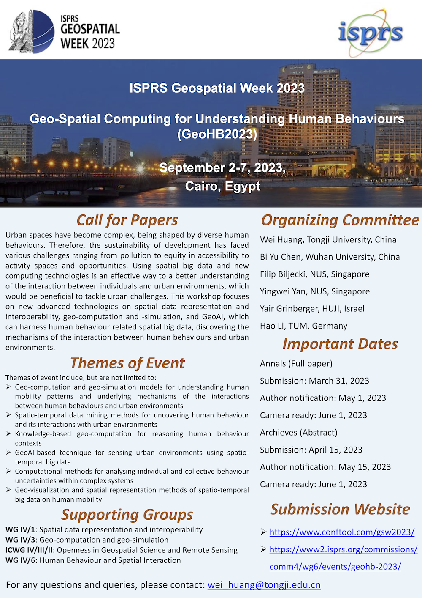

The Director of the Lab, {}, has been appointed as Chair of the working group [Spatial Data Representation and Interoperability](https://www2.isprs.org/commissions/comm4/wg1/) at the [International Society for Photogrammetry and Remote Sensing (ISPRS)](https://www.isprs.org/), a prominent international organisation in photogrammetry, remote sensing and spatial information sciences.
The organisation has been established more than a century ago and it is the oldest and most known umbrella society in this domain.

This working group has been designated as the working group 1 within the [ISPRS Technical Commission IV](https://www2.isprs.org/commissions/comm4/), which is on Spatial Information Science.

In the ISPRS WG IV/1, Filip will collaborate with [Francesca Noardo](http://www.noardo.eu) from the Open Geospatial Consortium, [Pawel Boguslawski](https://scholar.google.com.my/citations?user=4mvcBXQAAAAJ&hl=en) from the Wroclaw University of Environmental and Life Sciences, and [Elisabetta Colucci](https://www.polito.it/en/staff?p=elisabetta.colucci) from Politecnico di Torino. 

The working group has a mandate until 2026, and has the following mission:

> This working group aims to promote research on spatial data representations, their standardisation, and interoperability. This topic is increasingly important with the proliferation of digital twins, evolvement of new and developing urban data sources such as 3D city models and street view imagery, and the increasing volume and use of volunteered geoinformation. The group aims to intensify the relationships with standardisation organisations such as OGC, to strengthen topics related to open science/data/software.

The working group has already a couple of activities, most prominently, the co-organisation of the workshop
[GeoHB 2023: Geo-Spatial Computing for Understanding Human Behaviours](https://gsw2023.com/index.php/project/geohb-2023-geo-spatial-computing-for-understanding-human-behaviours/).
This event is organised in collaboration with Hao Li (TU Munich), Yingwei Yan (NUS Geography), Wei Huang (Tongji University) ([who was at our group last week]()), Yair Grinberger (HUJ), and Bi Yu Chen (Wuhan University), who are all part of other working groups within the same Commission. 
The workshop is part of the [ISPRS Geospatial Week 2023](https://gsw2023.com) in Cairo, Egypt (September 2023).

If you have a chance, please consider submitting a paper to this workshop.
Please see the poster below (note that the deadline has been extended).

