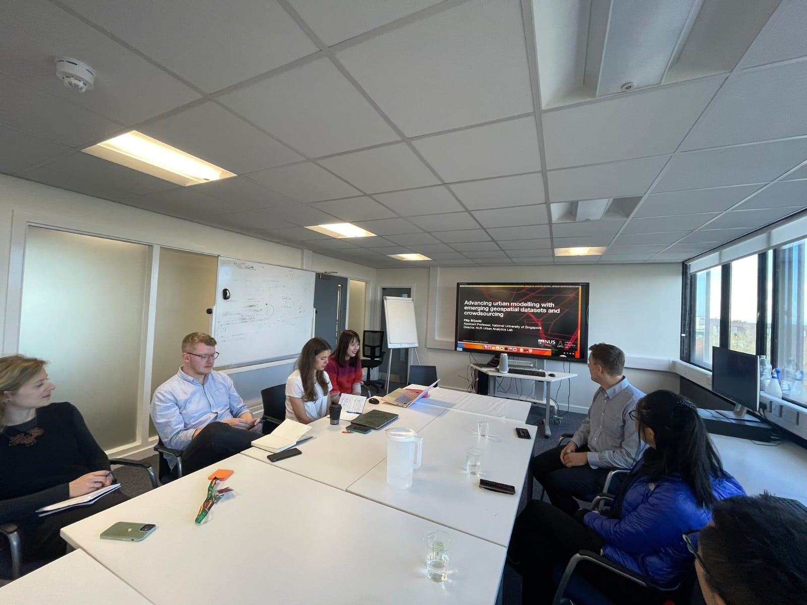
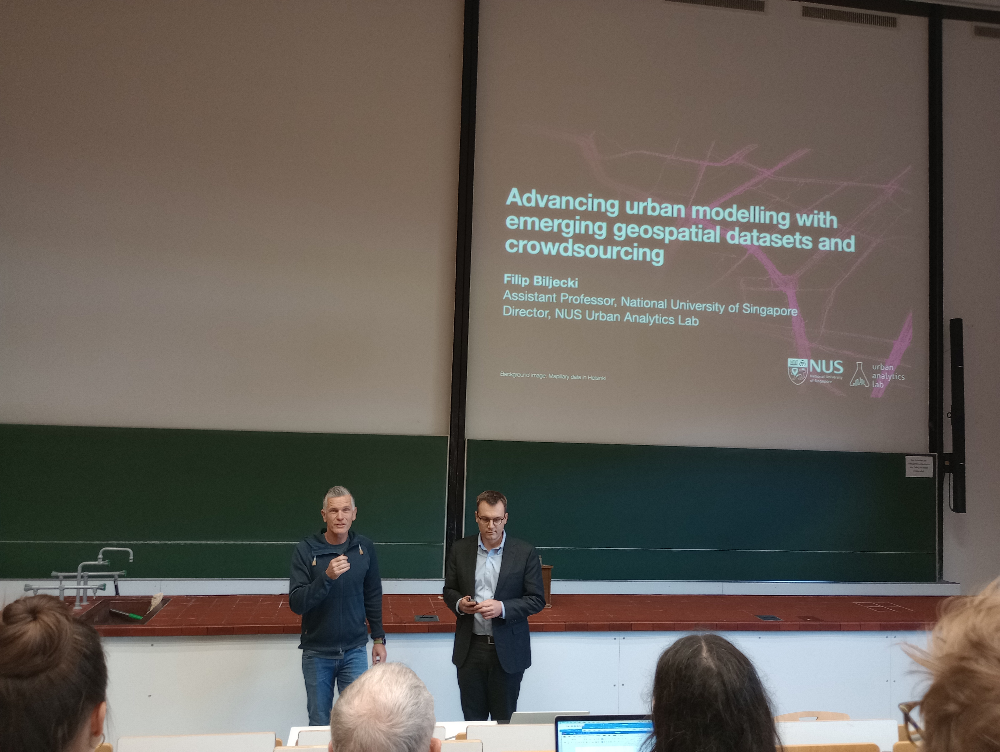
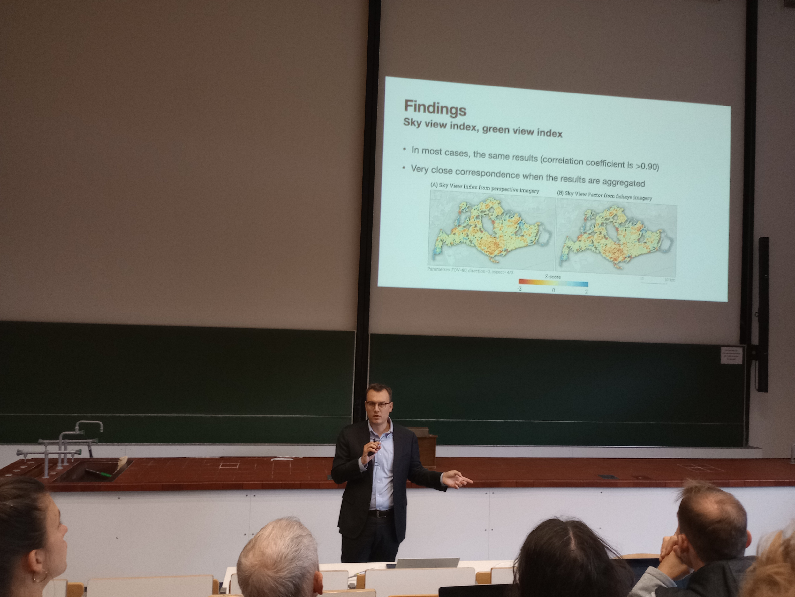
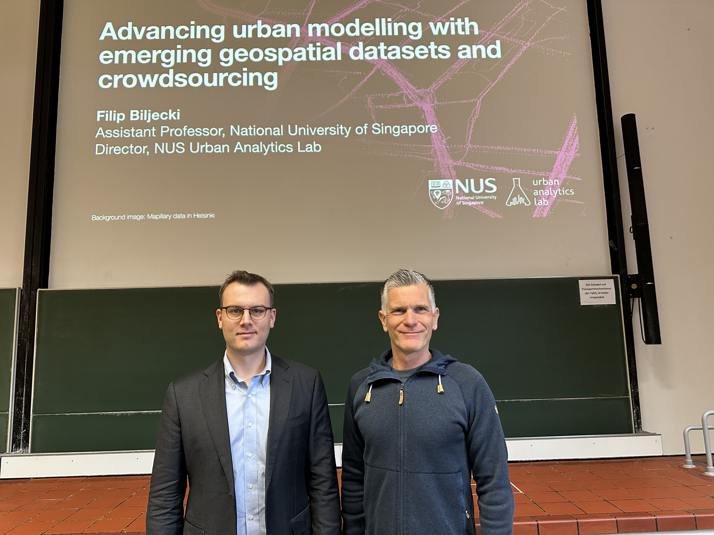

The PI of the Lab, , represented the research group during a recent visit to Europe where he gave guest lectures and participated in a variety of activities to further our network:

+ University of Liverpool, [Geographic Data Science Lab](https://www.liverpool.ac.uk/geographic-data-science/) :uk:
+ Heidelberg University, [GIScience Research Group](https://www.geog.uni-heidelberg.de/gis/index_en.html) and [Heidelberg Institute for Geoinformation Technology](https://heigit.org) :de:

These labs are leaders in our domain.

The [Geographic Data Science Lab](https://www.liverpool.ac.uk/geographic-data-science/) in Liverpool is a multidisciplinary group that serves as a centre of excellence for research and teaching within this emerging area, drawing expertise from the intersection of Geographic Information Science, Spatial Analysis and Applied Geocomputation. It is headed by Professor [Francisco Rowe](https://www.franciscorowe.com).

The [GIScience Research Group](https://www.geog.uni-heidelberg.de/gis/index_en.html) and [HeiGIT](https://heigit.org) (Heidelberg Institute for Geoinformation Technology) in Heidelberg are one of the leading groups in the domain of geographical information science, especially in user-generated geographical content (VGI, Crowdsourcing, Citizen Science). They are headed by Professor [Alexander Zipf](https://www.geog.uni-heidelberg.de/gis/zipf.html).

Both visits included guest lectures and several discussions on collaboration.

Thank you for the insightful and productive discussions, and sharing the inspiring work.
The hospitality is very much appreciated, and we look forward to collaboration.