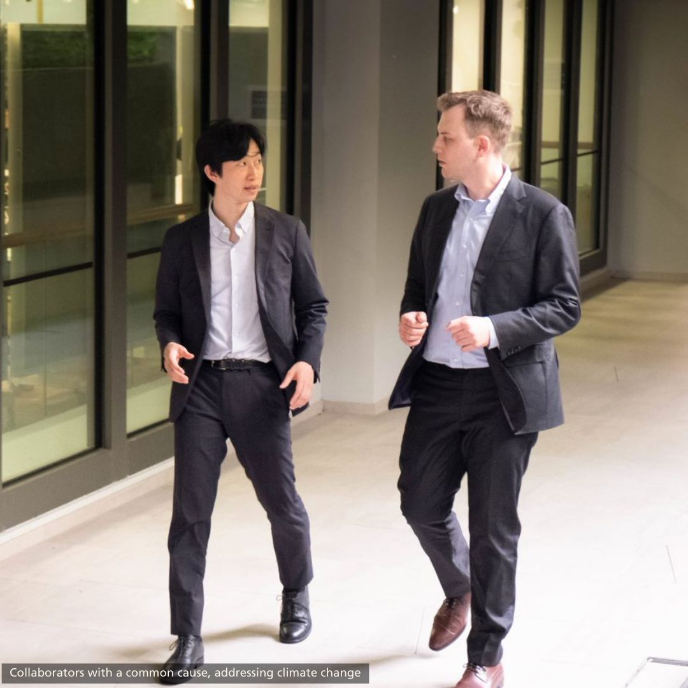
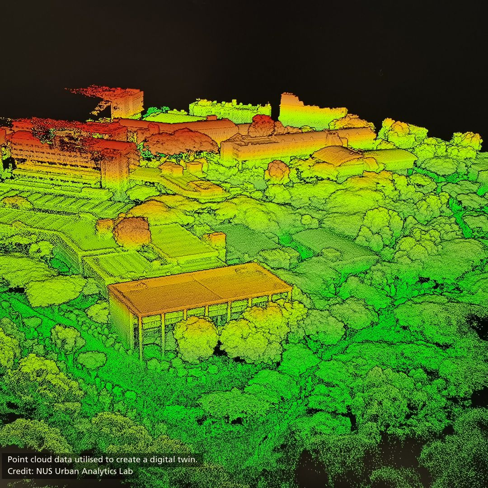

We are relaying [a release](https://www.linkedin.com/posts/nus-cde_urbansolutions-digitaltwins-nus-activity-7056460703796260864-vo18) from our College of Design and Engineering about a significant milestone for us: a first large and funded collaboration with a company.

---

In 2020, Assistant Professor {} was awarded the NUS Presidential Young Professorship and formed the NUS Urban Analytics Lab in CDE’s Department of Architecture. His multidisciplinary research group focuses on urban data management and analysis, geographic data science, and digital twins. Digital twins map physical bodies into virtual spaces. The connected virtual replica allows researchers to collect intersecting dynamic data and test and optimise solutions from the virtual space to reality.

Amongst the different research projects from his Lab, the work on integrating data on vegetation in digital twins caught the eye of Dr {}, Associate Chief Researcher at Takenaka Corporation, one of the major players in Japan's construction, engineering, and architectural services sector. It intrigued Dr Fujiwara so much that he contacted Dr Biljecki to explore ways Takenaka could work closely with the Lab.

Takenaka’s interest is in how such data can facilitate simulations to allow solutions towards climate change mitigation and thermal comfort. In short, how urban planners like Takenaka refine their urban solutions by integrating information on greenery to address the pressing issues arising from climate change. 

In just two years since the Lab’s formation, UAL has firmed its first industry partnership with a leading international corporation. 

Dr Fujiwara has joined UAL as a Visiting Research Fellow for a long-term period, and a PhD scholarship was set up geared towards such industry collaborations. For the next four years, this position will support the joint work between Takenaka and UAL. Funding from Takenaka to the Lab will also contribute towards this initiative. 

This is a step towards UAL’s work in extending its research towards direct application in close partnership with like-minded corporations such as Takenaka. The speed of Takenaka’s engagement with UAL is a positive signal of the common interests of the two parties to cross many divides towards working together on innovations for a sustainable built environment.

