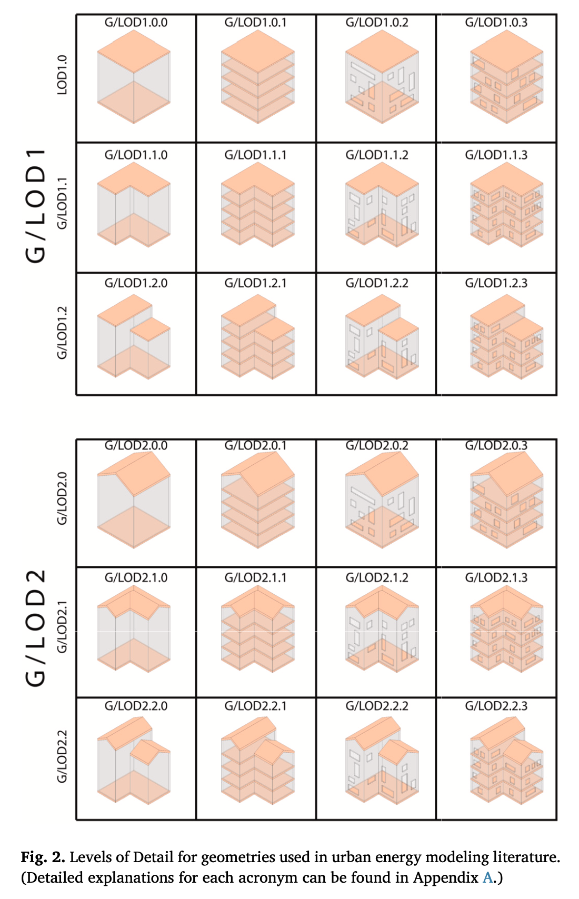
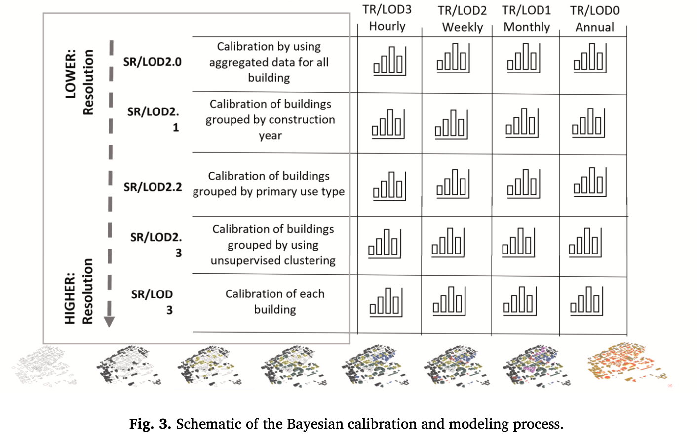
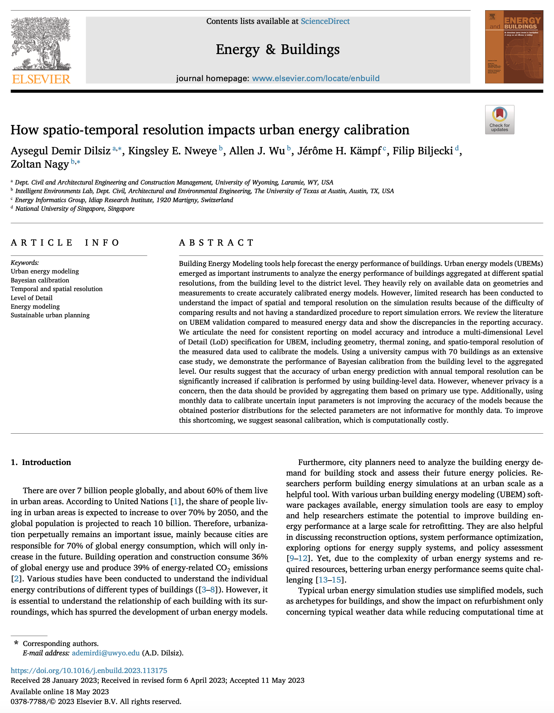

We are glad to share a new collaborative paper:

> Dilsiz AD, Nweye KE, Wu AJ, Kämpf JH, Biljecki F, Nagy Z (2023): How spatio-temporal resolution impacts urban energy calibration. _Energy and Buildings_ 292: 113175. [<i class="ai ai-doi-square ai"></i> 10.1016/j.enbuild.2023.113175](https://doi.org/10.1016/j.enbuild.2023.113175) [<i class="far fa-file-pdf"></i> PDF](/publication/2023-enb-ubem-resolution/2023-enb-ubem-resolution.pdf)</i>  <i class="ai ai-open-access-square ai"></i>

The paper addresses the crucial role of Urban Energy Models (UBEMs) in evaluating the energy performance of buildings, ranging from individual buildings to entire districts.
It articulates the need for consistent reporting on accuracy in UBEM, and it introduces a multi-dimensional Level of Detail (LoD) specification for UBEM, including geometry, thermal zoning, and spatio-temporal resolution of the measured data used to calibrate the models.

The project was spearheaded by [Aysegul Demir Dilsiz](https://www.uwyo.edu/civil/faculty_staff/faculty/aysegul-demir/) (who is now Asst Prof at the University of Wyoming) and [Zoltan Nagy](https://www.ie-lab.org/author/zoltan-nagy/) from the [Intelligent Environments Laboratory](https://www.ie-lab.org) at the University of Texas at Austin.

Until 2023-07-14, the article is available for free via [this link](https://authors.elsevier.com/c/1h8R9_8dCXk2Vr).






### Abstract

> Building Energy Modeling tools help forecast the energy performance of buildings. Urban energy models (UBEMs) emerged as important instruments to analyze the energy performance of buildings aggregated at different spatial resolutions, from the building level to the district level. They heavily rely on available data on geometries and measurements to create accurately calibrated energy models. However, limited research has been conducted to understand the impact of spatial and temporal resolution on the simulation results because of the difficulty of comparing results and not having a standardized procedure to report simulation errors. We review the literature on UBEM validation compared to measured energy data and show the discrepancies in the reporting accuracy. We articulate the need for consistent reporting on model accuracy and introduce a multi-dimensional Level of Detail (LoD) specification for UBEM, including geometry, thermal zoning, and spatio-temporal resolution of the measured data used to calibrate the models. Using a university campus with 70 buildings as an extensive case study, we demonstrate the performance of Bayesian calibration from the building level to the aggregated level. Our results suggest that the accuracy of urban energy prediction with annual temporal resolution can be significantly increased if calibration is performed by using building-level data. However, whenever privacy is a concern, then the data should be provided by aggregating them based on primary use type. Additionally, using monthly data to calibrate uncertain input parameters is not improving the accuracy of the models because the obtained posterior distributions for the selected parameters are not informative for monthly data. To improve this shortcoming, we suggest seasonal calibration, which is computationally costly.

### Paper 

For more information, please see the [paper](/publication/2023-enb-ubem-resolution/).

[](/publication/2023-enb-ubem-resolution/)

BibTeX citation:
```bibtex
@article{2023_enb_ubem_resolution,
  author = {Aysegul Demir Dilsiz and Kingsley E. Nweye and Allen J. Wu and Jérôme H. Kämpf and Filip Biljecki and Zoltan Nagy},
  doi = {10.1016/j.enbuild.2023.113175},
  journal = {Energy and Buildings},
  pages = {113175},
  title = {{How spatio-temporal resolution impacts urban energy calibration}},
  volume = {292},
  year = {2023}
}
```
