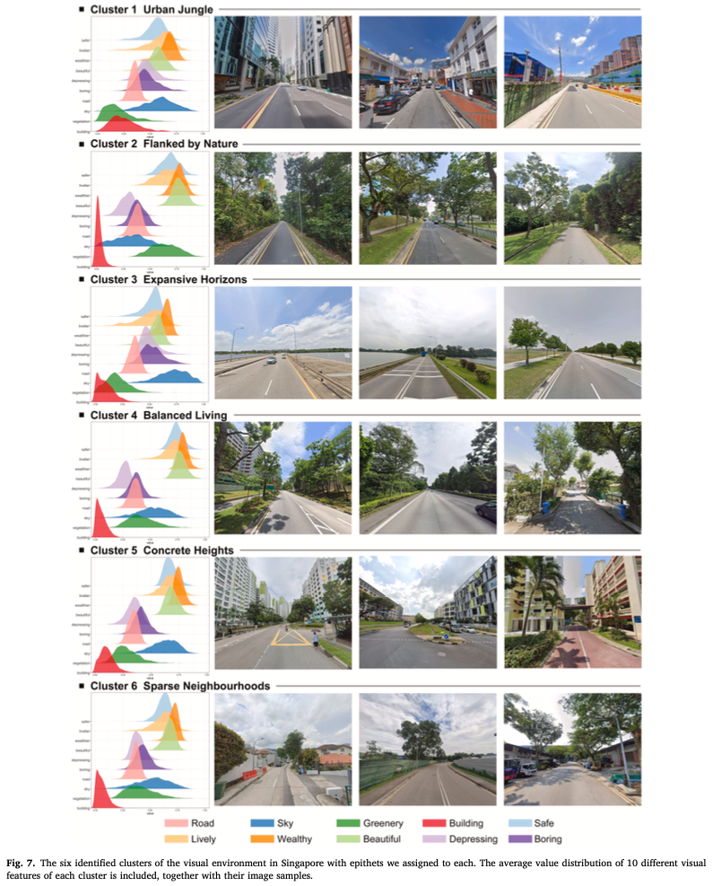
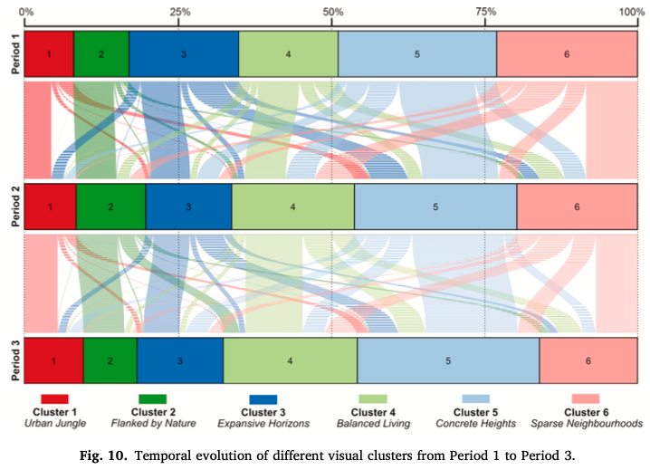
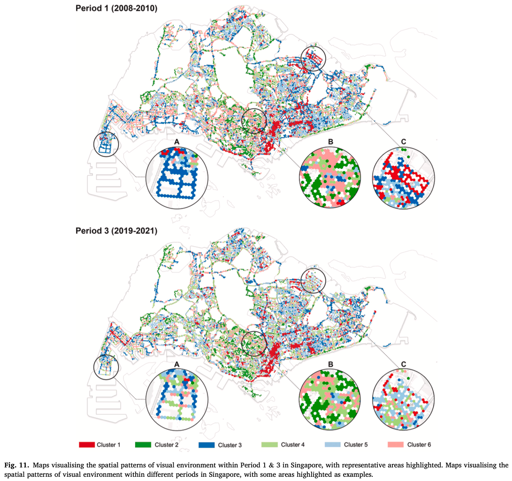
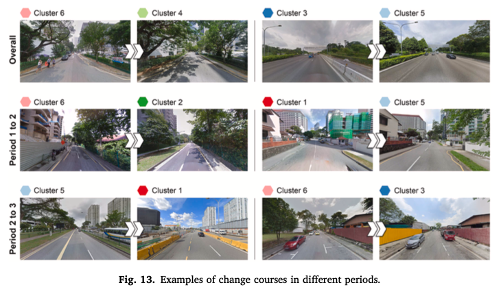
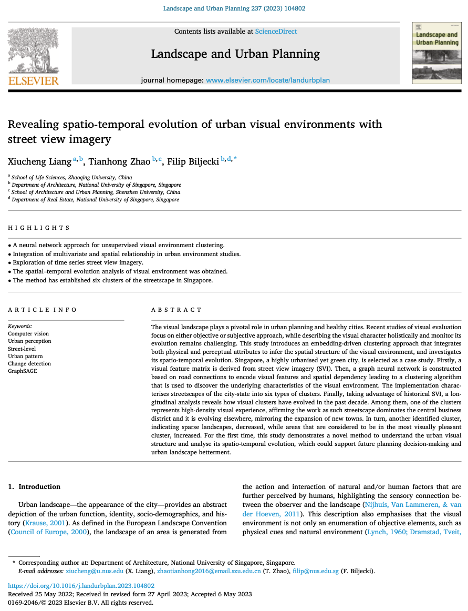

We are glad to share our new paper:

> Liang X, Zhao T, Biljecki F (2023): Revealing spatio-temporal evolution of urban visual environments with street view imagery. Landscape and Urban Planning 237: 104802. [<i class="ai ai-doi-square ai"></i> 10.1016/j.landurbplan.2023.104802](https://doi.org/10.1016/j.landurbplan.2023.104802) [<i class="far fa-file-pdf"></i> PDF](/publication/2023-landup-svi-evolution/2023-landup-svi-evolution.pdf)</i>

This research was led by {}.
Congratulations on the great work and publication! :raised_hands: :clap:
Xiucheng has graduated from our NUS Master of Urban Planning programme.

Until 2023-07-06, the article is available for free via [this link](https://authors.elsevier.com/a/1h5iEcUG5SiP%7E).









### Abstract

The abstract follows.

> The visual landscape plays a pivotal role in urban planning and healthy cities. Recent studies of visual evaluation focus on either objective or subjective approach, while describing the visual character holistically and monitor its evolution remains challenging. This study introduces an embedding-driven clustering approach that integrates both physical and perceptual attributes to infer the spatial structure of the visual environment, and investigates its spatio-temporal evolution. Singapore, a highly urbanised yet green city, is selected as a case study. Firstly, a visual feature matrix is derived from street view imagery (SVI). Then, a graph neural network is constructed based on road connections to encode visual features and spatial dependency leading to a clustering algorithm that is used to discover the underlying characteristics of the visual environment. The implementation characterises streetscapes of the city-state into six types of clusters. Finally, taking advantage of historical SVI, a longitudinal analysis reveals how visual clusters have evolved in the past decade. Among them, one of the clusters represents high-density visual experience, affirming the work as such streetscape dominates the central business district and it is evolving elsewhere, mirroring the expansion of new towns. In turn, another identified cluster, indicating sparse landscapes, decreased, while areas that are considered to be in the most visually pleasant cluster, increased. For the first time, this study demonstrates a novel method to understand the urban visual structure and analyse its spatio-temporal evolution, which could support future planning decision-making and urban landscape betterment.

### Highlights

+ A neural network approach for unsupervised visual environment clustering.
+ Integration of multivariate and spatial relationship in urban environment studies.
+ Exploration of time series street view imagery.
+ The spatial-temporal evolution analysis of visual environment was obtained.
+ The method has established six clusters of the streetscape in Singapore.

### Paper 

For more information, please see the [paper](/publication/2023-landup-svi-evolution/).

[](/publication/2023-landup-svi-evolution/)

BibTeX citation:
```bibtex
@article{2023_landup_svi_evolution,
  author = {Xiucheng Liang and Tianhong Zhao and Filip Biljecki},
  doi = {10.1016/j.landurbplan.2023.104802},
  journal = {Landscape and Urban Planning},
  pages = {104802},
  title = {{Revealing spatio-temporal evolution of urban visual environments with street view imagery}},
  volume = {237},
  year = {2023}
}
```
