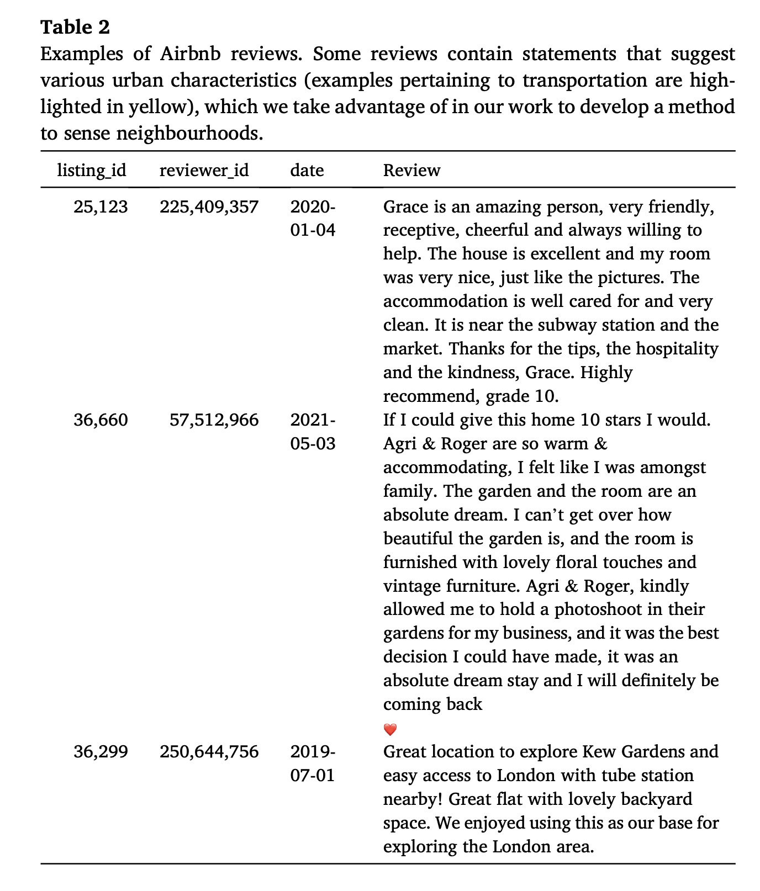
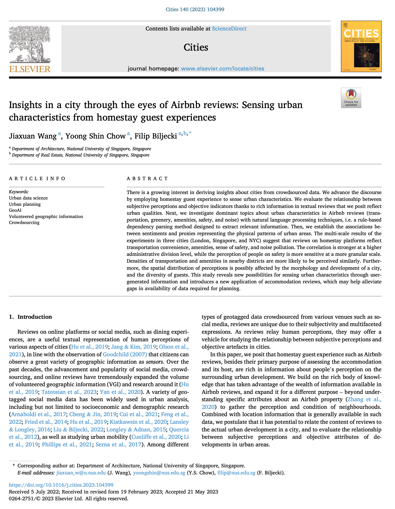

We are glad to share our new paper:

> Wang J, Chow YS, Biljecki F (2023): Insights in a city through the eyes of Airbnb reviews: Sensing urban characteristics from homestay guest experiences. Cities 140: 104399. [<i class="ai ai-doi-square ai"></i> 10.1016/j.cities.2023.104399](https://doi.org/10.1016/j.cities.2023.104399) [<i class="far fa-file-pdf"></i> PDF](/publication/2023-cities-airbnb/2023-cities-airbnb.pdf)</i>

This research was led by {}.
Congratulations on the great work and publication! :raised_hands: :clap:
Jiaxuan has graduated from our NUS Master of Urban Planning programme.

Until 2023-07-26, the article is available for free via [this link](https://authors.elsevier.com/a/1hCbTy5jOr5h-).




### Abstract

The abstract follows.

> There is a growing interest in deriving insights about cities from crowdsourced data. We advance the discourse by employing homestay guest experience to sense urban characteristics. We evaluate the relationship between subjective perceptions and objective indicators thanks to rich information in textual reviews that we posit reflect urban qualities. Next, we investigate dominant topics about urban characteristics in Airbnb reviews (transportation, greenery, amenities, safety, and noise) with natural language processing techniques, i.e. a rule-based dependency parsing method designed to extract relevant information. Then, we establish the associations between sentiments and proxies representing the physical patterns of urban areas. The multi-scale results of the experiments in three cities (London, Singapore, and NYC) suggest that reviews on homestay platforms reflect transportation convenience, amenities, sense of safety, and noise pollution. The correlation is stronger at a higher administrative division level, while the perception of people on safety is more sensitive at a more granular scale. Densities of transportation and amenities in nearby districts are more likely to be perceived similarly. Furthermore, the spatial distribution of perceptions is possibly affected by the morphology and development of a city, and the diversity of guests. This study reveals new possibilities for sensing urban characteristics through user-generated information and introduces a new application of accommodation reviews, which may help alleviate gaps in availability of data required for planning.

### Highlights

+ Text reviews on homestay platforms reflect physical conditions of a city.
+ 114,340 Airbnb listings and 899,776 reviews were analysed using dependency parsing.
+ Five dominant urban aspects common in Airbnb reviews in London, NYC, and Singapore
+ The homestay reviews suggest quality of access to transportation and amenities.
+ Human perceptions on urban characteristics vary on different administrative levels.

### Paper 

For more information, please see the [paper](/publication/2023-cities-airbnb/).

[](/publication/2023-cities-airbnb/)

BibTeX citation:
```bibtex
@article{2023_cities_airbnb,
  author = {Jiaxuan Wang and Yoong Shin Chow and Filip Biljecki},
  doi = {10.1016/j.cities.2023.104399},
  journal = {Cities},
  pages = {104399},
  title = {{Insights in a city through the eyes of Airbnb reviews: Sensing urban characteristics from homestay guest experiences}},
  volume = {140},
  year = {2023}
}
```
