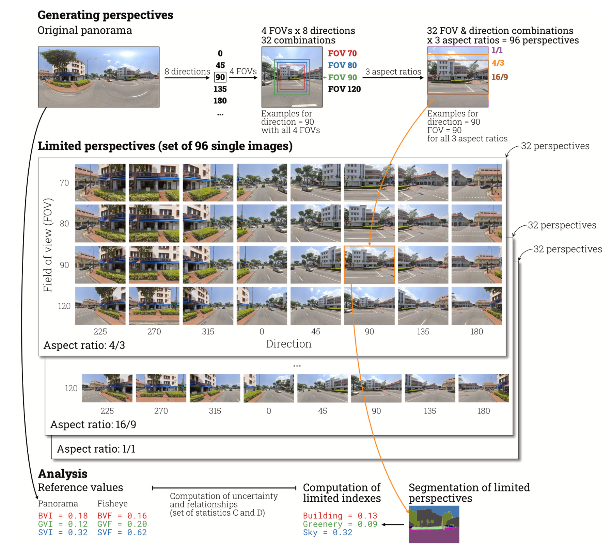
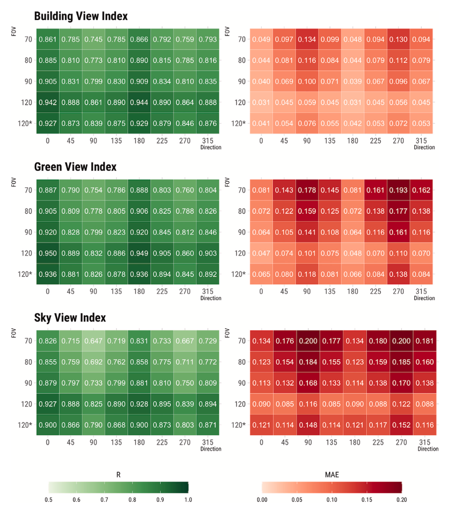
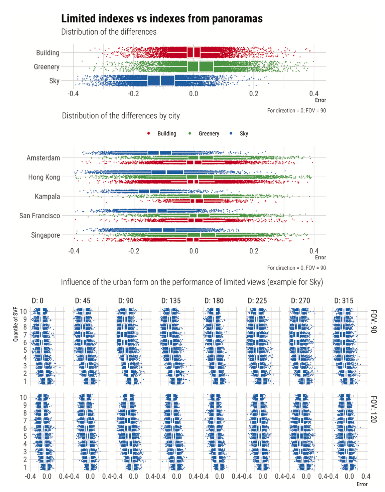
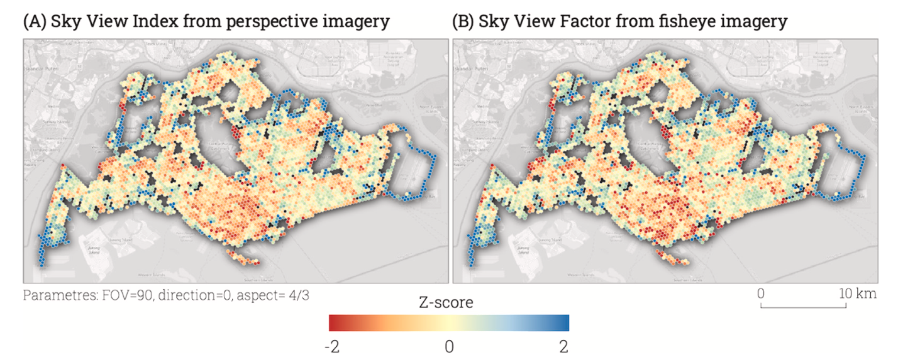
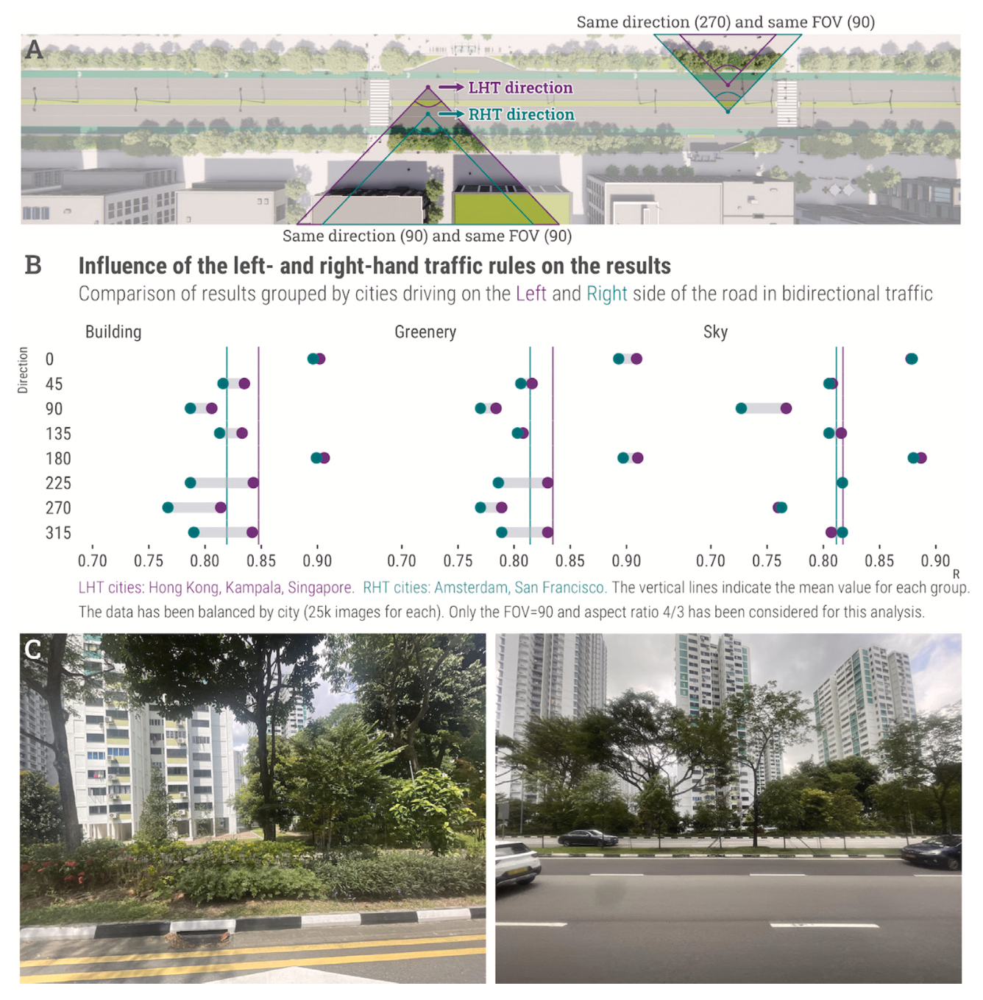
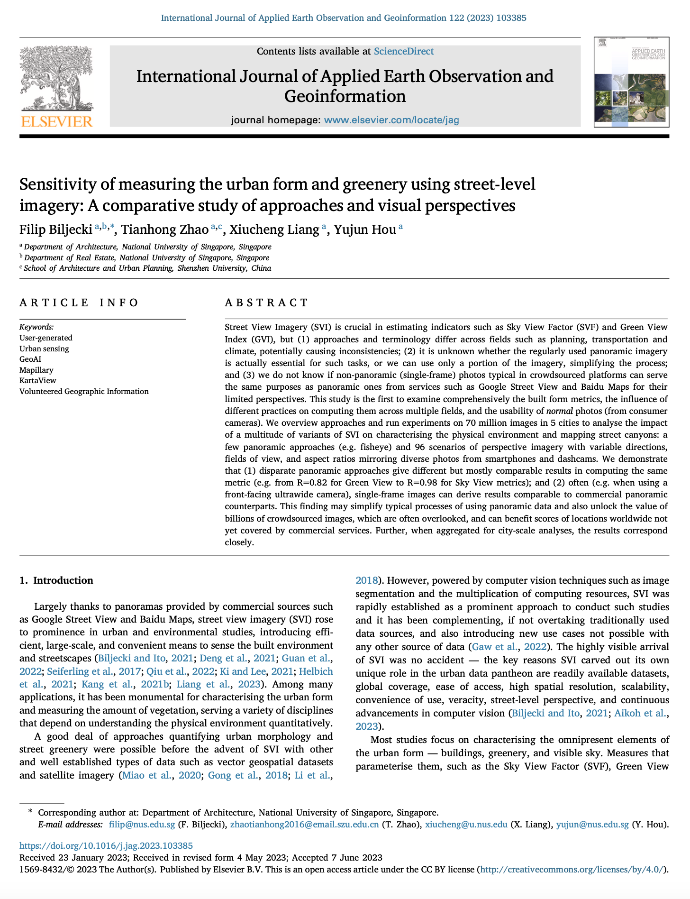

We are glad to share our new paper:

> Biljecki F, Zhao T, Liang X, Hou Y (2023): Sensitivity of measuring the urban form and greenery using street-level imagery: A comparative study of approaches and visual perspectives. _International Journal of Applied Earth Observation and Geoinformation_ 122: 103385. [<i class="ai ai-doi-square ai"></i> 10.1016/j.jag.2023.103385](https://doi.org/10.1016/j.jag.2023.103385) [<i class="far fa-file-pdf"></i> PDF](/publication/2023-jag-svi-sensitivity/2023-jag-svi-sensitivity.pdf)</i>  <i class="ai ai-open-access-square ai"></i>

This research was led by {}, and contributed by {}, {}, and {}.

The paper clarifies two matters related to street view imagery (SVI), which are arguably relevant but have not been examined yet:

1. Understanding the different ways that SVI is used to measure the urban form: green view index, sky view factor... These metrics are omnipresent in hundreds of papers, but can actually be computed in different ways, and the approaches have not been compared.

1. Understanding whether crowdsourced SVI (e.g. Mapillary & KartaView) can replace data from far more popular commercial sources such as Google Street View and Baidu Maps.
This is a broad topic because these data provenances differ in many ways -- completeness, image quality, etc. (we did publish [a paper]() on that, led by {}).
This new paper tackles one aspect: whether single images (like those collected from smartphones and dashcams) can be employed for the same use cases as panoramic images are routinely used for.
Most notably, the crowdsourced images usually have a limited view, as opposed to a panoramic insight in the streetscape, and we looked into whether that may be an obstacle.
We suspected it may be, because [the review paper we published in 2021]() found that only 1-2% studies use crowdsourced data. But is that really an obstacle?

To investigate both these aspects, we sourced 670k images from 5 cities around the world (this is another contribution since studies that use SVI rarely focus on multiple cities).
We simulated about 100 scenarios of different consumer cameras and settings of capture, e.g. capturing imagery looking at the right side of driving, at a field of view of 140 degrees and aspect ratio 16/9.
We ended up having 70 million images to analyse, deriving 210 million metrics (since we focused on 3 metrics: greenery, sky, and buildings).

Long story short:
1. We demonstrate that different ways result in having similar (R=0.82 for green view) to pretty much the same (R=0.98 for sky view) results. Therefore, different approaches of deriving similar metrics are mostly equivalent. 
1. Single images of a particular setting (e.g. for the scenario described above -- FOV=140, AR=16/9, D=0, we established that R is 0.92, pretty high).
That means that (i) crowdsourced imagery may be more useful than many may think; and (ii) when using GSV data, maybe we don't need the whole panorama, and we can simplify the process by using just one perspective image. This is important to our research group, since much of our research is increasingly shifting towards crowdsourced data, and some of us already use Mapillary and its limited images extensively (e.g. [the recent work]() by {} published in EPB).

You are welcome to check out the comprehensive findings in [the open access paper](/publication/2023-jag-svi-sensitivity/).











### Abstract

> Street View Imagery (SVI) is crucial in estimating indicators such as Sky View Factor (SVF) and Green View Index (GVI), but (1) approaches and terminology differ across fields such as planning, transportation and climate, potentially causing inconsistencies; (2) it is unknown whether the regularly used panoramic imagery is actually essential for such tasks, or we can use only a portion of the imagery, simplifying the process; and (3) we do not know if non-panoramic (single-frame) photos typical in crowdsourced platforms can serve the same purposes as panoramic ones from services such as Google Street View and Baidu Maps for their limited perspectives. This study is the first to examine comprehensively the built form metrics, the influence of different practices on computing them across multiple fields, and the usability of normal photos (from consumer cameras). We overview approaches and run experiments on 70 million images in 5 cities to analyse the impact of a multitude of variants of SVI on characterising the physical environment and mapping street canyons: a few panoramic approaches (e.g. fisheye) and 96 scenarios of perspective imagery with variable directions, fields of view, and aspect ratios mirroring diverse photos from smartphones and dashcams. We demonstrate that (1) disparate panoramic approaches give different but mostly comparable results in computing the same metric (e.g. from R=0.82 for Green View to R=0.98 for Sky View metrics); and (2) often (e.g. when using a front-facing ultrawide camera), single-frame images can derive results comparable to commercial panoramic counterparts. This finding may simplify typical processes of using panoramic data and also unlock the value of billions of crowdsourced images, which are often overlooked, and can benefit scores of locations worldwide not yet covered by commercial services. Further, when aggregated for city-scale analyses, the results correspond closely.

### Highlights

+ Comprehensive examination of approaches to estimating the urban form.
+ Different characteristics of data impact the measurements.
+ Novel method studying uncertainty in a controlled, simulated and scalable environment.
+ Multi-dimensional and multi-city experiments on buildings, greenery, and sky view.
+ Reliability of single (crowdsourced) imagery is comparable to commercial panoramas.

### Paper 

For more information, please see the [paper](/publication/2023-jag-svi-sensitivity/) (open access <i class="ai ai-open-access-square ai"></i>).

[](/publication/2023-jag-svi-sensitivity/)

BibTeX citation:
```bibtex
@article{2023_jag_svi_sensitivity,
  author = {Filip Biljecki and Tianhong Zhao and Xiucheng Liang and Yujun Hou},
  doi = {10.1016/j.jag.2023.103385},
  journal = {International Journal of Applied Earth Observation and Geoinformation},
  pages = {103385},
  title = {{Sensitivity of measuring the urban form and greenery using street-level imagery: A comparative study of approaches and visual perspectives}},
  volume = {122},
  year = {2023}
}
```
