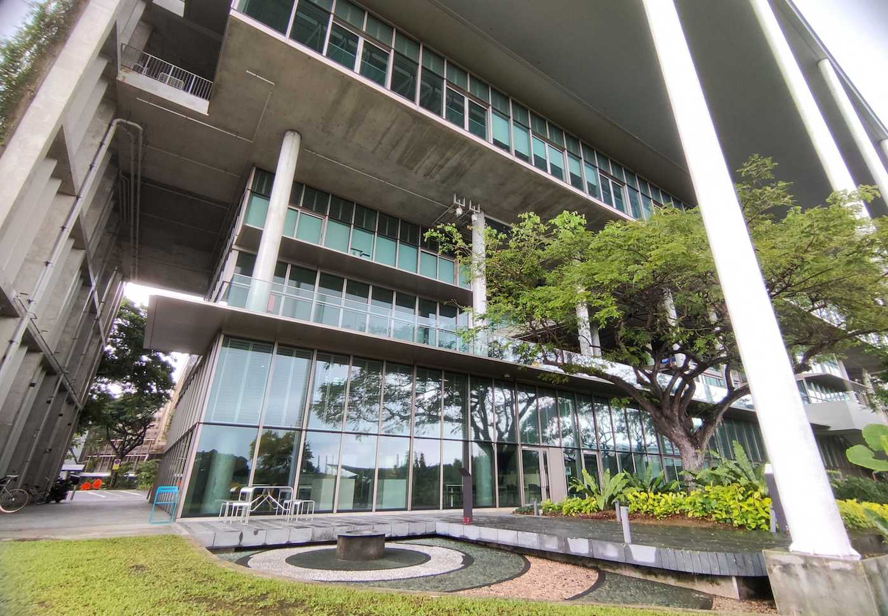

It was an honour to have Professor Carlo Ratti from the [MIT Senseable City Lab](https://senseable.mit.edu) visit our research group at the net-zero energy building SDE4 of our College of Design and Engineering.
We look forward to collaborations with his esteemed research group at the Massachusetts Institute of Technology.

