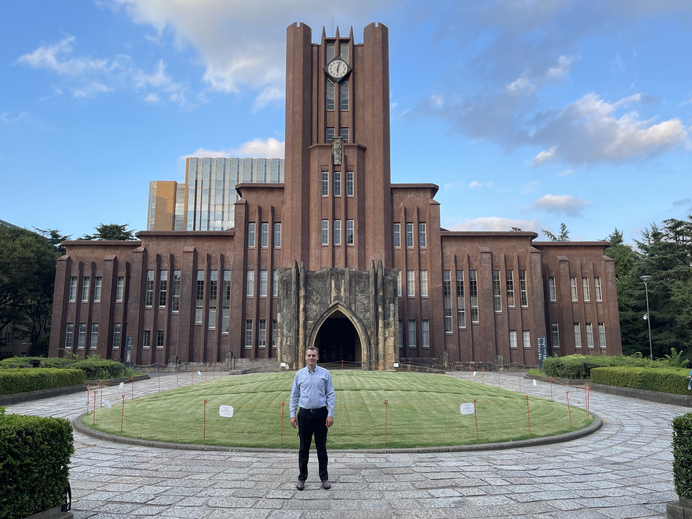

The PI of the Lab, , represented the Lab during a recent research visit to Japan :jp:.
He has been invited to meetings at the R&D Institute of [Takenaka Corporation](https://www.takenaka.co.jp/takenaka_e/).
We have recently started [collaborating]() with this prominent Japanese construction company and are excited to expand it.

While in Japan, Filip visited also the following universities:
+ Kyoto University
+ Kyoto Institute of Technology
+ University of Tokyo
+ Ritsumeikan University

for collaborative exchanges and guest lectures at departments and research groups in our domain.

Thank you for the insightful and productive discussions, and sharing the inspiring work.
The hospitality is very much appreciated, and we look forward to collaborating.

