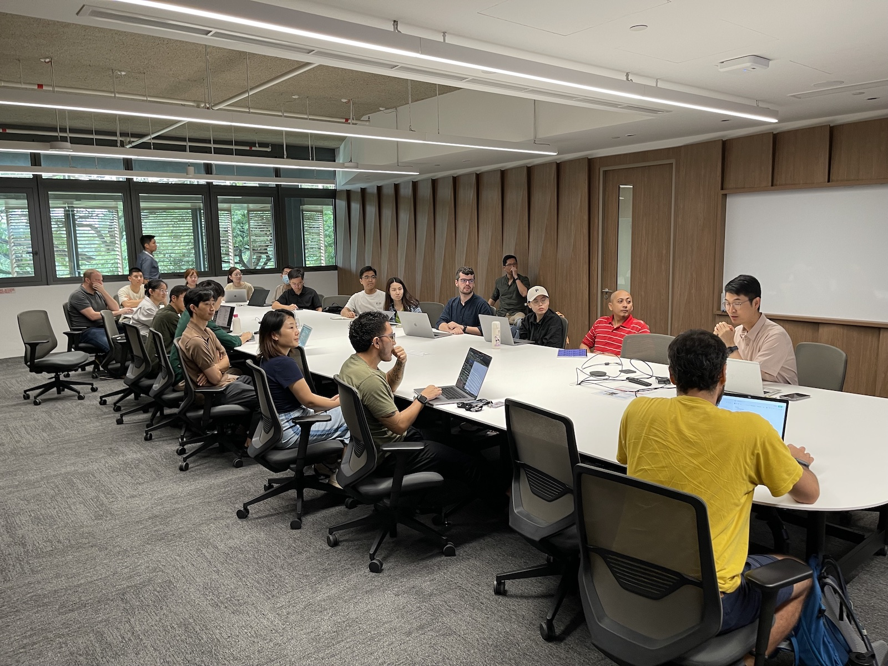
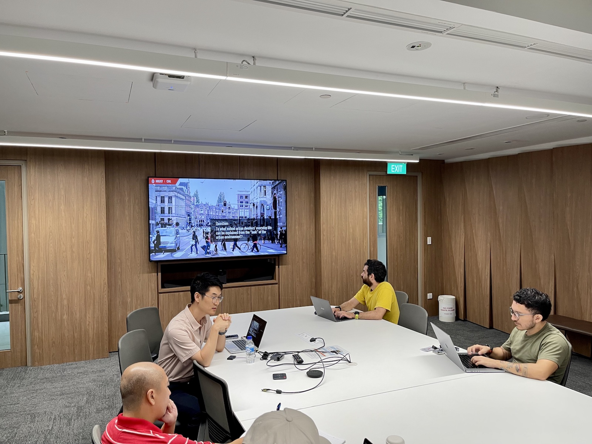
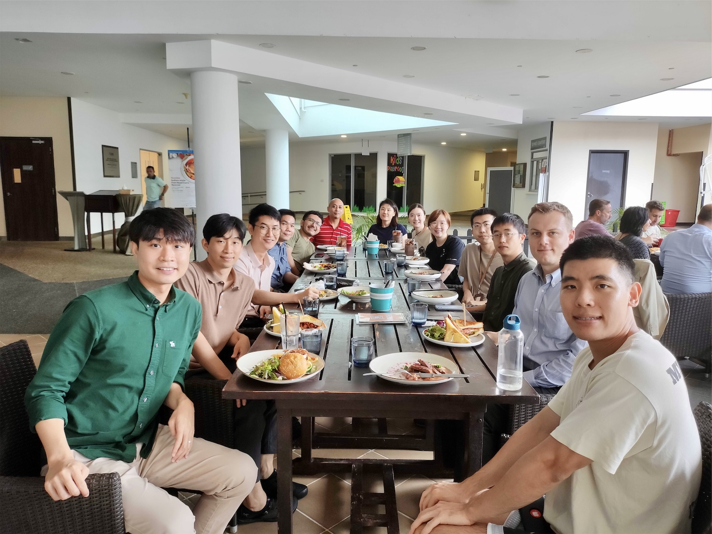
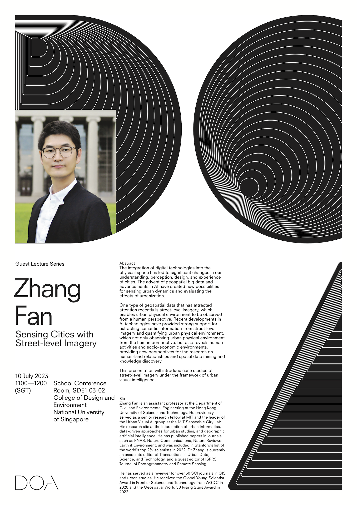

Our Lab and department hosted Dr [Zhang Fan](https://www.ce.ust.hk/people/fan-zhang-zhangfan) from the [Department of Civil and Environmental Engineering](https://www.ce.ust.hk) at the [Hong Kong University of Science and Technology](https://hkust.edu.hk). 🇭🇰

Fan previously served as a senior research fellow at MIT and the leader of the Urban Visual AI group at the MIT Senseable City Lab.
His research sits at the intersection of urban Informatics, data-driven approaches for urban studies, and geographic artificial intelligence.
He has published papers in journals such as PNAS, Nature Communications, Nature Reviews Earth & Environment, and was included in Stanford's list of the world's top 2% scientists in 2022.
Dr Zhang is currently an associate editor of Transactions in Urban Data, Science, and Technology, and a guest editor of ISPRS Journal of Photogrammetry and Remote Sensing.
He has served as a reviewer for over 50 SCI journals in GIS and urban studies.
He received the Global Young Scientist Award in Frontier Science and Technology from WGDC in 2020 and the Geospatial World 50 Rising Stars Award in 2022.

During his stay, Fan delivered the lecture _Sensing Cities with Street-Level Imagery_ (poster and abstract below).

Thanks, and looking forward to future collaborations!

### Abstract of the lecture

> The integration of digital technologies into the physical space has led to significant changes in our understanding, perception, design, and experience of cities. The advent of geospatial big data and advancements in AI have created new possibilities for sensing urban dynamics and evaluating the effects of urbanization. One type of geospatial data that has attracted attention recently is street-level imagery, which enables urban physical environment to be observed from a human perspective. Recent developments in AI technologies have provided strong support for extracting semantic information from street-level imagery and quantifying urban physical environment, which not only observing urban physical environment from the human perspective, but also reveals human activities and socio-economic environments, providing new perspectives for the research on human-land relationships and spatial data mining and knowledge discovery. This presentation will introduce case studies of street-level imagery under the framework of urban visual intelligence.
