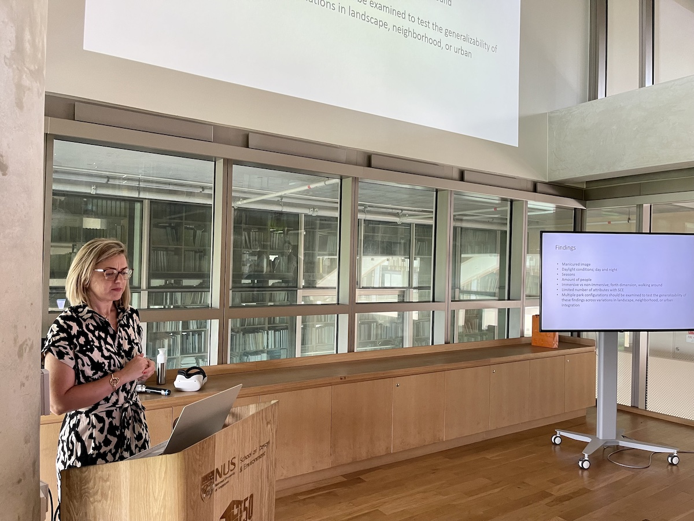
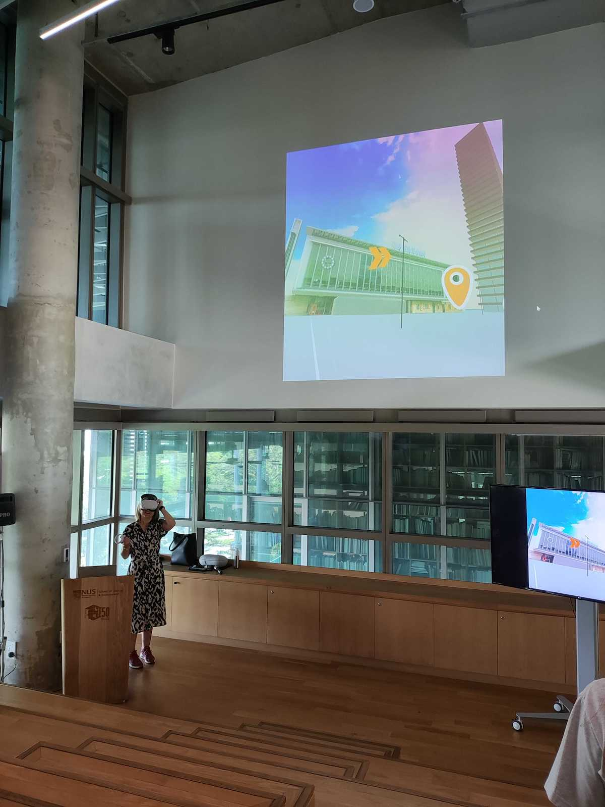
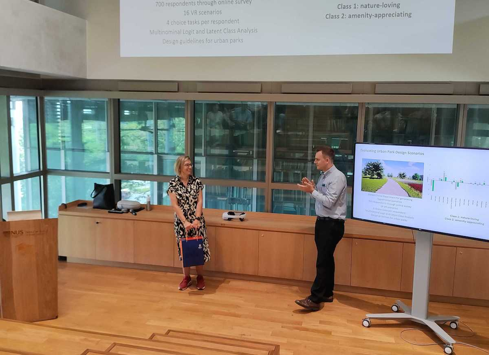
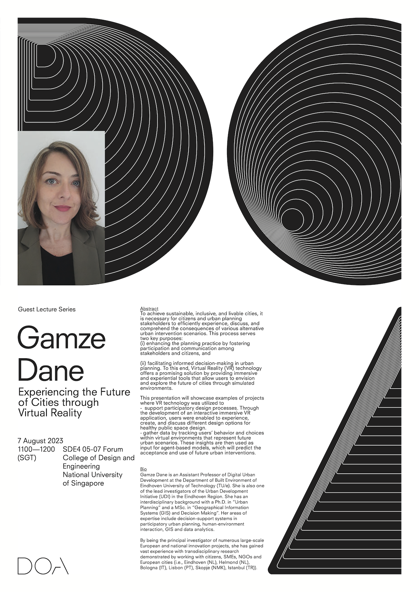

This week, our Lab and department are hosting Dr [Gamze Dane](https://gamzedane.com),
[Department of Built Environment](https://www.tue.nl/en/our-university/departments/built-environment), 
[Eindhoven University of Technology](https://www.tue.nl/en/),
the Netherlands. :netherlands:

Gamze Dane is an Assistant Professor of Digital Urban Development at the Department of Built Environment of Eindhoven University of Technology (TU/e). She is also one of the lead investigators of the Urban Development Initiative (UDI) in the Eindhoven Region. She has an interdisciplinary background with a Ph.D. in “Urban Planning” and a MSc. in “Geographical Information Systems (GIS) and Decision Making”. Her areas of expertise include decision-support systems in participatory urban planning, human-environment interaction, GIS and data analytics. By being the principal investigator of numerous large-scale European and national innovation projects, she has gained vast experience with transdisciplinary research demonstrated by working with citizens, SMEs, NGOs and European cities (i.e., Eindhoven (NL), Helmond (NL), Bologna (IT), Lisbon (PT), Skopje (NMK), Istanbul (TR)).

To kickstart her stay, Gamze delivered the guest lecture _Experiencing the Future of Cities through Virtual Reality_ (poster and abstract below).

Thanks, and looking forward to future collaborations!

### Abstract of the lecture

> To achieve sustainable, inclusive, and livable cities, it is necessary for citizens and urban planning stakeholders to efficiently experience, discuss, and comprehend the consequences of various alternative urban intervention scenarios. This process serves two key purposes: (i) enhancing the planning practice by fostering participation and communication among stakeholders and citizens, and (ii) facilitating informed decision-making in urban planning. To this end, Virtual Reality (VR) technology offers a promising solution by providing immersive and experiential tools that allow users to envision and explore the future of cities through simulated environments.
> This presentation will showcase examples of projects where VR technology was utilized to
> + support participatory design processes. Through the development of an interactive immersive VR application, users were enabled to experience, create, and discuss different design options for healthy public space design.
> + gather data by tracking users’ behavior and choices within virtual environments that represent future urban scenarios. These insights are then used as input for agent-based models, which will predict the acceptance and use of future urban interventions.
