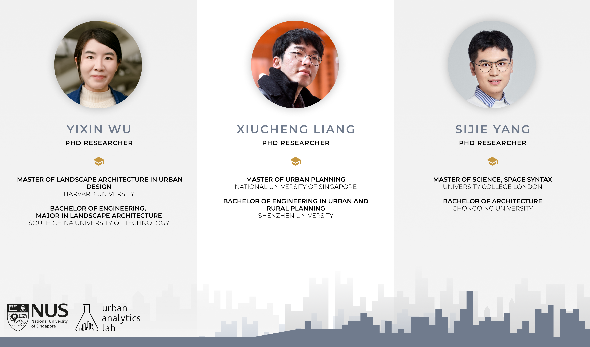

A warm welcome to our three new researchers embarking on their doctoral journeys this month: , , and .

They will work on our research lines exploring emerging urban datasets and their new applications in data-driven urban planning.

It is great to have them with us and we are excited to follow their progress towards developing innovative methods to harness urban data and transforming them into actionable insights that can help us build smarter and better cities. 🏙️💡

