The PI of the Lab, , represented the Lab during a recent research visit to Thailand :thailand:.

He has been invited to give guest lectures and participate in collaborative exchanges at multiple leading Thai institutions:
+ [Chulalongkorn University](https://www.chula.ac.th/en/)
+ [Asian Institute of Technology](https://ait.ac.th/), [Geoinformatics Centre](https://ait.ac.th/centre/geoinformatics-center/)
+ [Chiang Mai University](https://www.cmu.ac.th/en/), [Faculty of Engineering](https://www.cmu.ac.th/en/faculty/engineering/aboutus/head) (a press release by the university can be found [here](https://eng.cmu.ac.th/?p=34277))
+ [Urban Design and Development Center](https://www.uddc.net/)

Besides the guest lectures and workshops, he met vice presidents, deans and heads of departments, and discussed collaboration opportunities.

Many thanks for the hosts for the insightful and productive discussions, and sharing the inspiring work.
The hospitality is very much appreciated, and we look forward to collaborating.

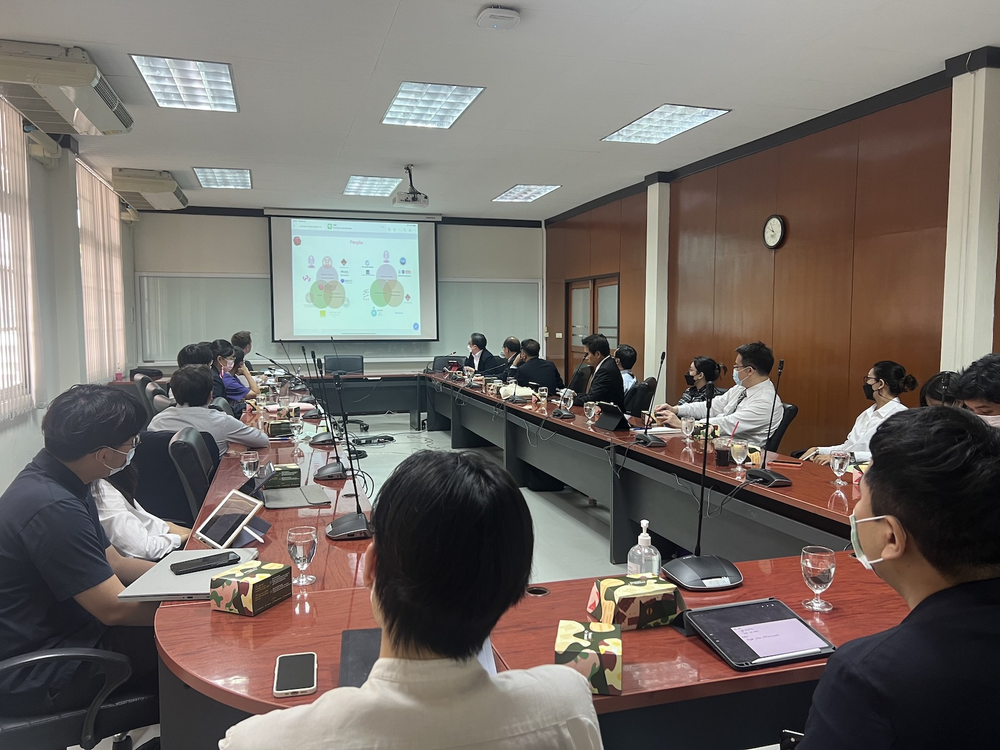

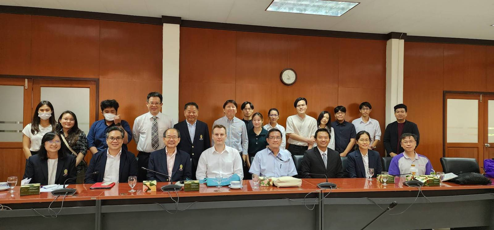

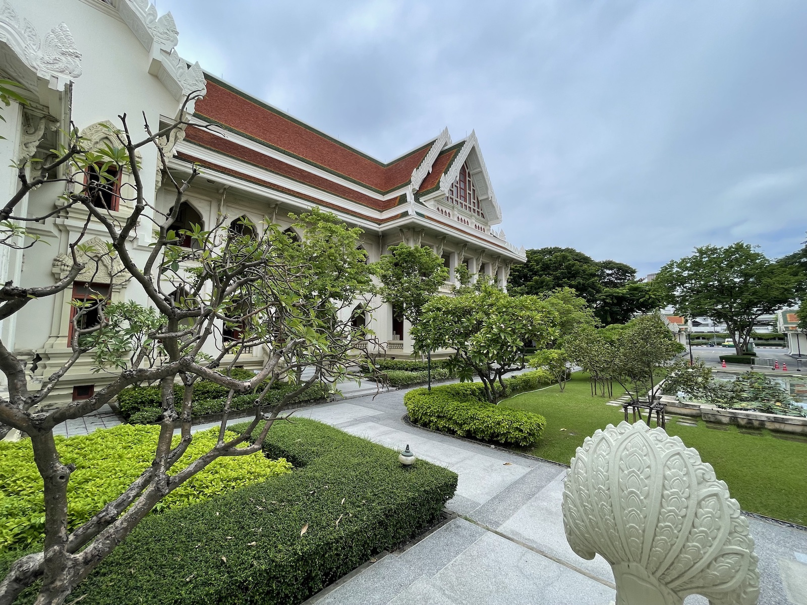

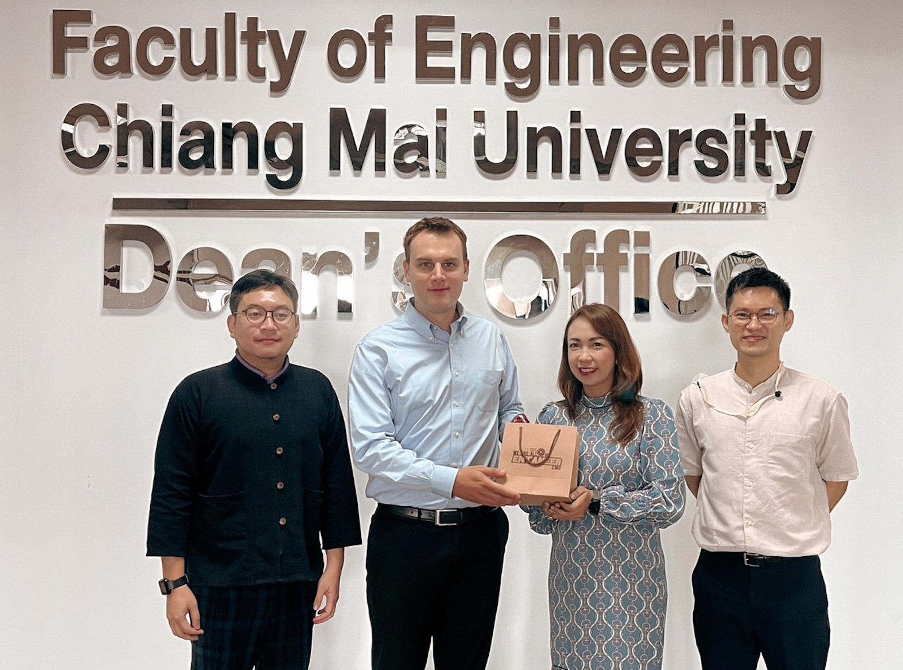

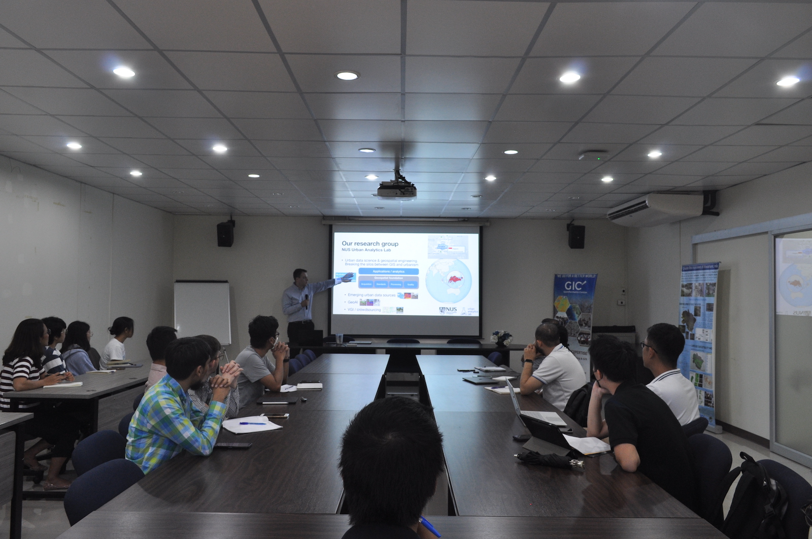

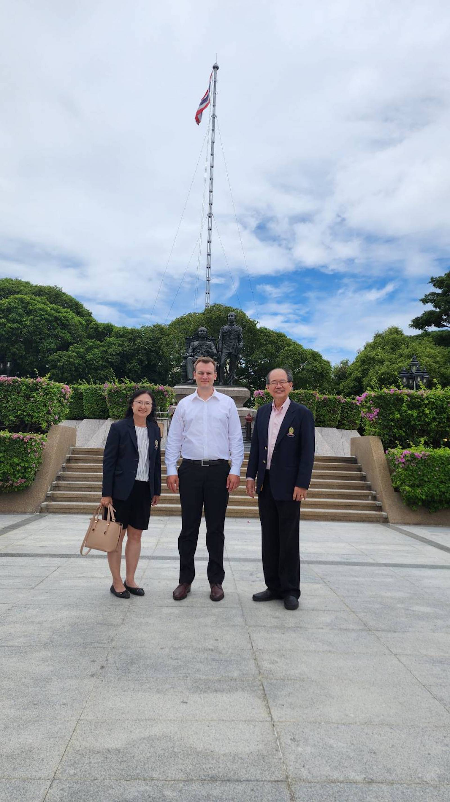

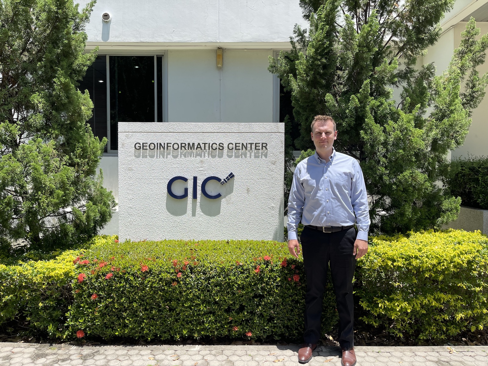

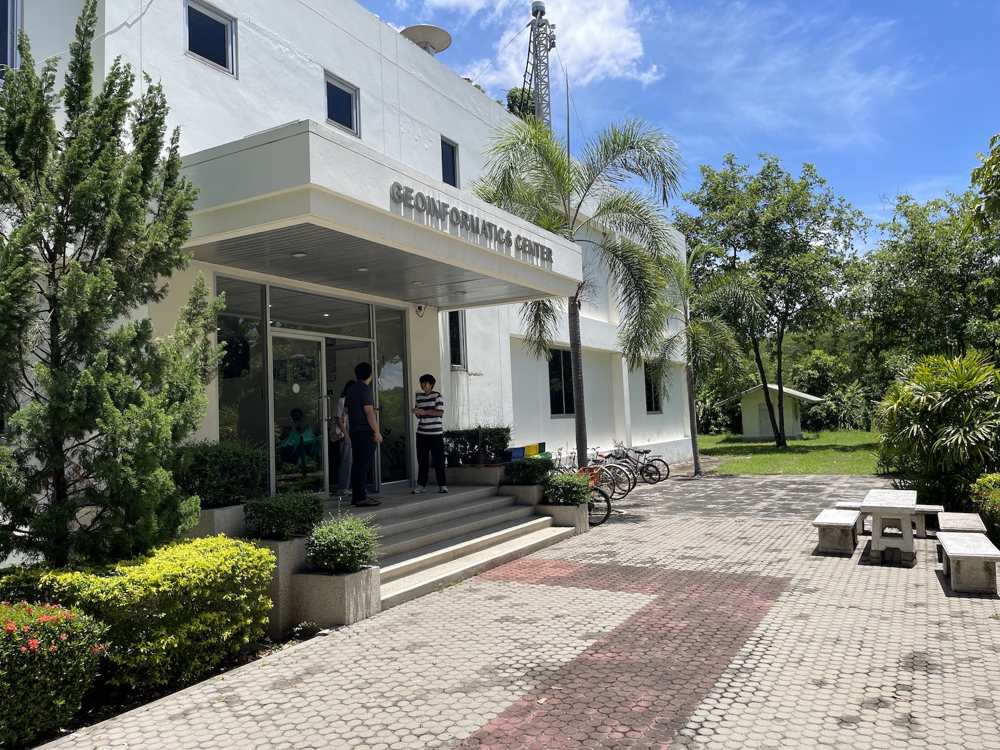

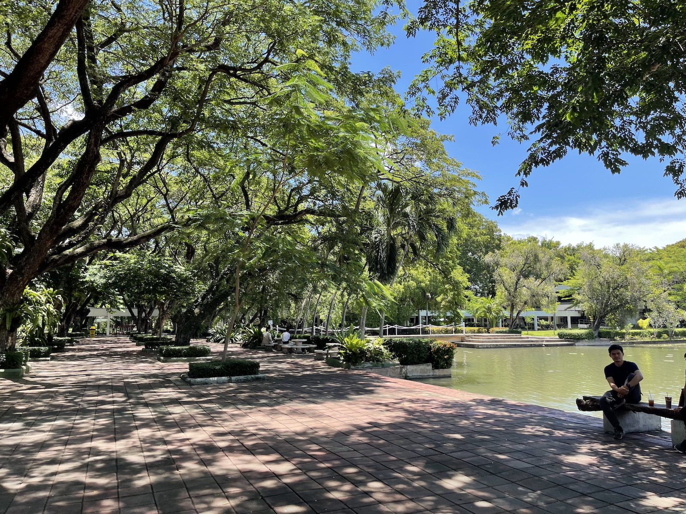

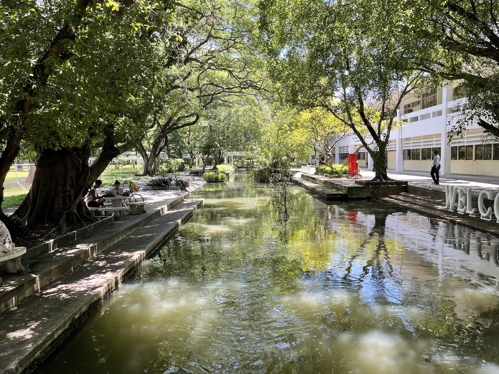

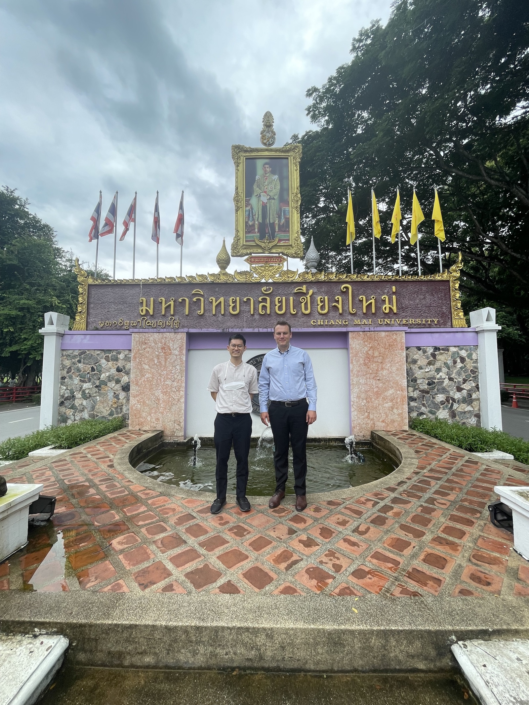

