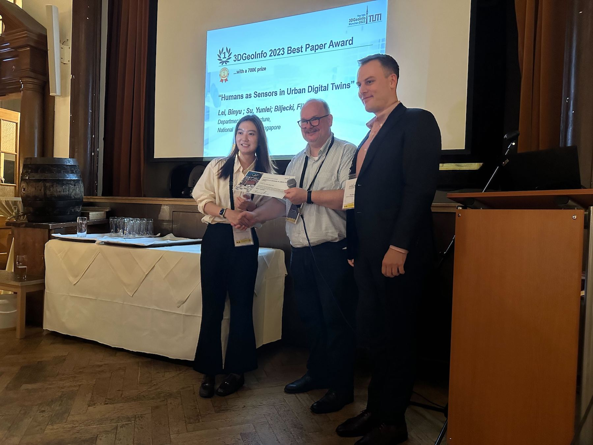
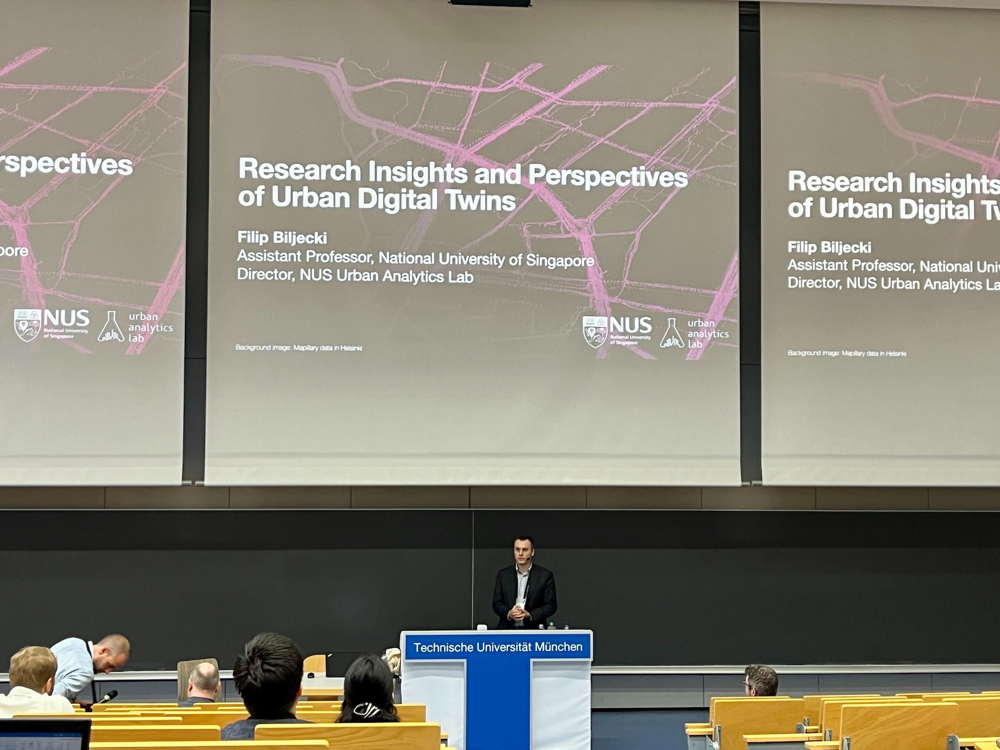
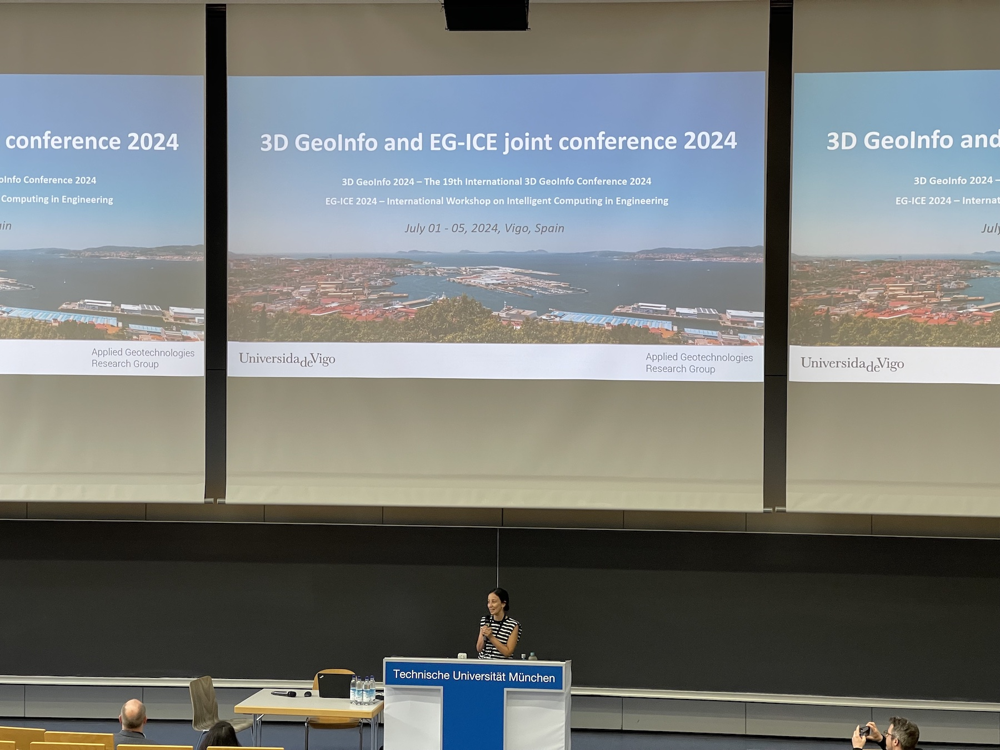

The [18th International 3D GeoInfo Conference 2023](https://www.3dgeoinfo.org/3dgeoinfo/) took place in Munich, Germany on 13-14 September 2023.
It was hosted by the [Chair of Geoinformatics at the Technical University of Munich](https://www.asg.ed.tum.de/en/gis/home/) led by [Professor Thomas H. Kolbe](https://www.asg.ed.tum.de/en/gis/our-team/staff/prof-thomas-h-kolbe/).

3D GeoInfo is the leading conference in this domain, and it started in 2006 in Kuala Lumpur, Malaysia under the auspices of Professor Alias Abdul Rahman and his research group.
We organised its [2019 instance in Singapore](), together with the Singapore Land Authority.

Prior to the conference, a full-day workshop --- _International Forum on Urban Digital Twins_ --- was organised by the City of Munich in cooperation with TUM.

Both the Forum and the conference had many interesting talks on the most recent developments in 3D GIS and urban digital twins.
Academics (mostly representing research groups in Europe), local governments (e.g. Munich, Barcelona, Utrecht, Helsinki, ...), and practioners were all well represented and significantly contributed. 
Further, the European Commission has a presentation as well.

Our research group was represented by  and .

 has presented the paper _Humans as Sensors in Urban Digital Twins_, which was coauthored with  and .
This paper was awarded the best paper of the conference. 🏆

 gave a keynote --- _Research Insights and Perspectives of Urban Digital Twins_ --- presenting our latest work, especially in the domain of urban digital twins, which is conducted also in collaboration with other research groups at NUS.

It was a great conference.
We highly appreciate the organisation by TU Munich and the City of Munich (please see the photo below for the full list of people involved).

The next instance of the conference, in July 2024, will be organised in Vigo, Spain under the leadership of Lucía Díaz Vilariño.
See below for a slide with more information, including the dates.

Our Lab remains committed to contributing to this vibrant community, and we very much look forward to the next instance of the conference.

