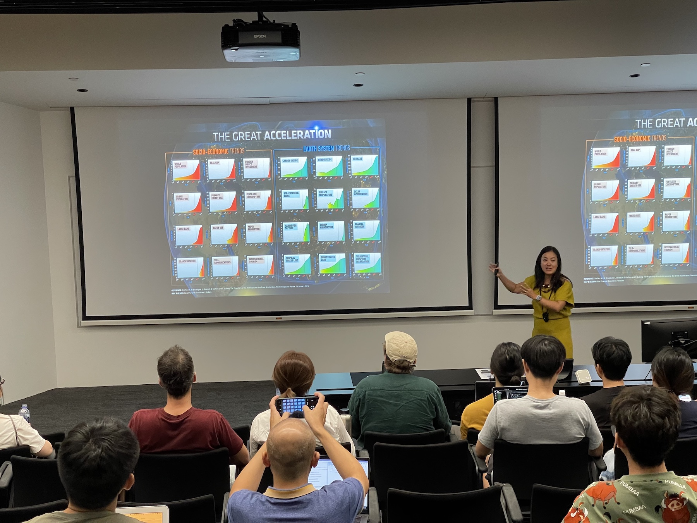
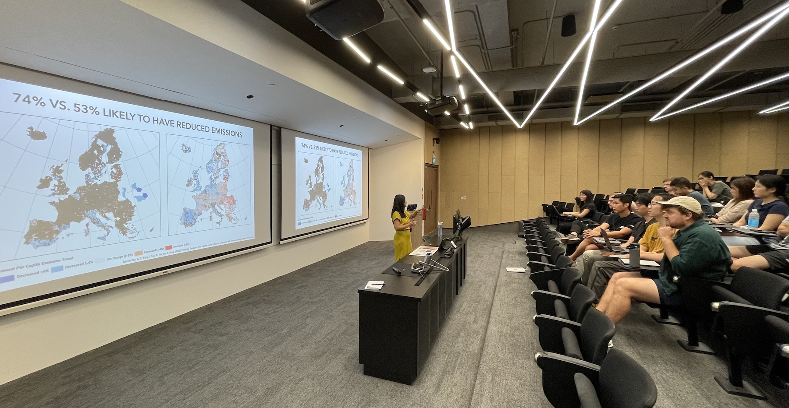

Our Lab and Department are hosting Prof [Angel Hsu](https://publicpolicy.unc.edu/person/hsu-angel/) from the [Data-Driven EnviroLab](https://datadrivenlab.org) at [The University of North Carolina at Chapel Hill](https://www.unc.edu/),
USA :us:

Dr Angel Hsu is an Assistant Professor of Public Policy and the Environment at UNC-Chapel Hill. She is the founder and director of the Data-Driven EnviroLab, an interdisciplinary research group that applies quantitative approaches to pressing environmental issues. She focuses on the convergence of urbanization and climate change, specifically delving into how cities play dual roles as contributors to and potential solutions to climate change. She was a contributing author to the IPCC 6th Assessment Report and lead author of the 2018 UNEP Emissions Gap Report chapter on non-state and subnational actors. She regularly advises governments, and has chaired and contributed to the World Economic Forum’s Global Future Councils and was a 2018 TED Age of Amazement and 2020 TED Climate Countdown invited speaker. She has a Ph.D. in Environmental Policy from Yale University and was formerly an Assistant Professor of Environmental Studies at Yale-NUS College in Singapore from 2015-2020.

Angel delivered the guest lecture _Cities on the Climate Frontlines: Evaluating Urban Climate Change and Policy Responses_ (poster and abstract below).

Thanks, and looking forward to future collaborations!

### Abstract of the lecture

> Cities are both contributors and potential problem solvers of the global climate crisis. They are also vulnerable to climate change impacts, including sea-level rise, extreme heat, and natural disasters. Consequently, they have risen to become prominent climate and environmental sustainability agents, with the UN’s Sustainable Development Goal 11 charging cities to be both sustainable and inclusive and the Paris Agreement’s recognition of their contributions. In this talk, I’ll introduce how my research is utilizing data science to evaluate cities’ contributions to global climate mitigation efforts and urban sustainable development more broadly.

