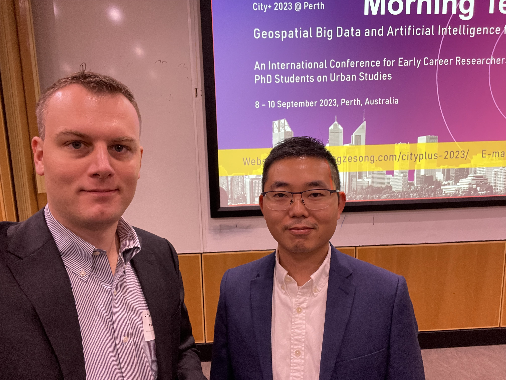

The [2023 edition of the City+ International Conference](https://yongzesong.com/cityplus-2023/) was organised at Curtin University in Perth, Australia 🇦🇺.

The PI of the Lab, , represented the Lab by giving a keynote talk.

Big thanks to [Yongze Song](https://yongzesong.com) and the team for the invitation and the fantastic organisation of the event!

This year's theme of the conference was 'Geospatial Big Data and Artificial Intelligence for Cities', and Yongze and the team attracted 300 participants from 29 countries. 

To follow the work of Yongze and the team, check out the [website](https://yongzesong.com).
In 2024, Curtin University will host another 'geo-conference': the Mid-Term Symposium of the [ISPRS Technical Commission IV 'Spatial Information Science](https://www2.isprs.org/commissions/comm4/activities/)'.

The hospitality is very much appreciated, and we look forward to collaborating.

