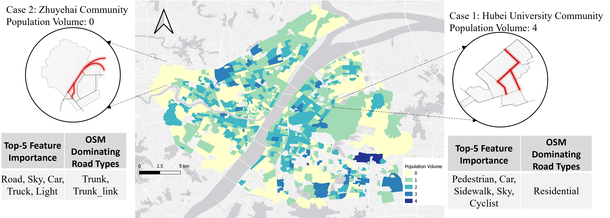
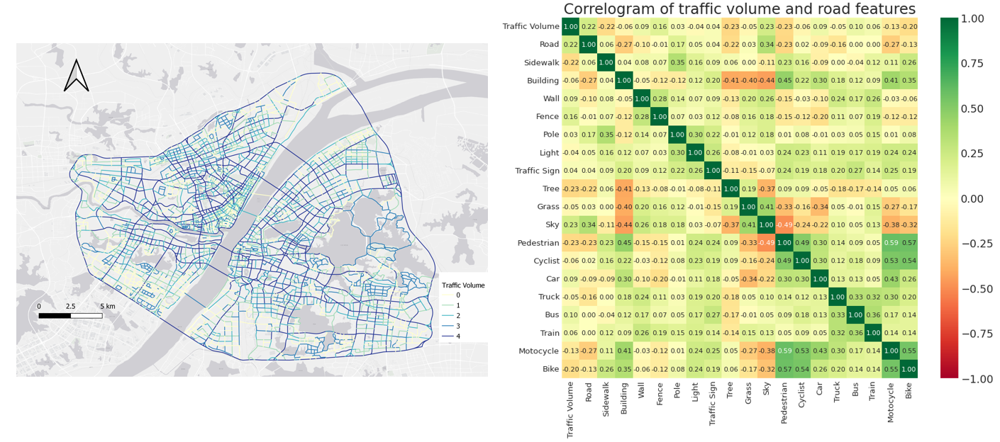
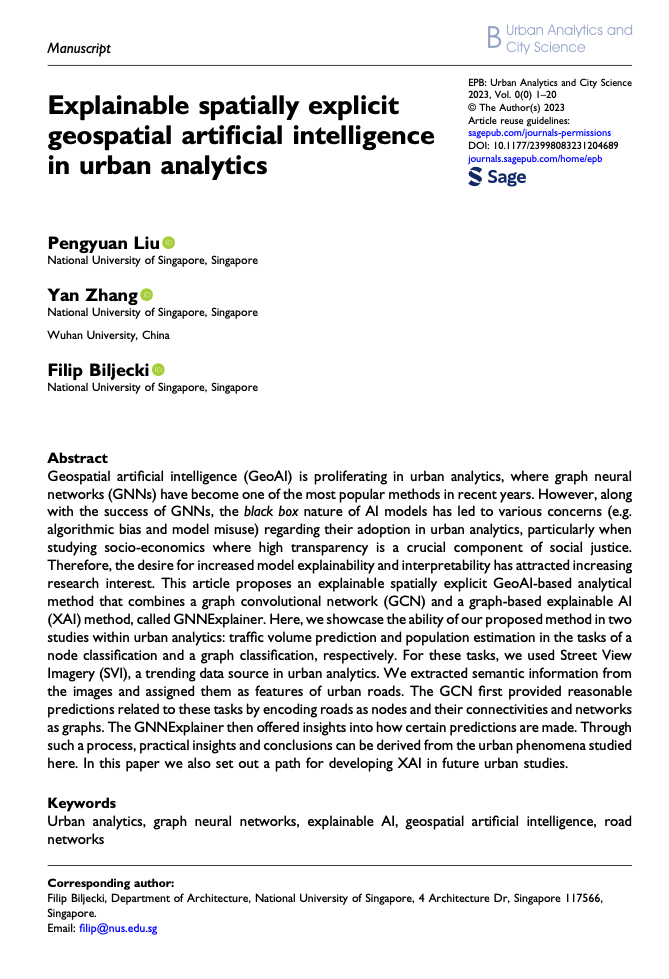

We are glad to share our new paper:

> Liu P, Zhang Y, Biljecki F (2023): Explainable spatially explicit geospatial artificial intelligence in urban analytics. Environment and Planning B: Urban Analytics and City Science. [<i class="ai ai-doi-square ai"></i> 10.1177/23998083231204689](https://doi.org/10.1177/23998083231204689) [<i class="far fa-file-pdf"></i> PDF](/publication/2023-epb-xai/2023-epb-xai.pdf)</i>

This research was led by {}.
Congratulations on the great work! :raised_hands: :clap:

The developed code has been released open-source on its [Github repository](https://github.com/PengyuanLiu1993/XAI-Urban-Analytics).

The paper is available below.





### Abstract

The abstract follows.

> Geospatial artificial intelligence (GeoAI) is proliferating in urban analytics, where graph neural networks (GNNs) have become one of the most popular methods in recent years. However, along with the success of GNNs, the black box nature of AI models has led to various concerns (e.g. algorithmic bias and model misuse) regarding their adoption in urban analytics, particularly when studying socio-economics where high transparency is a crucial component of social justice. Therefore, the desire for increased model explainability and interpretability has attracted increasing research interest. This article proposes an explainable spatially explicit GeoAI-based analytical method that combines a graph convolutional network (GCN) and a graph-based explainable AI (XAI) method, called GNNExplainer. Here, we showcase the ability of our proposed method in two studies within urban analytics: traffic volume prediction and population estimation in the tasks of a node classification and a graph classification, respectively. For these tasks, we used Street View Imagery (SVI), a trending data source in urban analytics. We extracted semantic information from the images and assigned them as features of urban roads. The GCN first provided reasonable predictions related to these tasks by encoding roads as nodes and their connectivities and networks as graphs. The GNNExplainer then offered insights into how certain predictions are made. Through such a process, practical insights and conclusions can be derived from the urban phenomena studied here. In this paper we also set out a path for developing XAI in future urban studies.

### Paper 

For more information, please see the [paper](/publication/2023-epb-xai/).

[](/publication/2023-epb-xai/)

BibTeX citation:
```bibtex
@article{2023_epb_xai,
  author = {Liu, Pengyuan and Yan, Zhang and Biljecki, Filip},
  doi = {10.1177/23998083231204689},
  journal = {Environment and Planning B: Urban Analytics and City Science},
  title = {{Explainable spatially explicit geospatial artificial intelligence in urban analytics}},
  volume = {},
  number = {},
  pages = {},
  year = {2023}
}
```
