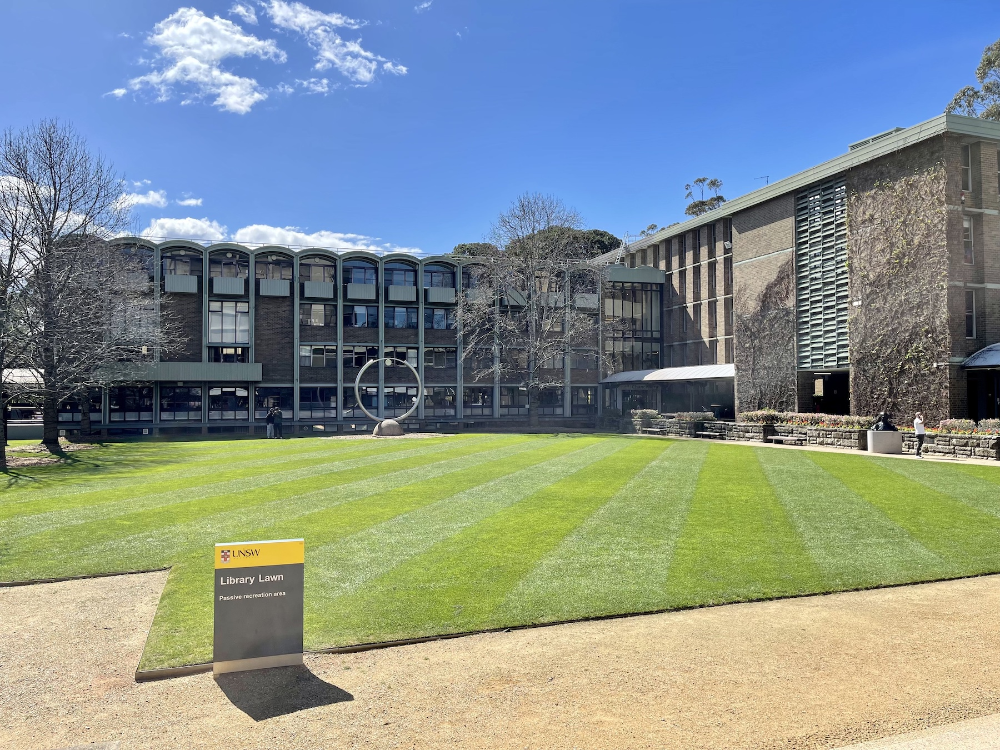
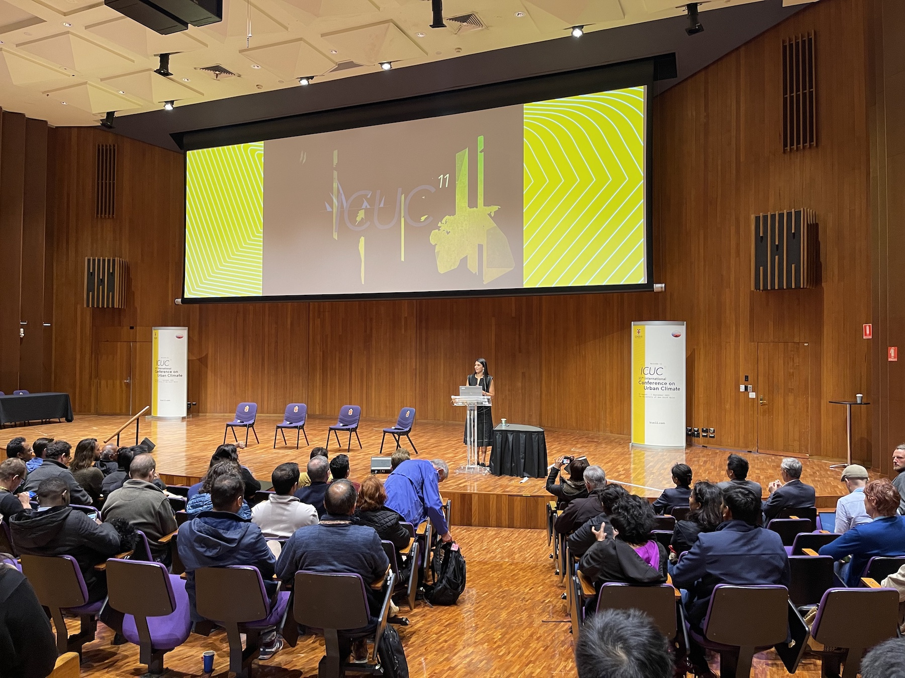
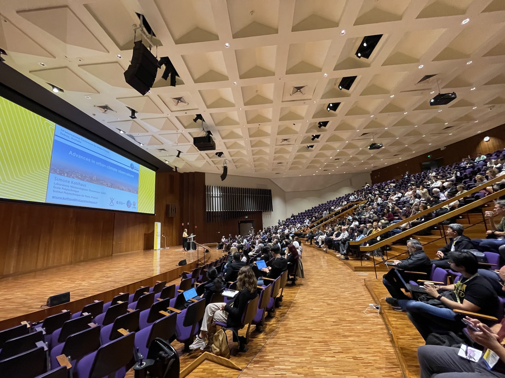
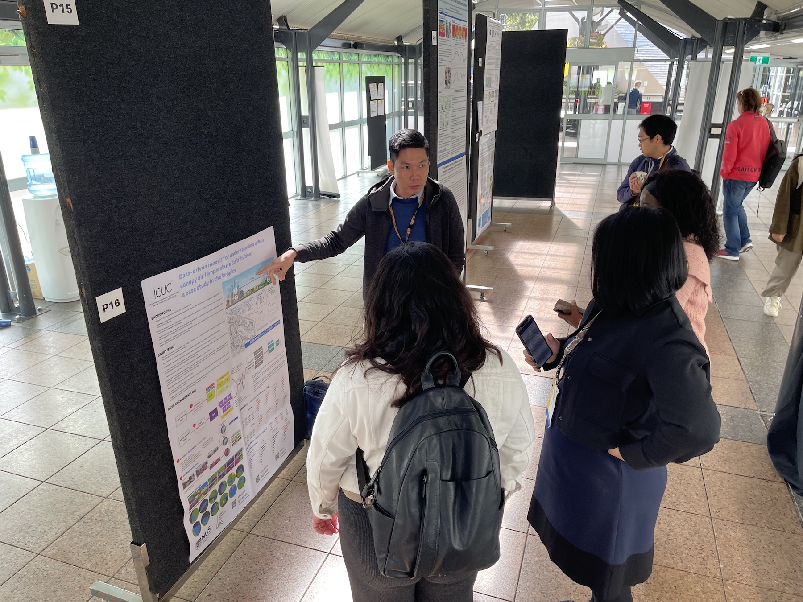
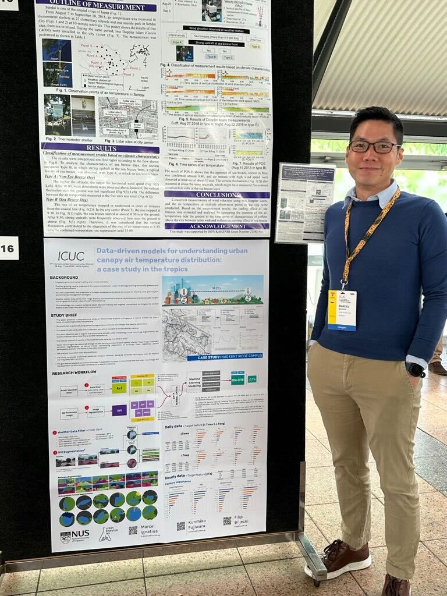
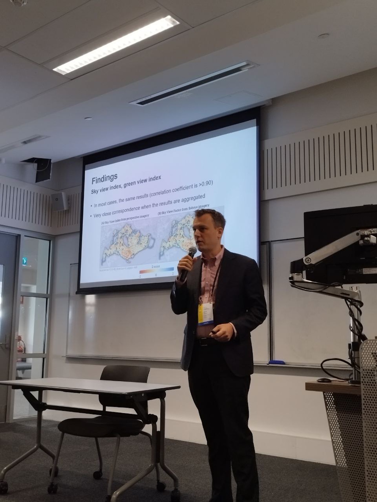
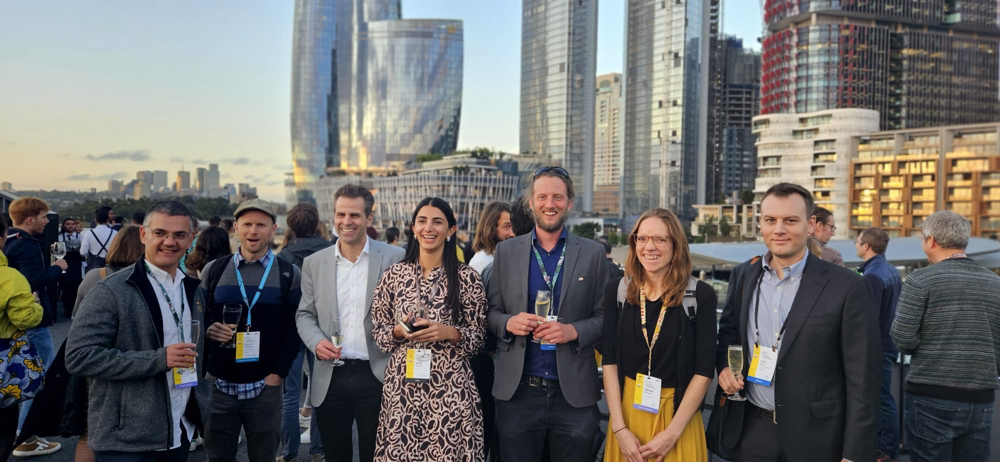

The [11th edition of the International Conference on Urban Climate (ICUC)](https://icuc11.com/) was hosted in Sydney, Australia 🇦🇺.
This truly multidisciplinary conference was organised by the [University of New South Wales](https://www.unsw.edu.au).

Big thanks to [Negin Nazarian](https://research.unsw.edu.au/people/dr-negin-nazarian) and [Melissa Hart](https://research.unsw.edu.au/people/associate-professor-melissa-anne-hart) for the meticulous and smooth organisation.

Our research group and others from the National University of Singapore were well represented.
In particular, we shared details about two ongoing projects.

 presented his multidisciplinary project _Data-driven models for understanding urban canopy air temperature distribution: a case study in the tropics_.
This work is being carried out in collaboration with .
More information about this research can be found [here](https://www.linkedin.com/posts/marcelignatius_icuc11sydney-urbanclimate-microclimateanalysis-activity-7106133611975737344-Am9u).

 has shared details on the investigations on _Crowdsourced imagery for urban climate informatics_, conducted with , , and .
Further, together with Mathew Lipson (Australian Bureau of Meteorology), he co-chaired the session _Urban data for climate modelling and sustainable cities_, which included contributions from several countries.

Also, he gave a guest lecture at the [University of Sydney](https://www.sydney.edu.au) -- [Heat & Health Research Incubator](https://www.sydney.edu.au/medicine-health/our-research/research-centres/heat-and-health-research-incubator.html). 
Many thanks to [Federico Tartarini](https://federicotartarini.github.io) for hosting it.

The hospitality is very much appreciated, and we look forward to the next instance of the conference.

