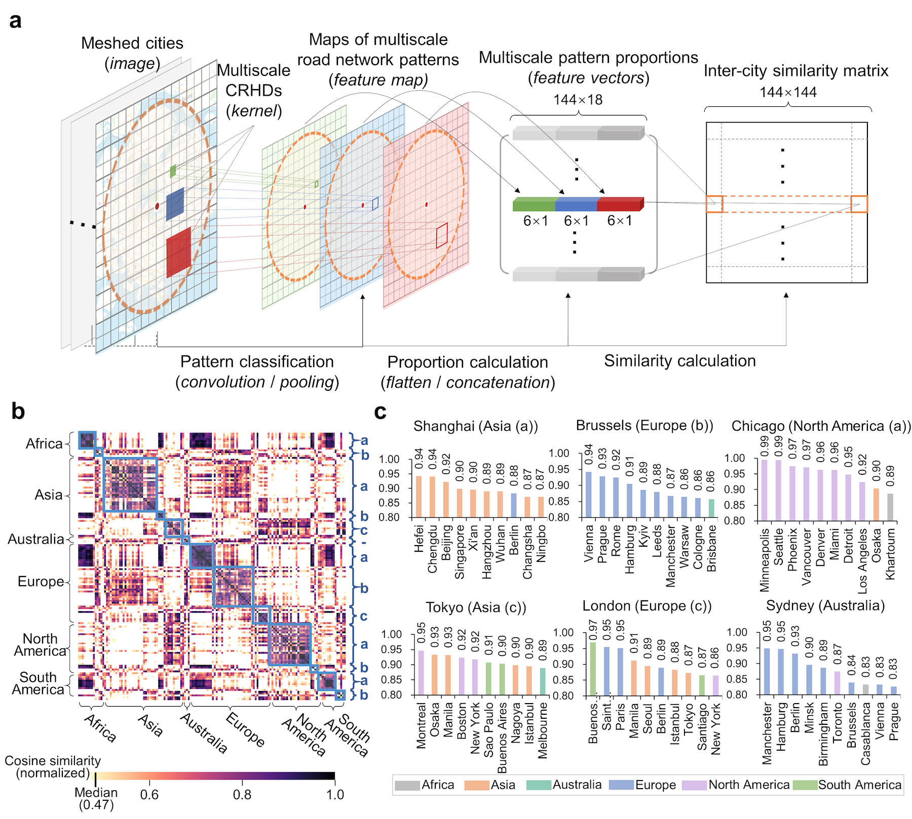
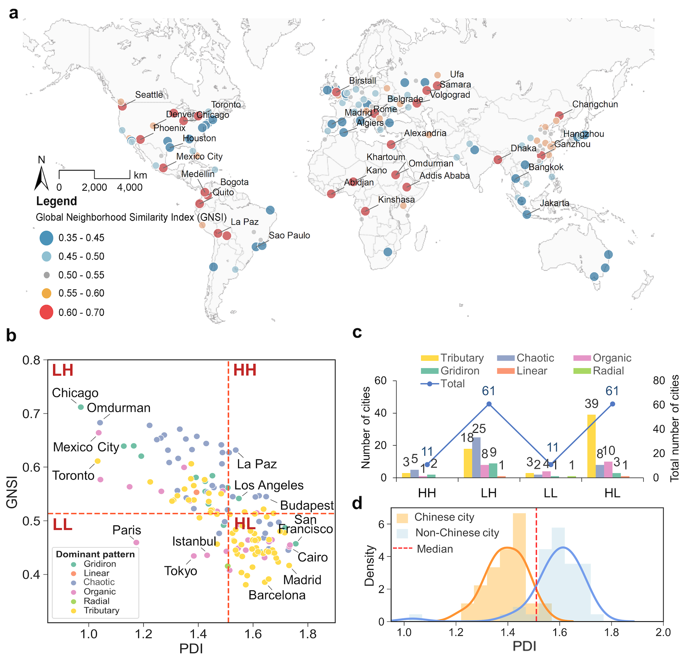
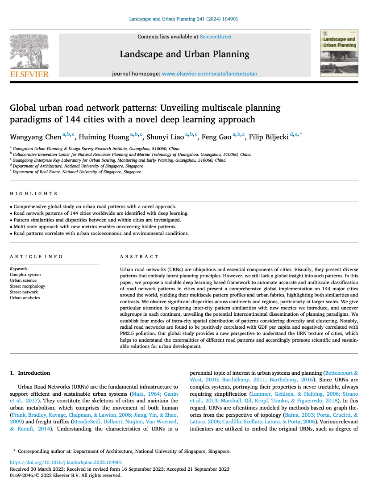

We are glad to share our new paper:

> Chen W, Huang H, Liao S, Gao F, Biljecki F (2024): Global urban road network patterns: Unveiling multiscale planning paradigms of 144 cities with a novel deep learning approach. Landscape and Urban Planning 241: 104901. [<i class="ai ai-doi-square ai"></i> 10.1016/j.landurbplan.2023.104901](https://doi.org/10.1016/j.landurbplan.2023.104901) [<i class="far fa-file-pdf"></i> PDF](/publication/2024-land-urn/2024-land-urn.pdf)</i>

This research was led by {}.
Congratulations on the great and innovative work and publication! :raised_hands: :clap:

The code can be found on its [Github repository](https://github.com/ualsg/Global-road-network-patterns).
The paper is available below.

The [previous publication](/publication/2021-ceus-dl-morphology/) stemming from this research line, which set the foundation of this project, was published in CEUS in 2021.
This paper considerably expands it by introducing several innovations and novelties.





The paper is [available freely](https://authors.elsevier.com/a/1hrEwcUG5SifV) until 2023-11-19.


### Highlights

+ Comprehensive global study on urban road patterns with a novel approach.
+ Road network patterns of 144 cities worldwide are identified with deep learning.
+ Pattern similarities and disparities between and within cities are investigated.
+ Multi-scale approach with new metrics enables uncovering hidden patterns.
+ Road patterns correlate with urban socioeconomic and environmental conditions.

### Abstract

The abstract follows.

> Urban road networks (URNs) are ubiquitous and essential components of cities. Visually, they present diverse patterns that embody latent planning principles. However, we still lack a global insight into such patterns. In this paper, we propose a scalable deep learning-based framework to automate accurate and multiscale classification of road network patterns in cities and present a comprehensive global implementation on 144 major cities around the world, yielding their multiscale pattern profiles and urban fabrics, highlighting both similarities and contrasts. We observe significant disparities across continents and regions, particularly at larger scales. We give particular attention to exploring inter-city pattern similarities with new metrics we introduce, and uncover subgroups in each continent, unveiling the potential intercontinental dissemination of planning paradigms. We establish four modes of intra-city spatial distribution of patterns considering diversity and clustering. Notably, radial road networks are found to be positively correlated with GDP per capita and negatively correlated with PM2.5 pollution. Our global study provides a new perspective to understand the URN texture of cities, which helps to understand the externalities of different road patterns and accordingly promote scientific and sustainable solutions for urban development.

### Paper 

For more information, please see the [paper](/publication/2024-land-urn/).

[](/publication/2024-land-urn/)

BibTeX citation:
```bibtex
@article{2024_land_urn,
  author = {Chen, Wangyang and Huang, Huiming and Liao, Shunyi and Gao, Feng and Biljecki, Filip},
  doi = {10.1016/j.landurbplan.2023.104901},
  journal = {Landscape and Urban Planning},
  title = {{Global urban road network patterns: Unveiling multiscale planning paradigms of 144 cities with a novel deep learning approach}},
  volume = {241},
  pages = {104901},
  year = {2024}
}
```
