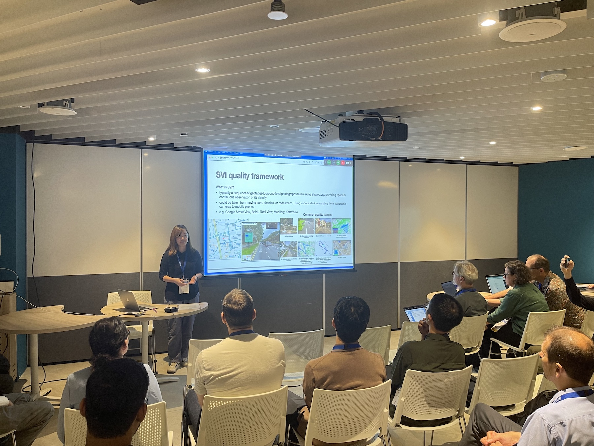
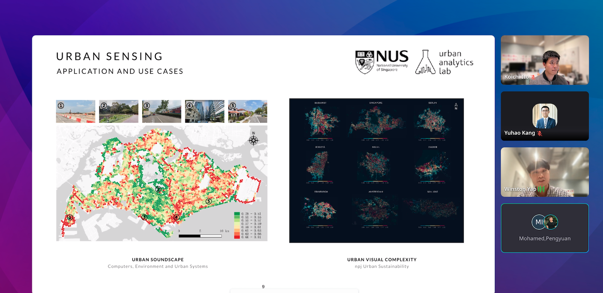
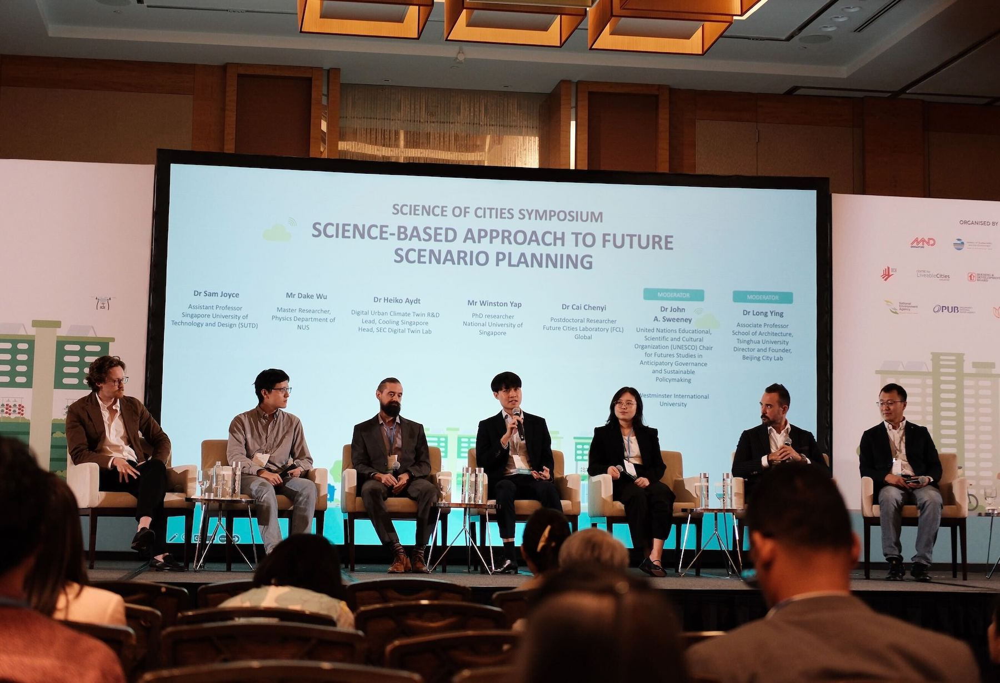
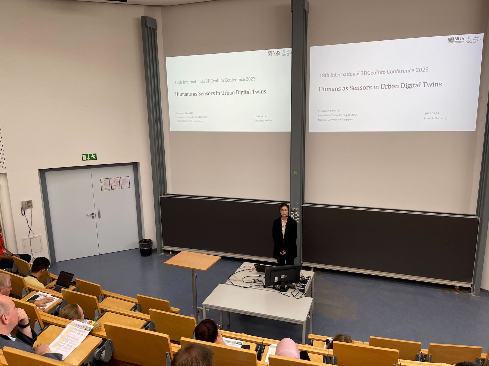
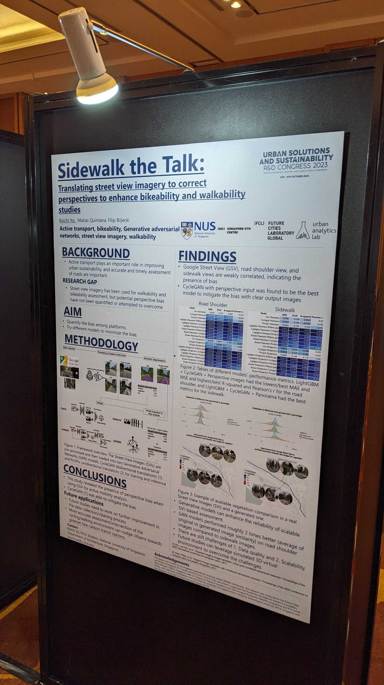

We are happy that recently our PhD and junior researchers have been quite active in outreach, from giving talks to organising sessions and winning awards at the international scale.

For example, {}, {}, and {} have taken part in the [Urban Solutions & Sustainability R&D Congress 2023: Science of Cities Symposium](https://www.mnd.gov.sg/urban-solutions-sustainability-r-d-congress-2023).
Yujun has also presented at the Data Quality Domain Working Group member meeting of the [Open Geospatial Consortium](https://www.ogc.org) (her [paper on establishing a framework for assessing data quality of street-level imagery]()), while Winston -- besides giving a talk at the same conference (on his project [Urbanity]()) -- gave further ones at the [Planning Institute of Australia](https://www.planning.org.au) and the [SMU College of Integrative Studies](https://cis.smu.edu.sg).

{} has been at [3D GeoInfo 2023](https://www.3dgeoinfo.org/3dgeoinfo/) in Munich, where [she has presented her work and won the best paper award]().

Both Koichi and Winston have organised a notable session on street-level imagery as part of [The Fourth Spatial Data Science Symposium (SDSS 2023)](http://sdss2023.spatial-data-science.net), which featured multiple speakers from different countries and 100+ participants.

Some photos are included below.

We are proud of our researchers and wish them continued successes. 

