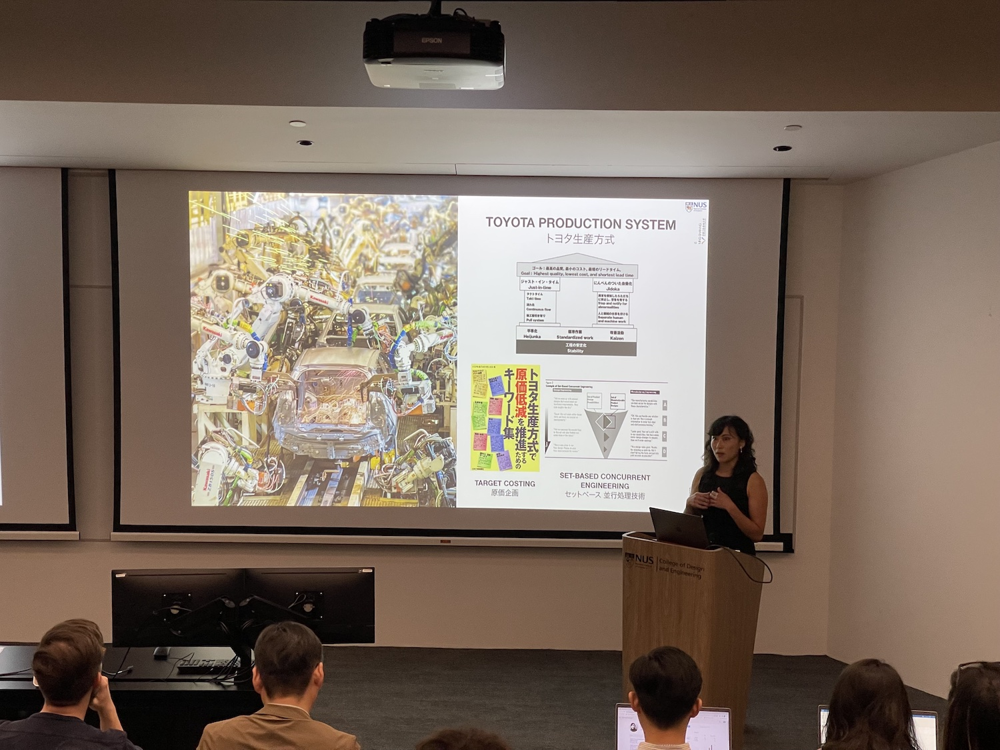
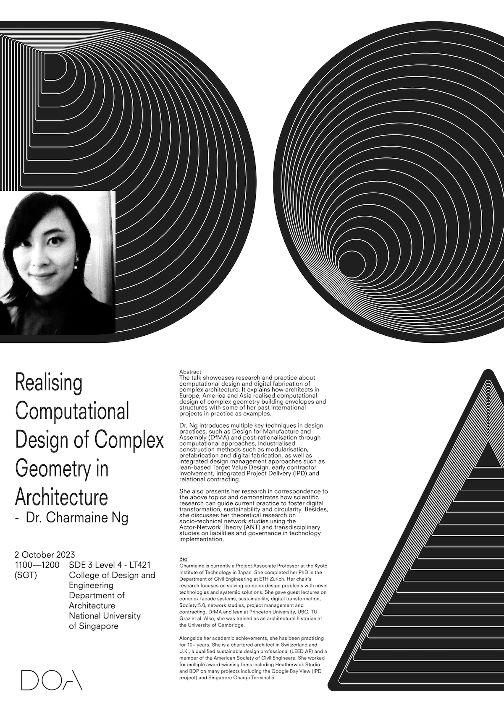

Earlier this week, our Lab and Department hosted Prof [Ming Shan (Charmaine) Ng](https://www.hyokadb.jim.kit.ac.jp/profile/en.a8ad724387d2489b91764df21b29a00b.html),
[Center for the Possible Futures](https://www.cpf.kit.ac.jp),
[Kyoto Institute of Technology](https://www.kit.ac.jp/en/),
Japan :jp: for a guest lecture.

Charmaine is currently a Project Associate Professor at the Kyoto Institute of Technology in Japan. She completed her PhD in the Department of Civil Engineering at ETH Zurich. Her chair’s research focuses on solving complex design problems with novel technologies and systemic solutions. She gave guest lectures on complex facade systems, sustainability, digital transformation, Society 5.0, network studies, project management and contracting, DfMA and lean at Princeton University, UBC, TU Graz et al. Also, she was trained as an architectural historian at the University of Cambridge. Alongside her academic achievements, she has been practising for 10+ years. She is a chartered architect in Switzerland and U.K., a qualified sustainable design professional (LEED AP) and a member of the American Society of Civil Engineers. She worked for multiple award-winning firms including Heatherwick Studio and BDP on many projects including the Google Bay View (IPD project) and Singapore Changi Terminal 5.

Charmaine delivered the guest lecture _Realising Computational Design of Complex Geometry in Architecture_ (poster and abstract below).

Thanks, and looking forward to future collaborations!

### Abstract of the lecture

> The talk showcases research and practice about computational design and digital fabrication of complex architecture. It explains how architects in Europe, America and Asia realised computational design of complex geometry building envelopes and structures with some of her past international projects in practice as examples. Dr. Ng introduces multiple key techniques in design practices, such as Design for Manufacture and Assembly (DfMA) and post-rationalisation through computational approaches, industrialised construction methods such as modularisation, prefabrication and digital fabrication, as well as integrated design management approaches such as lean-based Target Value Design, early contractor involvement, Integrated Project Delivery (IPD) and relational contracting. She also presents her research in correspondence to the above topics and demonstrates how scientific research can guide current practice to foster digital transformation, sustainability and circularity. Besides, she discusses her theoretical research on socio-technical network studies using the Actor-Network Theory (ANT) and transdisciplinary studies on liabilities and governance in technology implementation.
