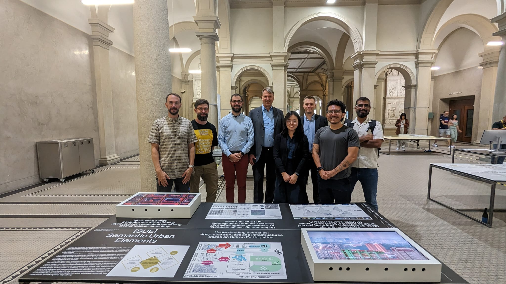
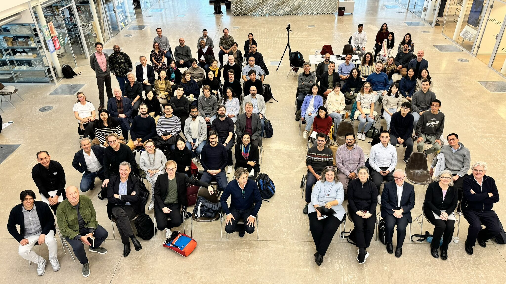
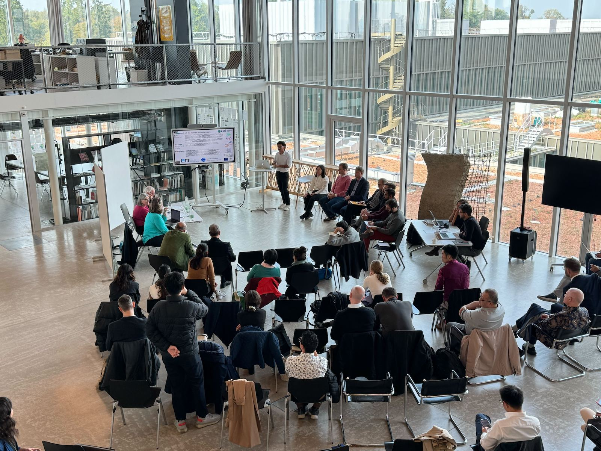
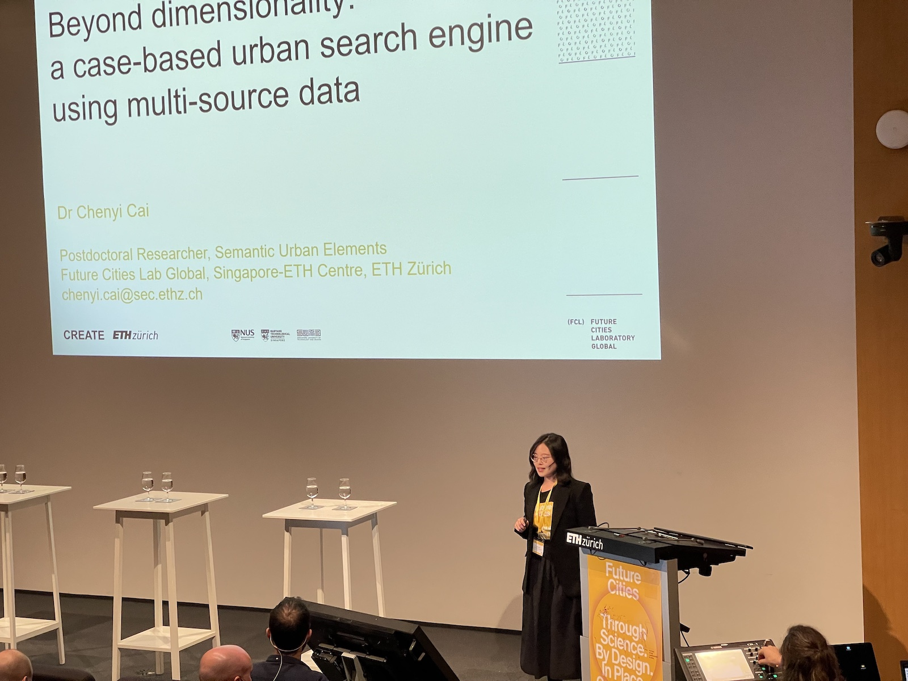
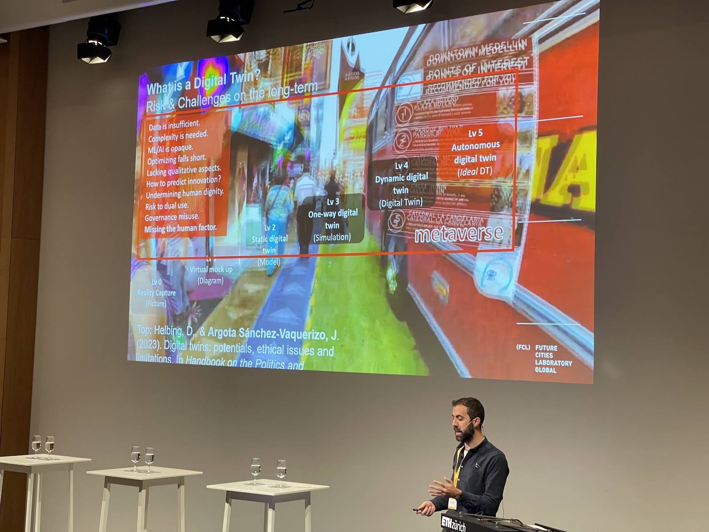
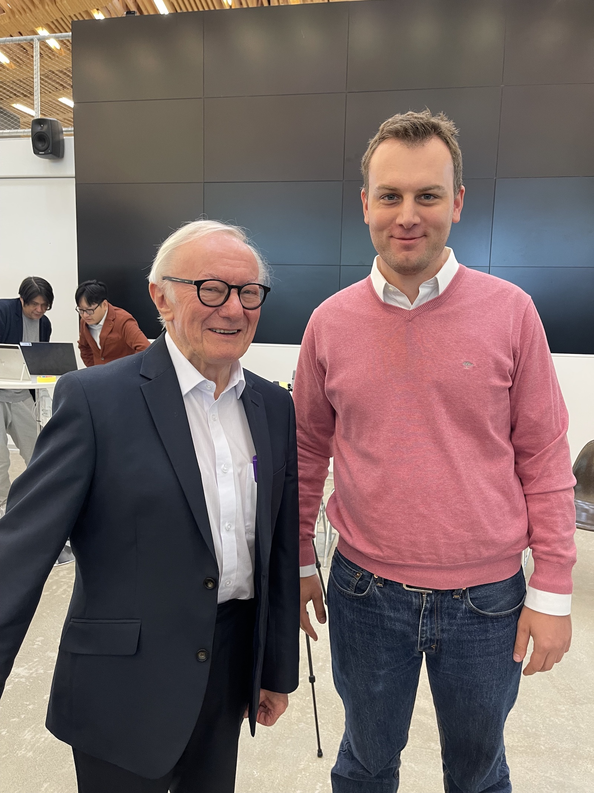
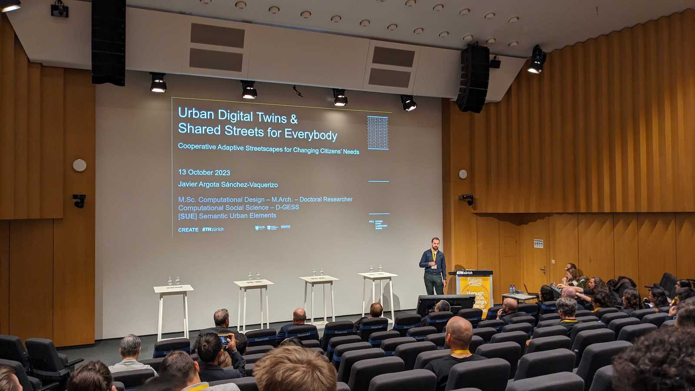

Our research group is managing the project [Semantic Urban Elements](https://fcl.ethz.ch/research/integration-and-strategies/semantic-urban-elements.html) at the [Singapore-ETH Centre](https://sec.ethz.ch) -- [Future Cities Lab Global](https://fcl.ethz.ch), in collaboration with the [ETH Zurich Computational Social Science group](https://coss.ethz.ch) led by Professor [Dirk Helbing](https://coss.ethz.ch/people/helbing.html).
We are quite active in cultivating this collaboration, e.g. , who is the Principal Investigator of the project, [spent some time at ETH Zurich earlier this year]().

As part of the project and collaboration, we just attended the [Conference and Exhibition of the Future Cities Laboratory Global](https://fclg-ep.ethz.ch) hosted at ETH Zurich in Switzerland, to which we contributed in several ways. 

Almost the entire project team, based in Singapore and Zurich, attended it and contributed with presentations and discussions: , , Rohit Dubey, Javier Argota Sánchez-Vaquerizo, Pieter Herthogs, Aurel von Richthofen, Stefan Müller Arisona, Christoph Hoelscher, Dirk Helbing, and .

The two-day conference featured prominent keynote speakers and panel discussions, and an opportunity to interact directly with young researchers.

A public exhibition showcased the results of the ongoing research activities.
Bringing together science, design, engineering and governance, FCL Global actively promotes the development of more sustainable, resilient and inclusive cities, setting the stage for a more liveable urban future.

The event was attended by prominent scientists in our domain such as Professor Michael Batty.

