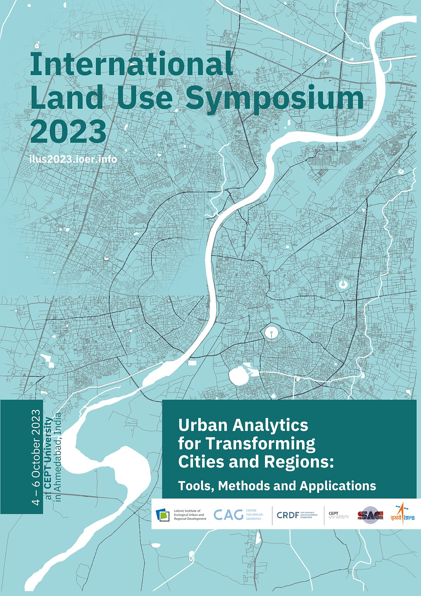
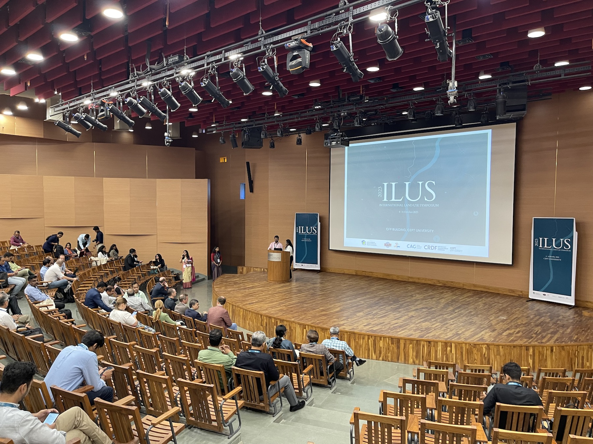
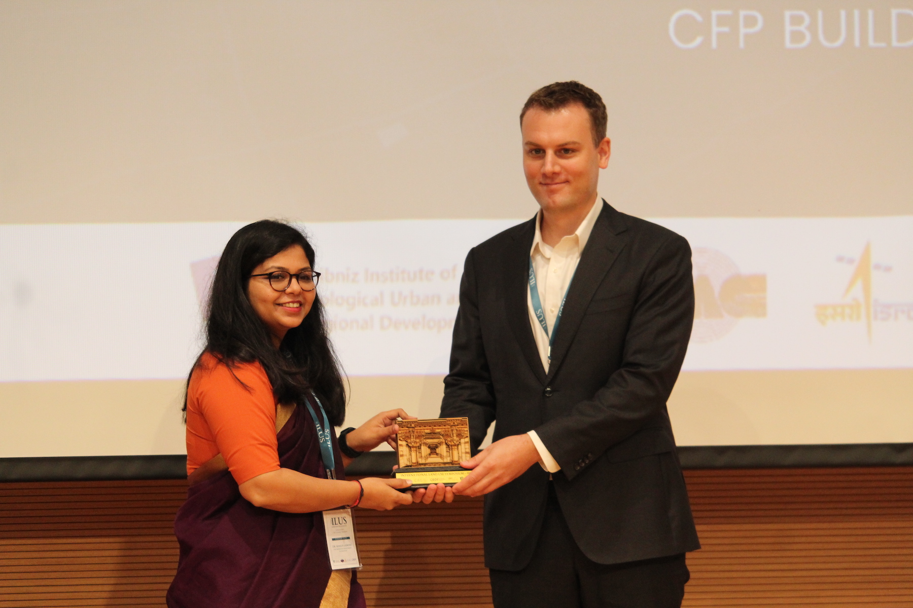
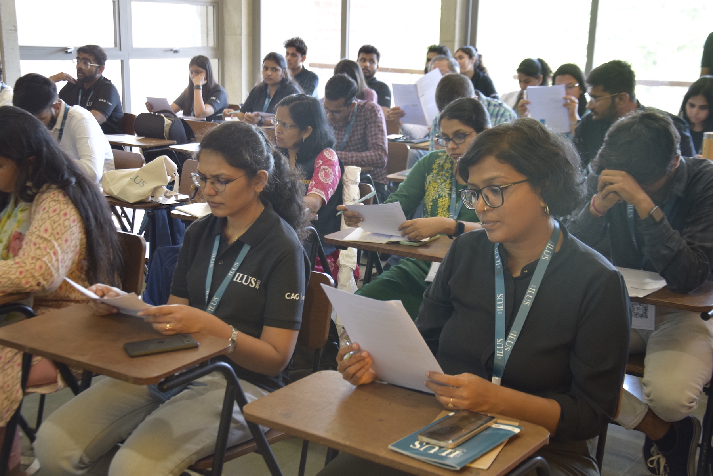
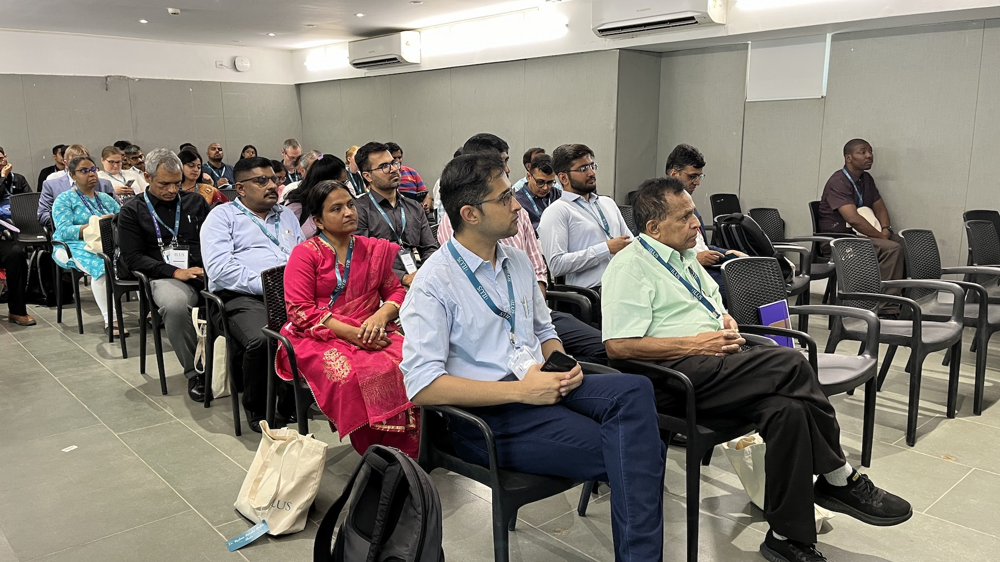
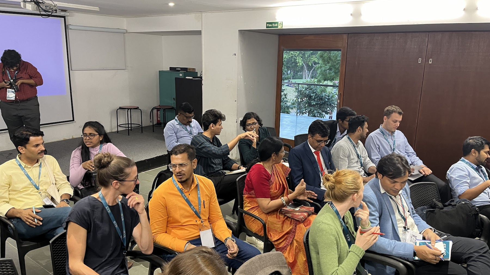

The [4th International Land Use Symposium (ILUS)](https://ilus2023.ioer.info/) on "Urban Analytics for Transforming Cities and Regions: Tools, Methods and Application" was held between 4 and 6 October 2023, in Ahmedabad, India. 🇮🇳

The event was hosted by [CEPT University](https://cept.ac.in/) and it was co-organised by the [Leibniz Institute of Ecological Urban and Regional development (IOER)](https://www.ioer.de/en) 🇩🇪.

The PI of the Lab, , represented the Lab with a keynote talk.

We appreciate the organisation of the event and invitation.
In particular, many thanks to Shaily Gandhi, Mathias Jehling, and Martin Behnisch.
Appreciation goes also to the [CEPT Research and Development Foundation (CRDF)](https://crdf.org.in/), [Center for Applied Geomatics (CAG)](https://crdf.org.in/center/center-for-applied-geomatics), and [Space Applications Centre (SAC), ISRO, Ahmedabad](https://www.sac.gov.in/Vyom/overview) for their role in the organisation.

The hospitality is very much appreciated, and we look forward to collaborating.

Credit for most of the photos goes to CEPT University. 

