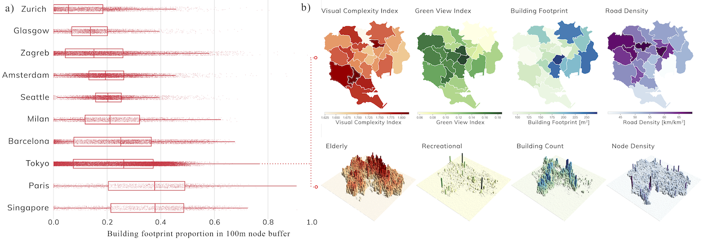
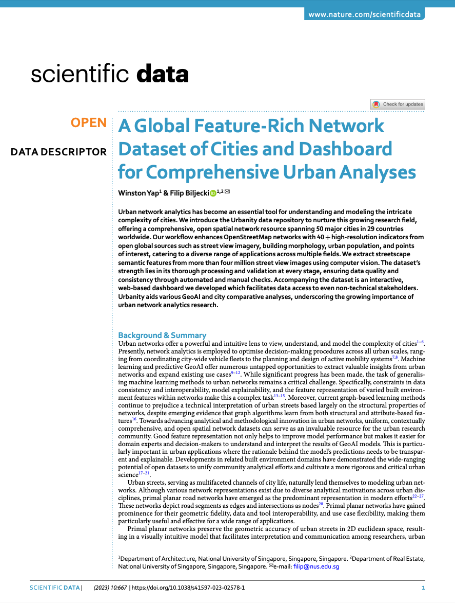

We are glad to share our new paper:

> Yap W, Biljecki F (2023): A Global Feature-Rich Network Dataset of Cities and Dashboard for Comprehensive Urban Analyses. Scientific Data 10: 667. [<i class="ai ai-doi-square ai"></i> 10.1038/s41597-023-02578-1](https://doi.org/10.1038/s41597-023-02578-1) [<i class="far fa-file-pdf"></i> PDF](/publication/2023-sd-urbanitydata/2023-sd-urbanitydata.pdf)</i> <i class="ai ai-open-access-square ai"></i>

This research was led by {}.
Congratulations on the great work! :raised_hands: :clap:

[Urbanity](https://github.com/winstonyym/urbanity) is a network-based Python package developed by {} at our NUS Urban Analytics Lab to automate the construction of feature rich (contextual and semantic) urban networks at any geographical scale. Through an accessible and simple to use interface, users can request heterogeneous urban information such as street view imagery, building morphology, population (including sub-group), and points of interest for target areas of interest.

The newly released dataset aims to promote contextual analyses on urban networks through the integration and harmonisation of various open data sources. The paper describes the global network dataset and dashboard generated which covers 50 cities in 29 countries around the world. The dataset features 40+ pre-computed SVI, urban points of interest, urban population, network topology, and build morphology indicators. We also detail our validation process, for example, comparing Meta population density map to WorldPop estimates for 25 cities and using image visual complexity as a post-heuristic measure to assess image suitability.


[The dataset is released openly under Creative Commons 4.0 at Figshare](https://doi.org/10.6084/m9.figshare.22124219).
The source code of the Urbanity dashboard is fully accessible [here](https://github.com/winstonyym/urbdash).

[A previous paper published in npj Urban Sustainability in July 2023](/publication/2023-npjus-urbanity/) presents the method and the open-source software that was used to generate this open dataset.
Please check it out as well.
The software can be found on the [Urbanity's Github repository](https://github.com/winstonyym/urbanity) and it is extensively documented.



### Abstract

The abstract follows.

> Urban network analytics has become an essential tool for understanding and modeling the intricate complexity of cities. We introduce the Urbanity data repository to nurture this growing research field, offering a comprehensive, open spatial network resource spanning 50 major cities in 29 countries worldwide. Our workflow enhances OpenStreetMap networks with 40 + high-resolution indicators from open global sources such as street view imagery, building morphology, urban population, and points of interest, catering to a diverse range of applications across multiple fields. We extract streetscape semantic features from more than four million street view images using computer vision. The dataset’s strength lies in its thorough processing and validation at every stage, ensuring data quality and consistency through automated and manual checks. Accompanying the dataset is an interactive, web-based dashboard we developed which facilitates data access to even non-technical stakeholders. Urbanity aids various GeoAI and city comparative analyses, underscoring the growing importance of urban network analytics research.

### Paper 

For more information, please see the [paper](/publication/2023-sd-urbanitydata/) (open access <i class="ai ai-open-access-square ai"></i>).

[](/publication/2023-sd-urbanitydata/)

BibTeX citation:
```bibtex
@article{2023_sd_urbanitydata,
  author = {Yap, Winston and Biljecki, Filip},
  doi = {10.1038/s41597-023-02578-1},
  journal = {Scientific Data},
  title = {{A Global Feature-Rich Network Dataset of Cities and Dashboard for Comprehensive Urban Analyses}},
  volume = {10},
  pages = {667},
  year = {2023}
}
```
