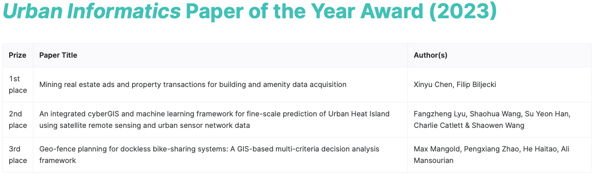

We are immensely proud that [the paper]() led by our master graduate {} has been [awarded](https://www.isocui.org/#/awards/icui2023) by the journal [Urban Informatics](https://link.springer.com/journal/44212) as the best paper of the year! 🏆

The paper awarded with the _Urban Informatics Paper of the Year Award (2023)_ is:

> Chen X, Biljecki F (2022): Mining real estate ads and property transactions for building and amenity data acquisition. _Urban Informatics_ 1: 12. [<i class="ai ai-doi-square ai"></i> 10.1007/s44212-022-00012-2](https://doi.org/10.1007/s44212-022-00012-2) [<i class="far fa-file-pdf"></i> PDF](/publication/2022-ui-real-estate-mining/2022-ui-real-estate-mining.pdf)</i> <i class="ai ai-open-access-square ai"></i>

Xinyu graduated with a masters degree from NUS and this paper is based on her graduation work that was supervised by . 
This is her first journal paper, marking a great start of her academic career.

This paper is the first one to uncover the potential of real estate data for GIS purposes, and puts forward the idea of such data as an instance of user-generated / volunteered geographic information that has been ignored in the field.
More information about it can be found below.

This recognition is also a testament to our dedication to growing our master students and integrating them in our research group.
Our Lab continues to support master students in their pursuit of excellence. 

[Urban Informatics (UI)](https://link.springer.com/journal/44212) is an international, open-access, peer-reviewed journal of the [International Society for Urban Informatics (ISUI)](https://www.isocui.org/) and is published online by Springer.
The journal aims to introduce cutting-edge researches that leverage emerging technologies and data in the context of urban environments, tackle the relationships among people, place and technologies in cities, and advance the science of cities.


The full list of awards is available [here](https://www.isocui.org/#/awards/icui2023).
Congratulations to others who won the 2nd and 3rd place. 🏅



Thank you for this recognition and running this journal and the society.

### Abstract

The abstract follows.

> Acquiring spatial data of fine and dynamic urban features such as buildings remains challenging. This paper brings attention to real estate advertisements and property sales data as valuable and dynamic sources of geoinformation in the built environment, but unutilised in spatial data infrastructures. Given the wealth of information they hold and their user-generated nature, we put forward the idea of real estate data as an instance of implicit volunteered geographic information and bring attention to their spatial aspect, potentially alleviating the challenge of acquiring spatial data of fine and dynamic urban features. We develop a mechanism of facilitating continuous acquisition, maintenance, and quality assurance of building data and associated amenities from real estate data. The results of the experiments conducted in Singapore reveal that one month of property listings provides information on 7% of the national building stock and about half of the residential subset, e.g. age, type, and storeys, which are often not available in sources such as OpenStreetMap, potentially supporting applications such as 3D city modelling and energy simulations. The method may serve as a novel means to spatial data quality control as it detects missing amenities and maps future buildings, which are advertised and transacted before they are built, but it exhibits mixed results in identifying unmapped buildings as ads may contain errors that impede the idea.nted water view imagery, and it is intended to support future studies.

### Paper 

For more information, please see the [paper](/publication/2022-ui-real-estate-mining/), published open access. <i class="ai ai-open-access-square ai"></i>

[](/publication/2022-ui-real-estate-mining/)

BibTeX citation:
```bibtex
@article{2022_ui_real_estate_mining, 
  year = {2022}, 
  title = {{Mining real estate ads and property transactions for building and amenity data acquisition}}, 
  author = {Chen, Xinyu and Biljecki, Filip}, 
  journal = {Urban Informatics}, 
  doi = {10.1007/s44212-022-00012-2}, 
  pages = {12}, 
  volume = {1}
}
```
