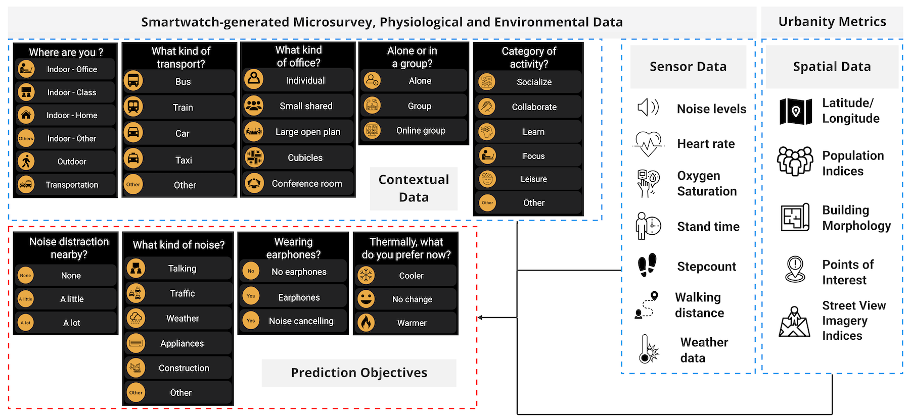
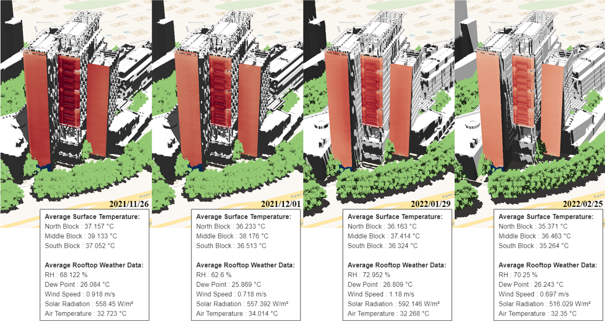
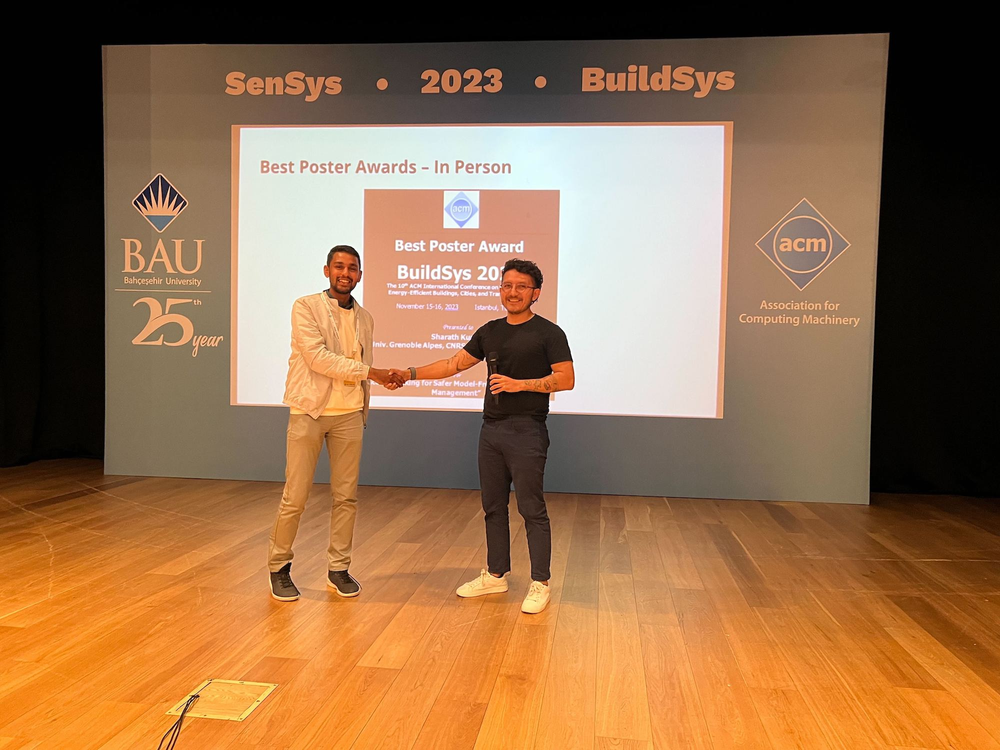

Our research group and our sibling labs -- [BUDS Lab](https://budslab.org) and [IDEAS Lab](https://ideaslab.io) -- have been active at this year's [ACM International Conference on Systems for Energy-Efficient Buildings, Cities, and Transportation (BuildSys)](https://buildsys.acm.org/2023/), which took place in Istanbul, Turkey. 🇹🇷

BuildSys is a highly selective, single-track forum for research on systems issues covering all aspects of the built environment

The PI of the Lab  gave a keynote at the [1st Int'l Workshop on Cyber-Physical-Social Infrastructure Systems (CPSIS'23)](https://www.flanigansaluslab.com/cpsis-2023), which was organised by [Prof Katherine Flanigan (Carnegie Mellon University)](https://www.flanigansaluslab.com).

Two papers were published and presented at the conference:

> Miller C, Quintana M, Frei M, Chua YX, Fu C, Picchetti B, Yap W, Chong A, Biljecki F (2023): Introducing the Cool, Quiet City Competition: Predicting Smartwatch-Reported Heat and Noise with Digital Twin Metrics. Proceedings of the 10th ACM International Conference on Systems for Energy-Efficient Buildings, Cities, and Transportation, pp. 298-299. [<i class="ai ai-doi-square ai"></i> 10.1145/3600100.3626269](https://doi.org/10.1145/3600100.3626269) [<i class="far fa-file-pdf"></i> PDF](/publication/2023-buildsys-cool-quiet/2023-buildsys-cool-quiet.pdf)</i> <i class="ai ai-open-access-square ai"></i>

> Ramani V, Ignatius M, Lim J, Biljecki F, Miller C (2023): A Dynamic Urban Digital Twin Integrating Longitudinal Thermal Imagery for Microclimate Studies. Proceedings of the 10th ACM International Conference on Systems for Energy-Efficient Buildings, Cities, and Transportation, pp. 421-428. [<i class="ai ai-doi-square ai"></i> 10.1145/3600100.3626345](https://doi.org/10.1145/3600100.3626345) [<i class="far fa-file-pdf"></i> PDF](/publication/2023-buildsys-ir-dt/2023-buildsys-ir-dt.pdf)</i> <i class="ai ai-open-access-square ai"></i>

The first paper introduces [_Cool, Quiet City Competition -- Predicting Smartwatch-Reported Heat and Noise with Digital Twin Metrics_](https://www.kaggle.com/competitions/cool-quiet-city-competition), a machine learning competition hosted by Kaggle that is launched for participants to compete in training models on the various contextual data to predict noise distraction and source as well as thermal preference across a diversity of spaces.



The second paper presents ongoing efforts on building a digital twin that integrates the longitudinal thermal envelope data of buildings on our campus with a virtual 3D model.
Thermal images of the buildings were captured using a neighborhood-scale infrared observatory for a few months.
Integrating these data sources in digital twins is a novelty, and we hope to make further advancements in this domain.



Lots of people were involved in these efforts and in the conference, e.g.  was the poster chair of the conference.

See you next year!



BibTeX citations:
```bibtex
@article{2023_buildsys_cool_quiet, 
  year = {2023}, 
  title = {{Introducing the Cool, Quiet City Competition: Predicting Smartwatch-Reported Heat and Noise with Digital Twin Metrics}}, 
  author = {Miller, Clayton and Quintana, Matias and Frei, Mario and Chua, Yun Xuan and Fu, Chun and Picchetti, Bianca and Yap, Winston and Chong, Adrian and Biljecki, Filip}, 
  journal = {Proceedings of the 10th ACM International Conference on Systems for Energy-Efficient Buildings, Cities, and Transportation}, 
  doi = {10.1145/3600100.3626269}, 
  pages = {298--299}
}
```

```bibtex
@article{2023_buildsys_ir_dt, 
  year = {2023}, 
  title = {{A Dynamic Urban Digital Twin Integrating Longitudinal Thermal Imagery for Microclimate Studies}}, 
  author = {Ramani, Vasantha and Ignatius, Marcel and Lim, Joie and Biljecki, Filip and Miller, Clayton}, 
  journal = {Proceedings of the 10th ACM International Conference on Systems for Energy-Efficient Buildings, Cities, and Transportation}, 
  doi = {10.1145/3600100.3626345}, 
  pages = {421--428}
}
```
