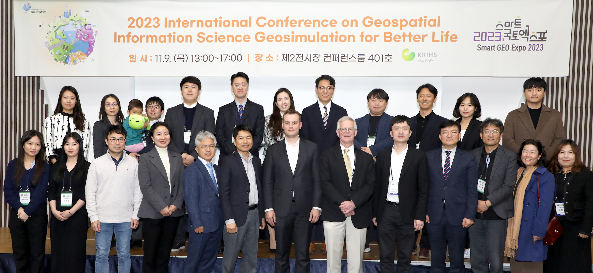
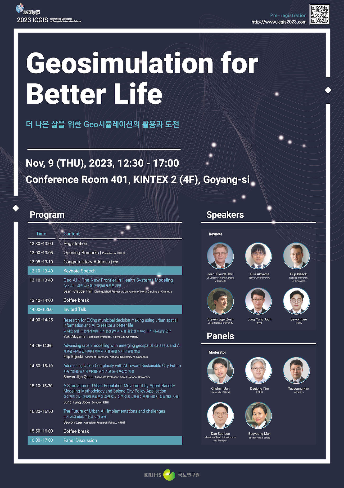
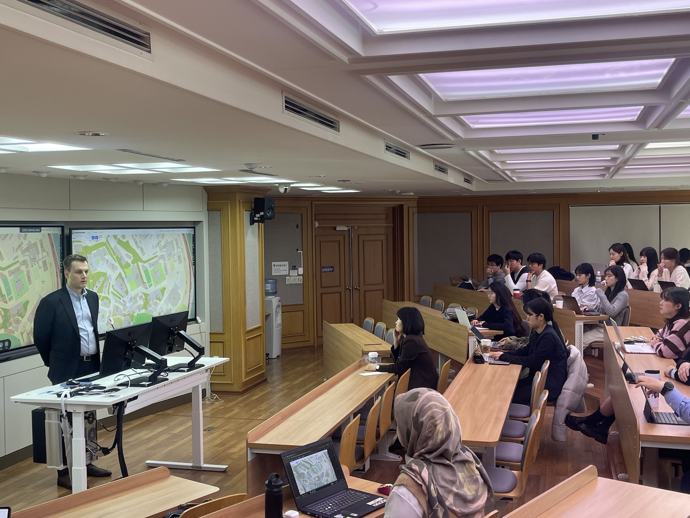
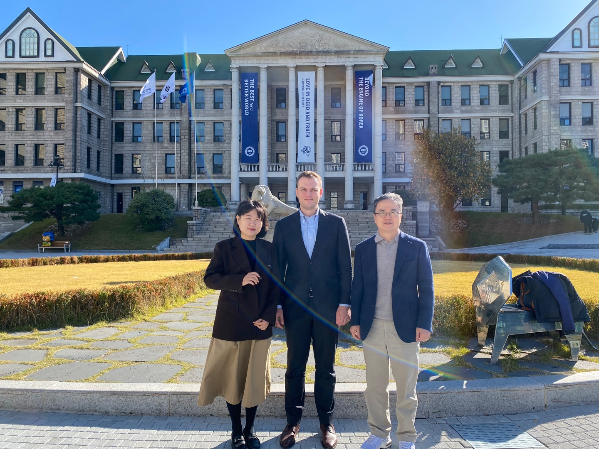

The research of the NUS Urban Analytics Lab was presented in Korea by the PI of the Lab . 🇰🇷

First, he gave an invited talk at the [2023 International Conference on Geospatial Information Science (ICGIS)](https://icgis2023.com), an event organised by the [Korea Research Institute for Human Settlements (KRIHS)](https://www.krihs.re.kr/eng/).

ICGIS is an international academic conference held annually since 1996.
This year's theme was _Geosimulation for Better Life_, and it was part of the [Smart Geo Expo 2023](http://smartgeoexpo.kr), an annual flagship event of the Korean geospatial community.

The keynote speaker of the event was [Prof Jean-Claude Thill](https://pages.charlotte.edu/jean-claude-thill/) from the University of North Carolina at Charlotte.
The community owes him gratitude for his service as the former editor-in-chief of the journal [Computers, Environment and Urban Systems](https://www.sciencedirect.com/journal/computers-environment-and-urban-systems).

The full programme is included below.

We appreciate the organisation of the event and invitation.
Many thanks go especially to Dr Jae Soen Son (손재선) from the KRIHS's Geospatial Analytics & Monitoring Center.

Second, Filip gave a guest lecture at the [Department of Urban Planning and Engineering at Hanyang University](http://hyurban.hanyang.ac.kr), thanks to the organisation of [Prof Sugie Lee](http://junhwan89.cafe24.com/mainpeople/nueva-professor) (이수기) and [Dr Li Na](https://scholar.google.com/citations?user=eaH__jsAAAAJ&hl=zh-CN).

Hanyang University is a private research university in Seoul, and one of the most prestigious universities in the country.
Notably, it has one of the leading departments in urban planning in Korea. 

Prof Lee is the head of the department and heads the [Urban Design & Spatial Analysis Lab (UDSAL)](http://udsal.hanyang.ac.kr), a prominent research group with which we hope to have more collaborations.

Many thanks for the hospitality!

