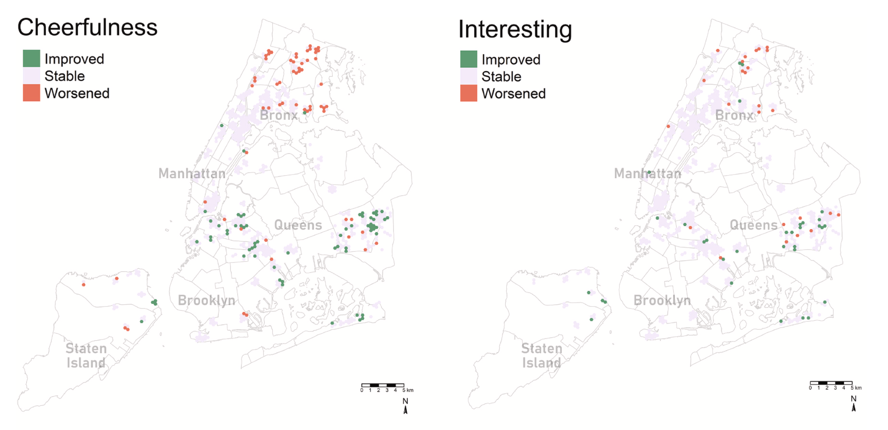
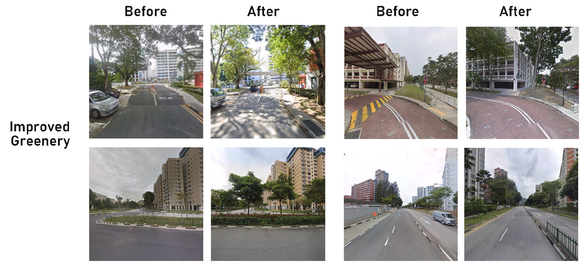
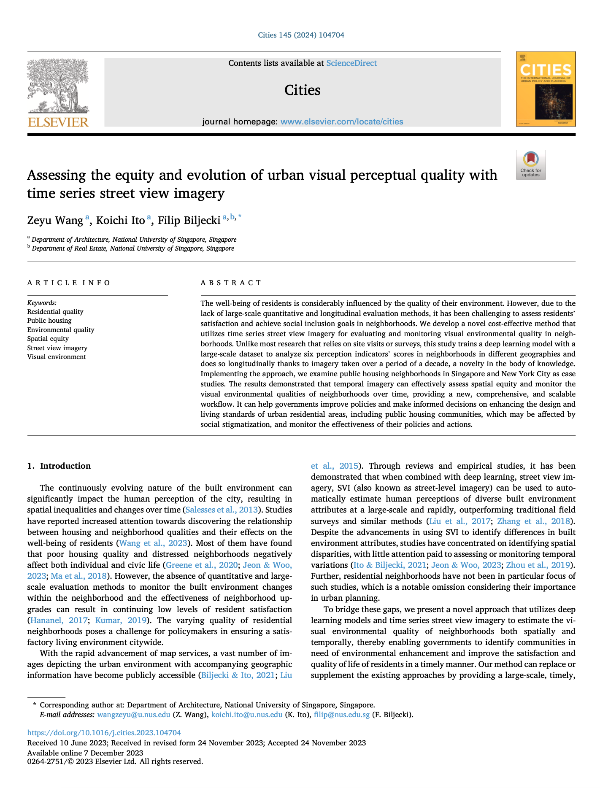

We are glad to share our new paper:

> Wang Z, Ito K, Biljecki F (2024): Assessing the equity and evolution of urban visual perceptual quality with time series street view imagery. Cities, 145: 104704. [<i class="ai ai-doi-square ai"></i> 10.1016/j.cities.2023.104704](https://doi.org/10.1016/j.cities.2023.104704) [<i class="far fa-file-pdf"></i> PDF](/publication/2024-cities-evolution/2024-cities-evolution.pdf)</i>

This research was led by {}, our Master of Urban Planning graduate.
Congratulations on the first journal publication! :raised_hands: :clap:





The paper is [available freely](https://authors.elsevier.com/a/1iD8Yy5jOr6Ri) until 2024-01-26.

### Abstract

The abstract follows.

> The well-being of residents is considerably influenced by the quality of their environment. However, due to the lack of large-scale quantitative and longitudinal evaluation methods, it has been challenging to assess residents' satisfaction and achieve social inclusion goals in neighborhoods. We develop a novel cost-effective method that utilizes time series street view imagery for evaluating and monitoring visual environmental quality in neighborhoods. Unlike most research that relies on site visits or surveys, this study trains a deep learning model with a large-scale dataset to analyze six perception indicators' scores in neighborhoods in different geographies and does so longitudinally thanks to imagery taken over a period of a decade, a novelty in the body of knowledge. Implementing the approach, we examine public housing neighborhoods in Singapore and New York City as case studies. The results demonstrated that temporal imagery can effectively assess spatial equity and monitor the visual environmental qualities of neighborhoods over time, providing a new, comprehensive, and scalable workflow. It can help governments improve policies and make informed decisions on enhancing the design and living standards of urban residential areas, including public housing communities, which may be affected by social stigmatization, and monitor the effectiveness of their policies and actions.

### Paper 

For more information, please see the [paper](/publication/2024-cities-evolution/).

[](/publication/2024-cities-evolution/)

BibTeX citation:
```bibtex
@article{2024_cities_evolution,
  author = {Wang, Zeyu and Ito, Koichi and Biljecki, Filip},
  doi = {10.1016/j.cities.2023.104704},
  journal = {Cities},
  pages = {104704},
  title = {Assessing the equity and evolution of urban visual perceptual quality with time series street view imagery},
  volume = {145},
  year = {2024}
}
```
