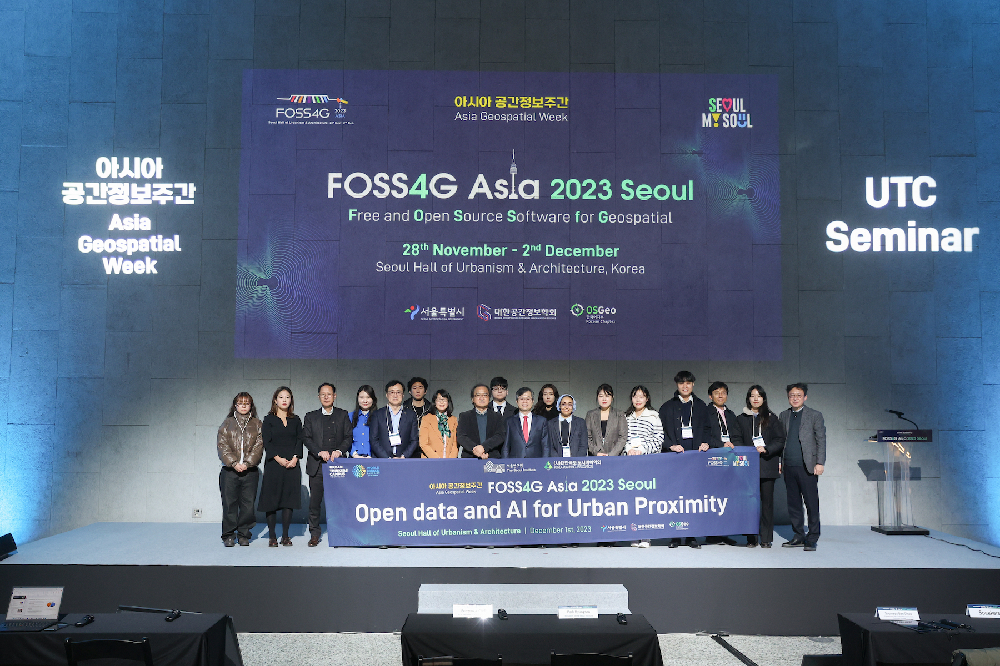
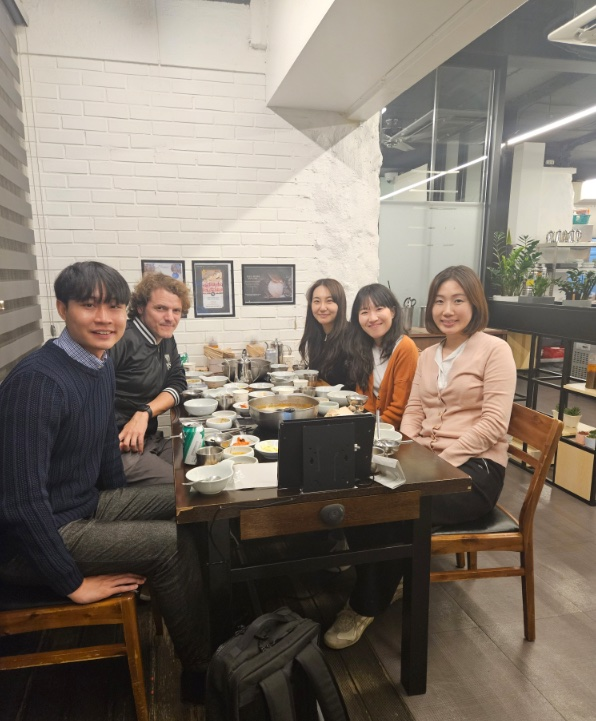

The latest software development at the Urban Analytics Lab was recently featured at the FOSS4G Asia Conference in Seoul, South Korea 🇰🇷 by {}, PhD candidate at our research group.

Supported by the FOSS4G Travel Grant Program, Winston presented his latest work on [Urbanity: A global tool for open urban network analysis](https://github.com/winstonyym/urbanity), as part of the Urban Proximity - UN Habitat UTC session, which was co-organised by The Seoul Institute and Korea Planning Association.

The presentation builds on two open access papers published in his PhD:

> Yap W, Biljecki F (2023): A Global Feature-Rich Network Dataset of Cities and Dashboard for Comprehensive Urban Analyses. Scientific Data 10: 667. [<i class="ai ai-doi-square ai"></i> 10.1038/s41597-023-02578-1](https://doi.org/10.1038/s41597-023-02578-1) [<i class="far fa-file-pdf"></i> PDF](/publication/2023-sd-urbanitydata/2023-sd-urbanitydata.pdf)</i> <i class="ai ai-open-access-square ai"></i>

> Yap W, Stouffs R, Biljecki F (2023): Urbanity: automated modelling and analysis of multidimensional networks in cities. npj Urban Sustainability 3: 45. [<i class="ai ai-doi-square ai"></i> 10.1038/s42949-023-00125-w](https://doi.org/10.1038/s42949-023-00125-w) [<i class="far fa-file-pdf"></i> PDF](/publication/2023-npjus-urbanity/2023-npjus-urbanity.pdf)</i> <i class="ai ai-open-access-square ai"></i>

These papers underscore the our Lab's commitment to open data, software, and reproducibility in research.
During his visit, Winston also visited the labs of Professor Myung-Jin Jun and Asst. Professor Yujin Park at the [Department of Urban Planning and Real Estate](http://planning.cau.ac.kr/), [Chung-Ang University](https://www.cau.ac.kr/).
Our group looks forward to continue collaborating with these wonderful research groups and being a part of FOSS4G.

