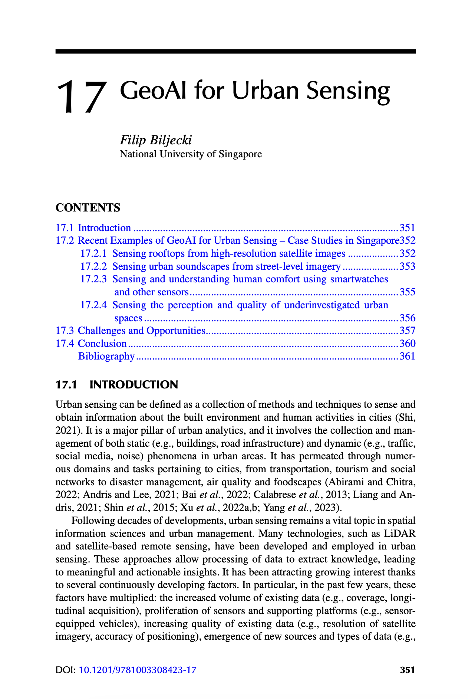

The [Handbook of Geospatial Artificial Intelligence](https://www.taylorfrancis.com/books/edit/10.1201/9781003308423/handbook-geospatial-artificial-intelligence-song-gao-yingjie-hu-wenwen-li) has been published!

The official description summarises it well:

> This comprehensive handbook covers Geospatial Artificial Intelligence (GeoAI), which is the integration of geospatial studies and AI machine (deep) learning and knowledge graph technologies. It explains key fundamental concepts, methods, models, and technologies of GeoAI, and discusses the recent advances, research tools, and applications that range from environmental observation and social sensing to natural disaster responses. As the first single volume on this fast-emerging domain, Handbook of Geospatial Artificial Intelligence is an excellent resource for educators, students, researchers, and practitioners utilizing GeoAI in fields such as information science, environment and natural resources, geosciences, and geography.

The book was organised and edited by [Song Gao](https://geography.wisc.edu/staff/gao-song/) (UW Madison), [Yingjie Hu](https://www.buffalo.edu/cas/geography/faculty/faculty_directory/yingjie-hu.html) (University at Buffalo), and [Wenwen Li](https://search.asu.edu/profile/1978357) (Arizona State University).

The book packs a lot of interesting content and covers a variety of subjects pertaining to GeoAI -- it features 22 chapters with each describing a particular topic in GeoAI.
Most of the leading research groups in the field globally are represented in this book, and our contribution is Chapter 17: GeoAI for Urban Sensing, written by {}.

The chapter describes a general introduction to the topic, challenges and opportunities, and it gives examples of research conducted at our Lab.
It is the only contribution from a research group from Asia.

> Biljecki F (2023): GeoAI for Urban Sensing. In Gao S, Hu Y, Li W (editors) Handbook of Geospatial Artificial Intelligence. CRC Press, pp. 351-366. [<i class="ai ai-doi-square ai"></i> 10.1201/9781003308423-17](https://doi.org/10.1201/9781003308423-17) [<i class="far fa-file-pdf"></i> PDF](/publication/2023-geoai-handbook-urban-sensing/2023-geoai-handbook-urban-sensing.pdf)</i>

### Abstract

The abstract follows.

> Urban sensing has been an important topic in the past decades, and research has been amplified in the last several years with the emergence of new urban data sources and advancements in GeoAI. This chapter gives a high-level overview of the applications of GeoAI for urban sensing, which have multiplied across various domains. It reviews four examples of GeoAI applied for urban sensing, which span a variety of data sources, techniques developed, and application domains such as urban sustainability. Concluding this topic, several challenges and opportunities for future research are discussed, such as ethics and data quality.

### Paper 

For more information, please see the [paper](/publication/2023-geoai-handbook-urban-sensing/) or have a look at the [entire book](https://www.taylorfrancis.com/books/edit/10.1201/9781003308423/handbook-geospatial-artificial-intelligence-song-gao-yingjie-hu-wenwen-li).

[](/publication/2023-geoai-handbook-urban-sensing/)

BibTeX citation:
```bibtex
@inbook{2023_geoai_handbook_urban_sensing,
  author = {Biljecki, Filip},
  booktitle = {Handbook of Geospatial Artificial Intelligence},
  chapter = {17},
  doi = {10.1201/9781003308423-17},
  editor = {Song Gao and Yingjie Hu and Wenwen Li},
  isbn = {9781003308423},
  pages = {351--366},
  publisher = {CRC Press},
  title = {GeoAI for Urban Sensing},
  year = {2023}
}
```
