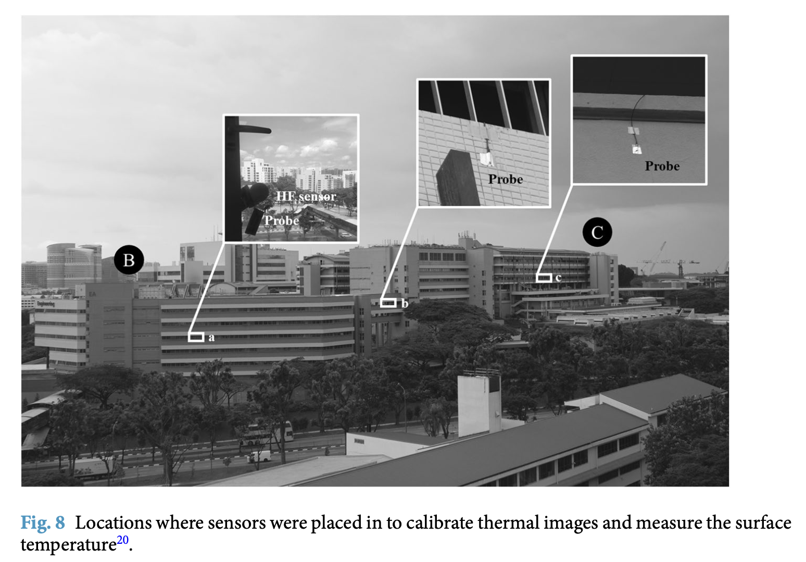
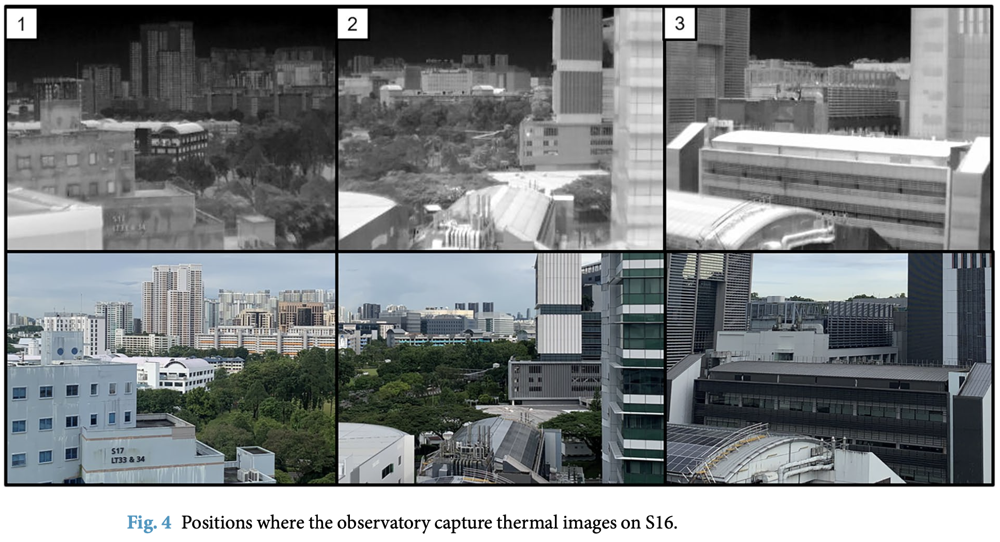
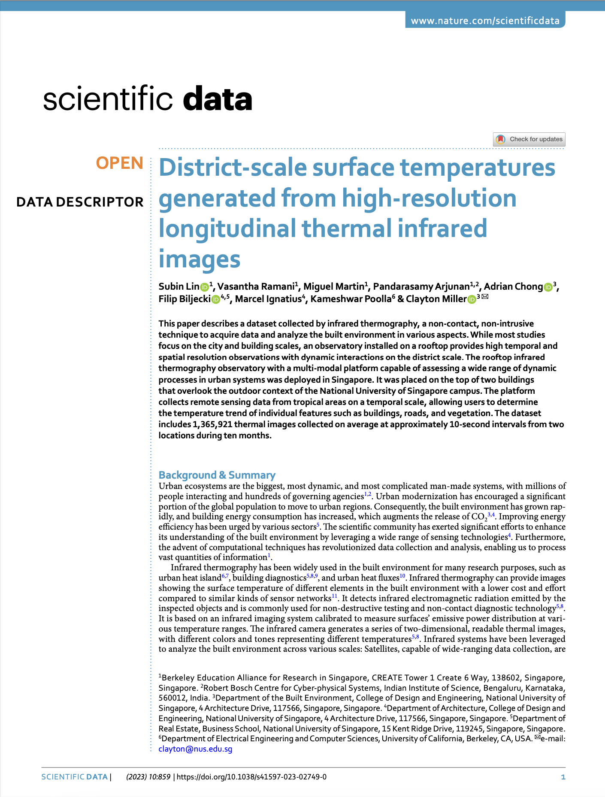

We are glad to share a new collaborative paper:

> Lin S, Ramani V, Martin M, Arjunan P, Chong A, Biljecki F, Ignatius M, Poolla K, Miller C (2023): District-scale surface temperatures generated from high-resolution longitudinal thermal infrared images. _Scientific Data_ 10: 859. [<i class="ai ai-doi-square ai"></i> 10.1038/s41597-023-02749-0](https://doi.org/10.1038/s41597-023-02749-0) [<i class="far fa-file-pdf"></i> PDF](/publication/2023-sd-iris/2023-sd-iris.pdf)</i>  <i class="ai ai-open-access-square ai"></i>

This paper presents an openly released dataset collected from thermal observatories deployed in the campus of our National University of Singapore.

Infrared thermography provides a non-contact technique to analyze the built environment in various aspects. While most studies focus on a city and building scale, rooftop observatorys provide high resolution with dynamical interactions on a neighborhood scale. The first rooftop thermal observatory with a multi-modal platform capable of assessing a wide range of dynamical processes in urban systems was deployed in Singapore. The thermal observatory was placed on the top of a building that overlooks several educational buildings on the campus of the National University of Singapore. The platform collects remote sensing data from tropical areas on a temporal scale, allowing users to determine the temperature trend of individual features such as buildings, roads, and vegetation. To manage and analyze the obtained raw data and allow scientific users to utilize the data as they saw fit, demonstration code with data preprocessing such as segmentation was provided.

The project was spearheaded by [Subin Lin](https://sg.linkedin.com/in/subin-lin-81710b211) from NUS and the Berkeley Education Alliance for Research in Singapore (BEARS).

The dataset can be accessed [here](https://github.com/buds-lab/project-iris-dataset).






### Abstract

> This paper describes a dataset collected by infrared thermography, a non-contact, non-intrusive technique to acquire data and analyze the built environment in various aspects. While most studies focus on the city and building scales, an observatory installed on a rooftop provides high temporal and spatial resolution observations with dynamic interactions on the district scale. The rooftop infrared thermography observatory with a multi-modal platform capable of assessing a wide range of dynamic processes in urban systems was deployed in Singapore. It was placed on the top of two buildings that overlook the outdoor context of the National University of Singapore campus. The platform collects remote sensing data from tropical areas on a temporal scale, allowing users to determine the temperature trend of individual features such as buildings, roads, and vegetation. The dataset includes 1,365,921 thermal images collected on average at approximately 10-second intervals from two locations during ten months.

### Paper 

For more information, please see the [paper](/publication/2023-sd-iris/).

[](/publication/2023-sd-iris/)

BibTeX citation:
```bibtex
@article{2023_sd_iris,
  author = {Lin, Subin and Ramani, Vasantha and Martin, Miguel and Arjunan, Pandarasamy and Chong, Adrian and Biljecki, Filip and Ignatius, Marcel and Poolla, Kameshwar and Miller, Clayton},
  doi = {10.1038/s41597-023-02749-0},
  journal = {Scientific Data},
  pages = {859},
  title = {District-scale surface temperatures generated from high-resolution longitudinal thermal infrared images},
  volume = {10},
  year = {2023}
}
```
