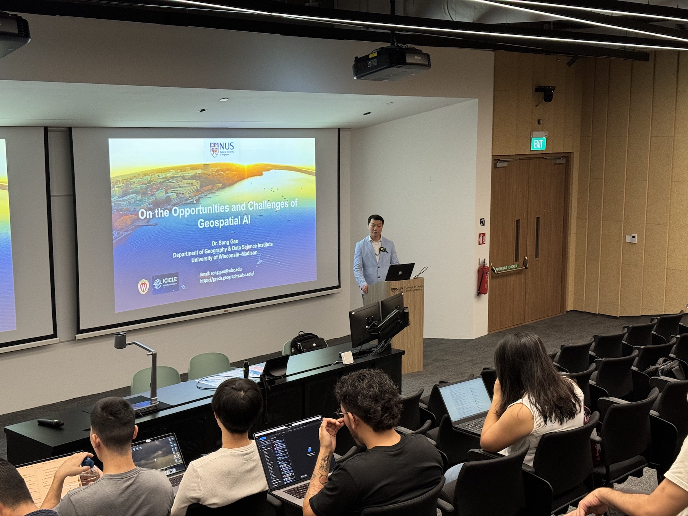
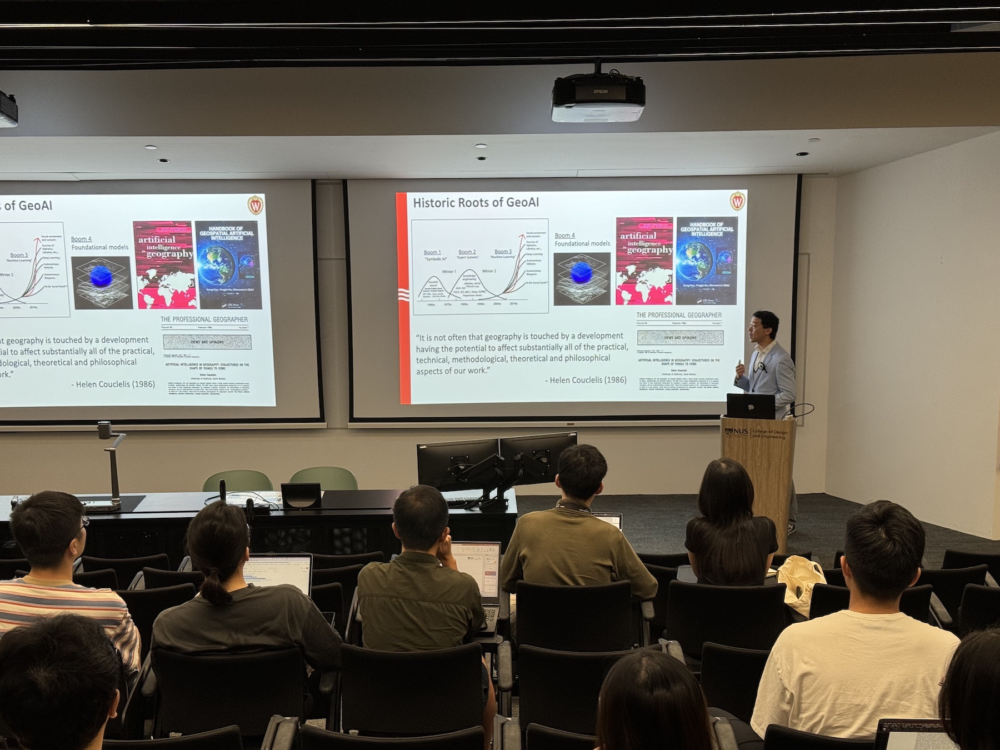
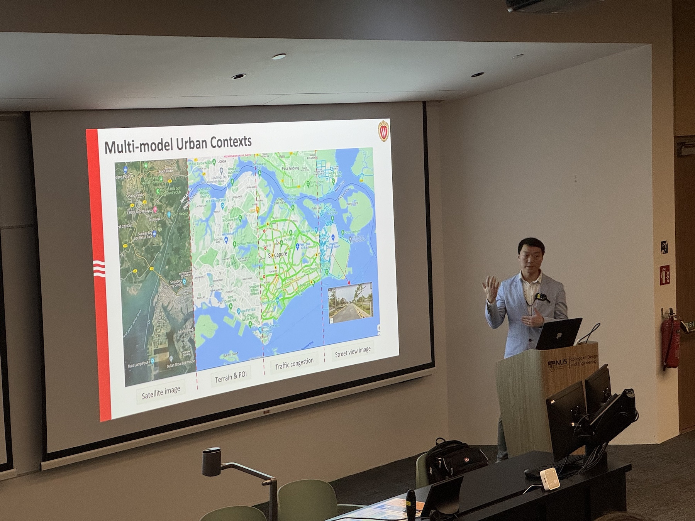
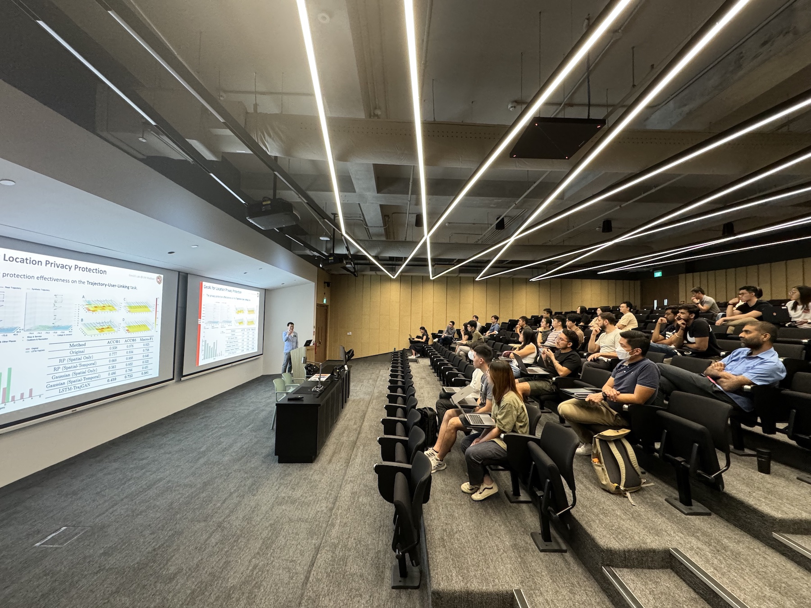
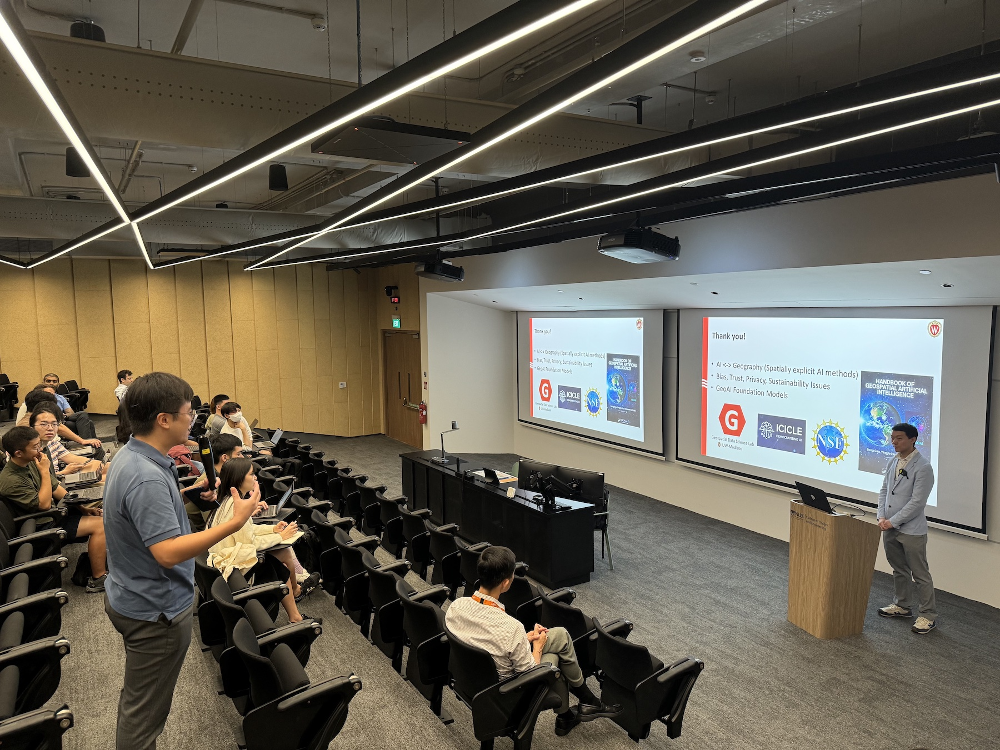
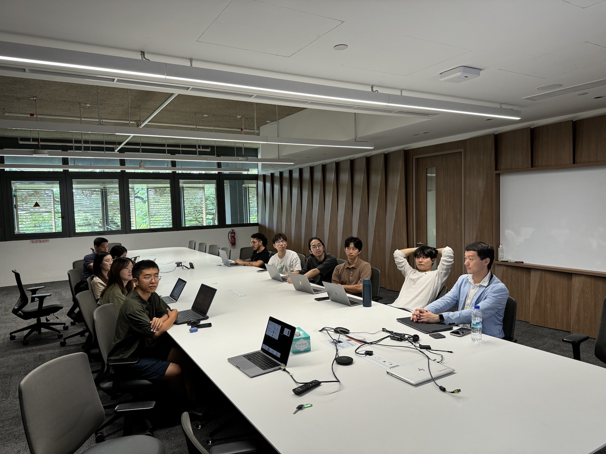
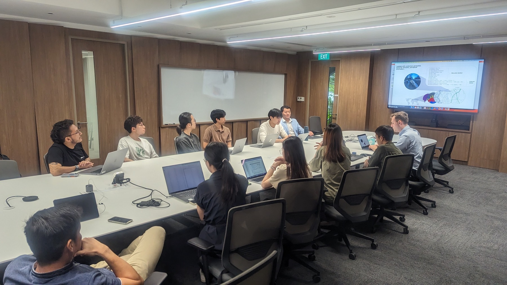
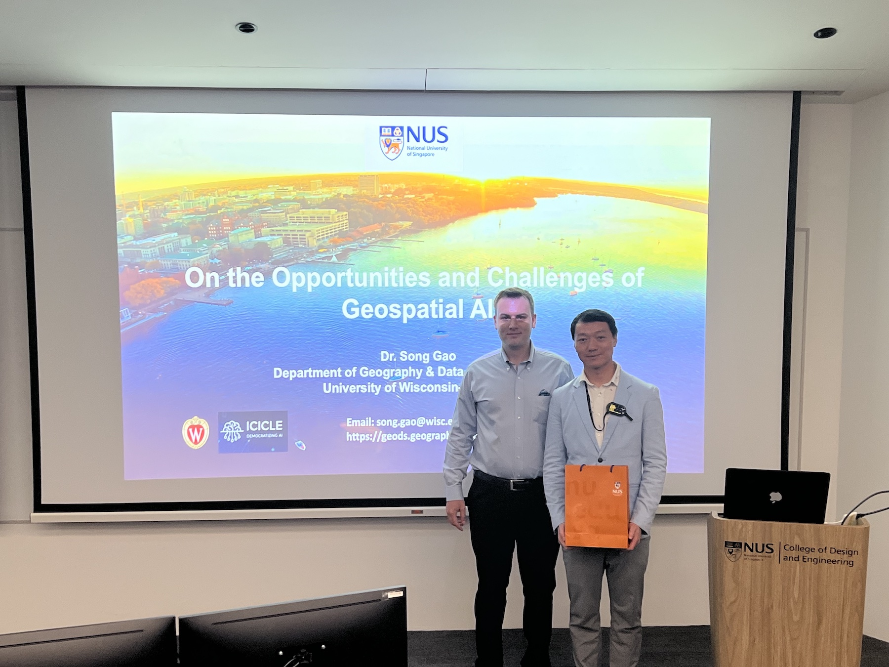
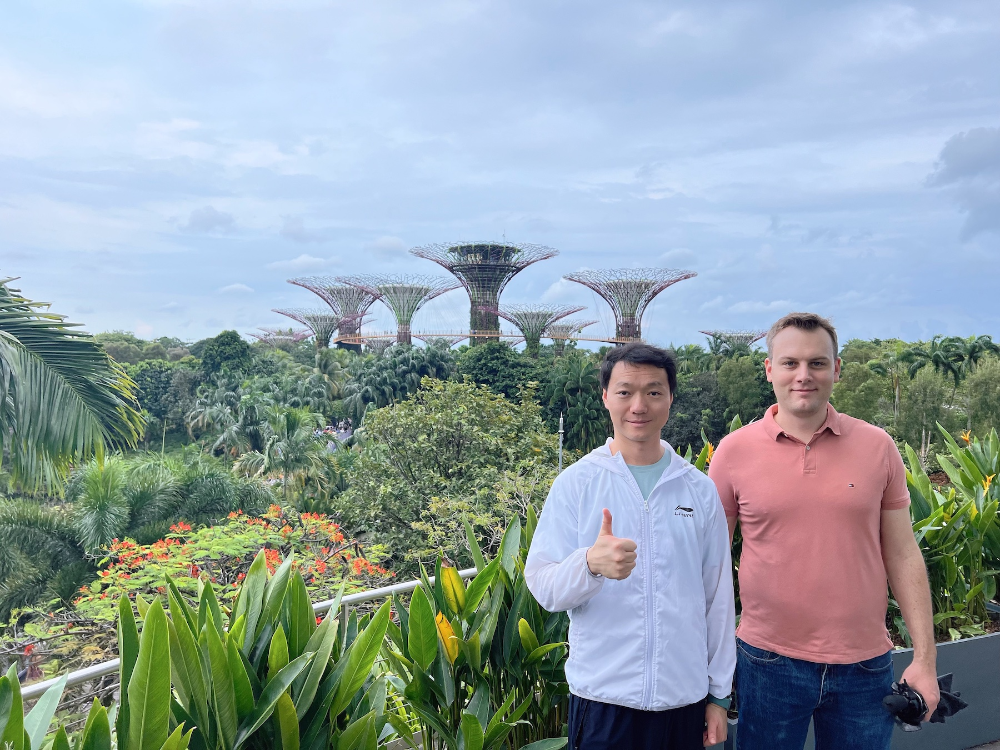
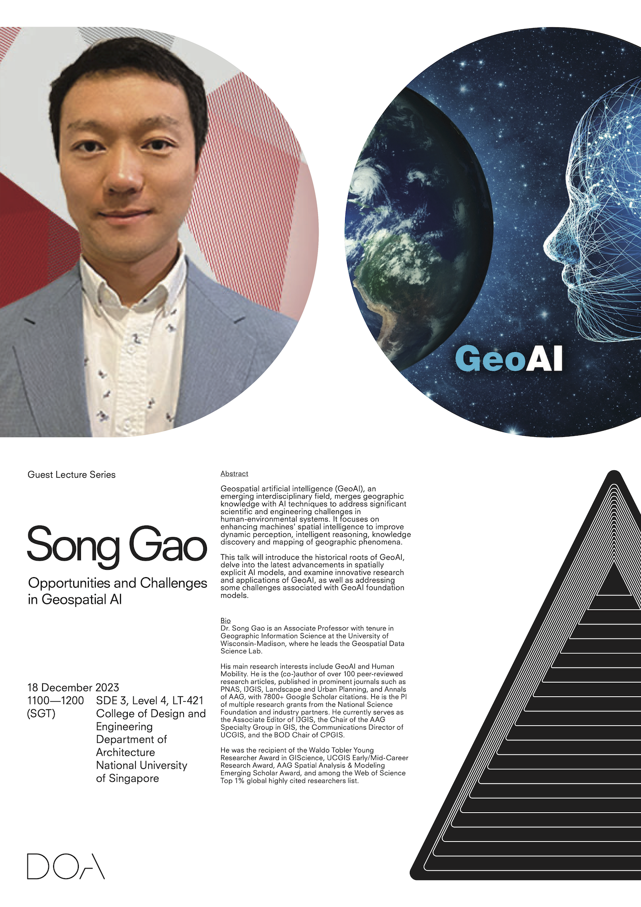

Our Lab hosted Dr [Song Gao](https://geography.wisc.edu/staff/gao-song/), Associate Professor at the [University of Wisconsin - Madison](https://www.wisc.edu), where he leads the [Geospatial Data Science Lab](https://geography.wisc.edu/geods/research). 🇺🇸

Dr Song Gao is an Associate Professor with tenure in Geographic Information Science at the University of Wisconsin-Madison, where he leads the Geospatial Data Science Lab. His main research interests include GeoAI and Human Mobility. He is the (co-)author of over 100 peer-reviewed research articles, published in prominent journals such as PNAS, IJGIS, Landscape and Urban Planning, and Annals of AAG, with 7800+ Google Scholar citations. He is the PI of multiple research grants from the National Science Foundation and industry partners. He currently serves as the Associate Editor of IJGIS, the Chair of the AAG Specialty Group in GIS, the Communications Director of UCGIS, and the BOD Chair of CPGIS. He was the recipient of the Waldo Tobler Young Researcher Award in GIScience, UCGIS Early/Mid-Career Research Award, AAG Spatial Analysis & Modeling Emerging Scholar Award, and among the Web of Science Top 1% global highly cited researchers list. 

During his stay, besides several collaborative exchanges such as discussion sessions and meetings, Song delivered the lecture _Opportunities and Challenges in Geospatial AI_ (poster and abstract below).

Thanks, and looking forward to future collaborations!

### Abstract of the lecture

> Geospatial artificial intelligence (GeoAI), an emerging interdisciplinary field, merges geographic knowledge with AI techniques to address significant scientific and engineering challenges in human-environmental systems. It focuses on enhancing machines’ spatial intelligence to improve dynamic perception, intelligent reasoning, knowledge discovery and mapping of geographic phenomena. This talk will introduce the historical roots of GeoAI, delve into the latest advancements in spatially explicit AI models, and examine innovative research and applications of GeoAI, as well as addressing some challenges associated with GeoAI foundation models.
