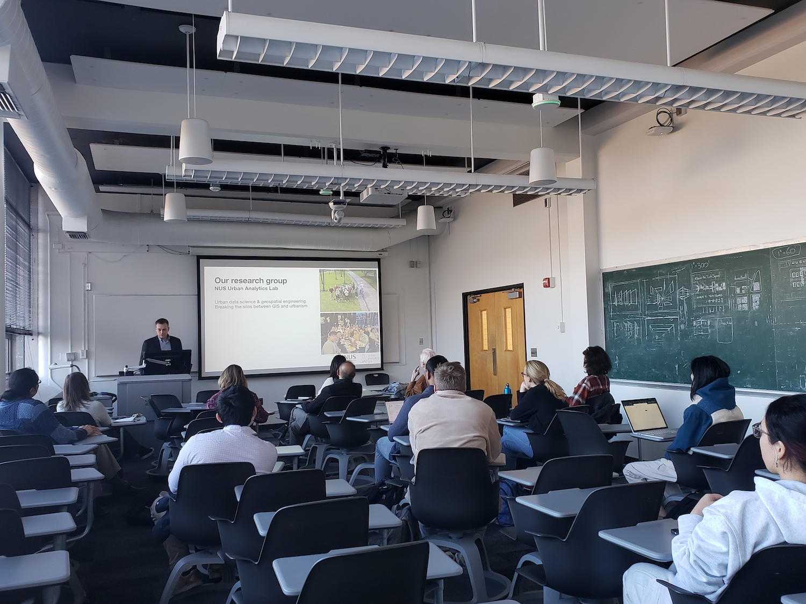
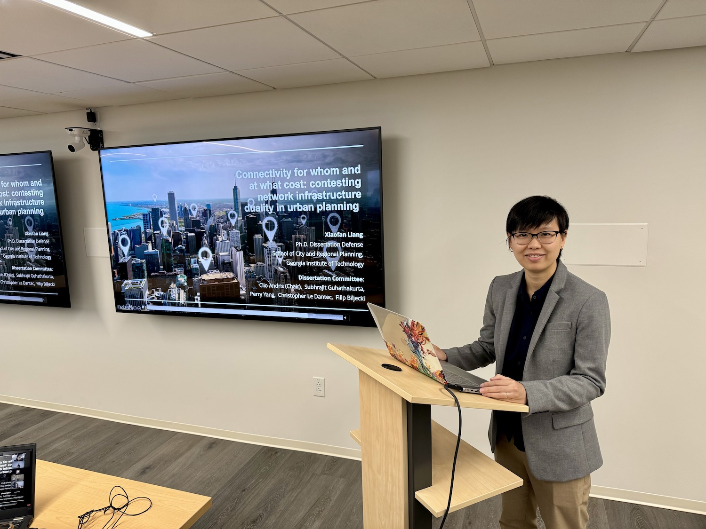
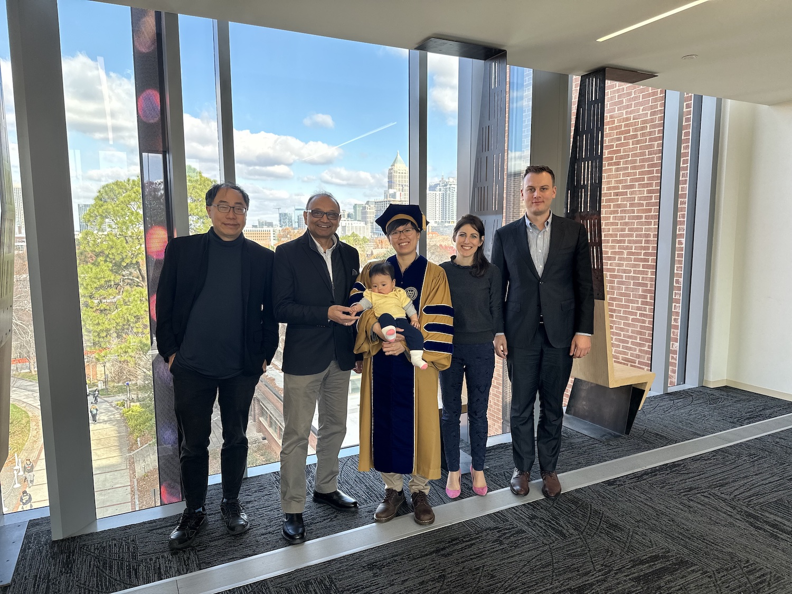
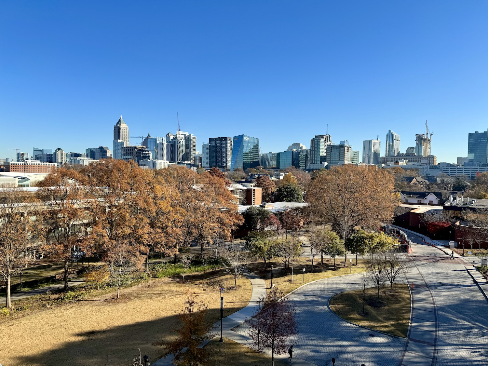
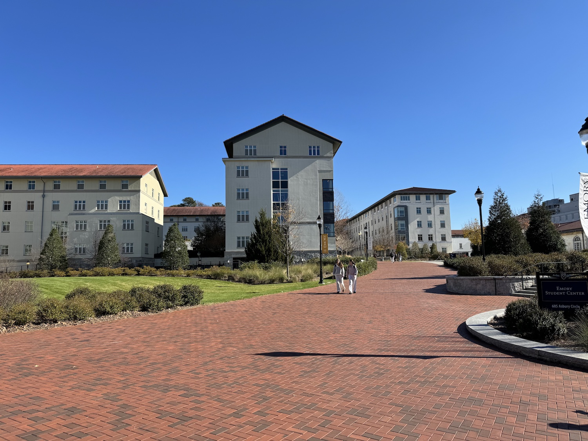
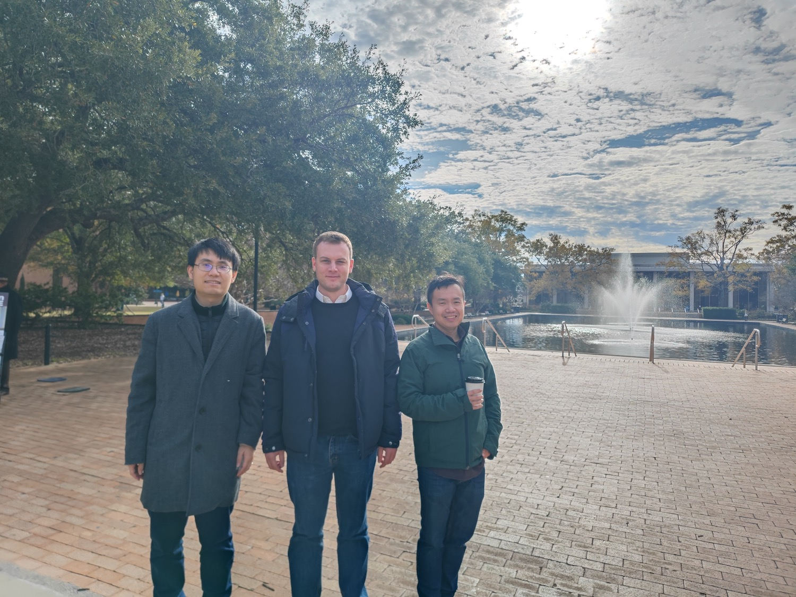
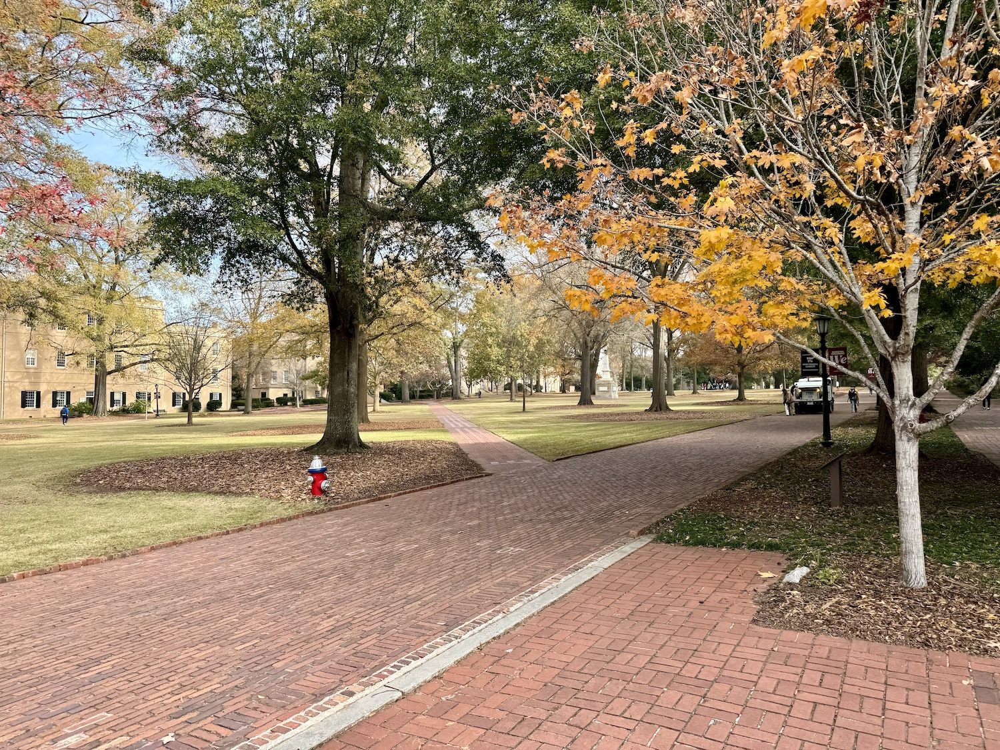
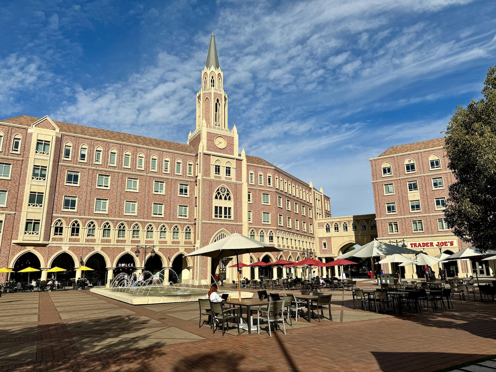

The PI of the Urban Analytics Lab, {}, has participated and contributed to the [2023 AGU Annual Meeting](https://www.agu.org/fall-meeting) in San Francisco, California, USA 🇺🇸.
This is the flagship event of [The American Geophysical Union (AGU)](https://www.agu.org).

He gave an invited presentation _Quality and Usability of Crowdsourced Global Building Information_ in the session _Detailed Guesstimates: The Art of Sampling, Simplifying, and Scaling a Feasible Distribution of Global Building Assets_, which was organised by the [Oak Ridge National Laboratory](https://www.ornl.gov).
In the presentation, Filip overviewed a couple of Lab papers focused on geospatial data on buildings, such as:

> Biljecki F, Chow YS, Lee K (2023): Quality of crowdsourced geospatial building information: A global assessment of OpenStreetMap attributes. _Building and Environment_ 237: 110295. [<i class="ai ai-doi-square ai"></i> 10.1016/j.buildenv.2023.110295](https://doi.org/10.1016/j.buildenv.2023.110295) [<i class="far fa-file-pdf"></i> PDF](/publication/2023-bae-osm-qa/2023-bae-osm-qa.pdf)</i>  <i class="ai ai-open-access-square ai"></i>

> Biljecki F, Chow YS (2022): Global Building Morphology Indicators. _Computers, Environment and Urban Systems_ 95: 101809.
> [<i class="ai ai-doi-square ai"></i>10.1016/j.compenvurbsys.2022.101809](https://doi.org/10.1016/j.compenvurbsys.2022.101809) [<i class="far fa-file-pdf"></i> PDF](/publication/2022-ceus-gbmi/2022-ceus-gbmi.pdf)</i> <i class="ai ai-open-access-square ai"></i>

These papers encompass some of the pillars of our research agenda such as spatial data quality assessment and enhancing the usability of crowdsourced geospatial data in the built environment.

As part of this trip, Filip visited the following departments and sister labs, and key collaborators:

+ Georgia Institute of Technology, [School of City and Regional Planning](https://planning.gatech.edu), [Friendly Cities Lab](https://friendlycities.gatech.edu) ([Prof Clio Andris](https://planning.gatech.edu/people/clio-andris))
+ Emory University, [Department of Environmental Sciences](https://envs.emory.edu) ([Prof Xiao Huang](https://envs.emory.edu/people/bios/Huang-Xiao%20.html))
+ University of South Carolina, [Center for GIScience and Geospatial Big Data](http://gis.cas.sc.edu/cegis/) ([Prof Yuhao Kang](http://www.kkyyhh96.site/))
+ University of Southern California, [Spatial Sciences Institute](https://dornsife.usc.edu/spatial/) ([Prof Sisi Wang](https://dornsife.usc.edu/spatial/profile/siqin-sisi-wang/))

During the visit, he took part in the PhD committee of {}, who has defended her doctoral thesis _Connectivity for whom and at what cost: contesting network infrastructure duality in urban planning_, and has conducted a part of her research in our NUS Urban Analytics Lab.
Big congrats, Dr Liang! She is moving to University of Michigan - Ann Arbor as faculty.
More about her work can be found at [her personal webpage](https://www.xiaofanliang.com).

Many thanks to collaborators and hosts Clio, Yuhao, Sisi and Xiao, and everyone else for the great hospitality.
We look forward to continue collaborating with these wonderful research groups.

