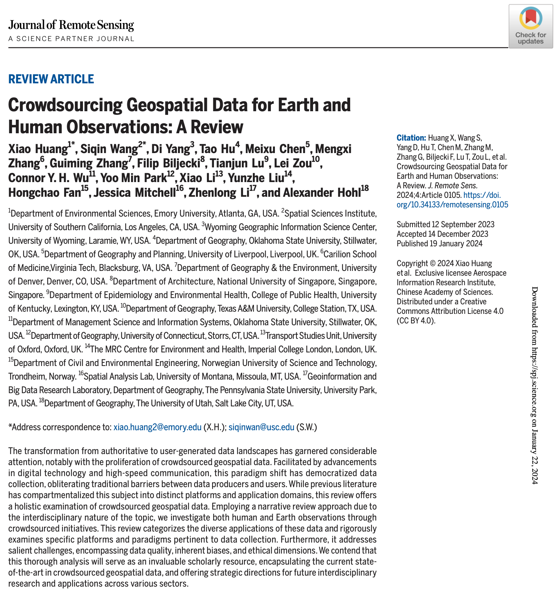

We are glad to share a new collaborative paper:

> Huang X, Wang S, Yang D, Hu T, Chen M, Zhang M, Zhang G, Biljecki F, Lu T, Zou L, Wu CHY, Park YM, Li X, Liu Y, Fan H, Mitchell J, Li Z, Hohl A (2024): Crowdsourcing Geospatial Data for Earth and Human Observations: A Review. _Journal of Remote Sensing_ 4: 0105. [<i class="ai ai-doi-square ai"></i> 10.1038/s41597-023-02749-0](https://doi.org/10.34133/remotesensing.0105) [<i class="far fa-file-pdf"></i> PDF](/publication/2024-jrs-crowdsourcing/2024-jrs-crowdsourcing.pdf)</i>  <i class="ai ai-open-access-square ai"></i>

The article covers a large range of data types and provenances, reveals challenges, and outlines future directions, together with a few other topics.

The review paper was led by [Xiao Huang](https://envs.emory.edu/people/bios/Huang-Xiao%20.html) from Emory University.

It was put together by authors from 18 university departments around the world (USA, UK, Singapore, and Norway): Xiao Huang (Emory University), Siqin Wang (University of Southern California), Di Yang (University of Wyoming), Tao Hu (Oklahoma State University), Meixu Chen (University of Liverpool), Mengxi Zhang (Virginia Tech), Guiming Zhang (University of Denver), Filip Biljecki (National University of Singapore), Tianjun Lu (University of Kentucky), Lei Zou (Texas A&M University), Connor Y.H. Wu (Oklahoma State University), Yoo Min Park (University of Connecticut), Xiao Li (University of Oxford), Yunzhe Liu (Imperial College London), Hongchao Fan (Norwegian University of Science and Technology), Jessica Mitchell (University of Montana), Zhenlong Li (The Pennsylvania State University), and Alexander Hohl (The University of Utah).

### Abstract

> The transformation from authoritative to user-generated data landscapes has garnered considerable attention, notably with the proliferation of crowdsourced geospatial data. Facilitated by advancements in digital technology and high-speed communication, this paradigm shift has democratized data collection, obliterating traditional barriers between data producers and users. While previous literature has compartmentalized this subject into distinct platforms and application domains, this review offers a holistic examination of crowdsourced geospatial data. Employing a narrative review approach due to the interdisciplinary nature of the topic, we investigate both human and Earth observations through crowdsourced initiatives. This review categorizes the diverse applications of these data and rigorously examines specific platforms and paradigms pertinent to data collection. Furthermore, it addresses salient challenges, encompassing data quality, inherent biases, and ethical dimensions. We contend that this thorough analysis will serve as an invaluable scholarly resource, encapsulating the current state-of-the-art in crowdsourced geospatial data, and offering strategic directions for future interdisciplinary research and applications across various sectors.

### Paper 

For more information, please see the [paper](/publication/2024-jrs-crowdsourcing/) (open access <i class="ai ai-open-access-square ai"></i>).

[](/publication/2024-jrs-crowdsourcing/)

BibTeX citation:
```bibtex
@article{2024_jrs_crowdsourcing,
  author = {Huang, Xiao and Wang, Siqin and Yang, Di and Hu, Tao and Chen, Meixu and Zhang, Mengxi and Zhang, Guiming and Biljecki, Filip and Lu, Tianjun and Zou, Lei and Wu, Connor Y. H. and Park, Yoo Min and Li, Xiao and Liu, Yunzhe and Fan, Hongchao and Mitchell, Jessica and Li, Zhenlong and Hohl, Alexander},
  doi = {10.34133/remotesensing.0105},
  journal = {Journal of Remote Sensing},
  title = {Crowdsourcing Geospatial Data for Earth and Human Observations: A Review},
  volume = {4},
  number = {0105}, 
  year = {2024}
}
```
