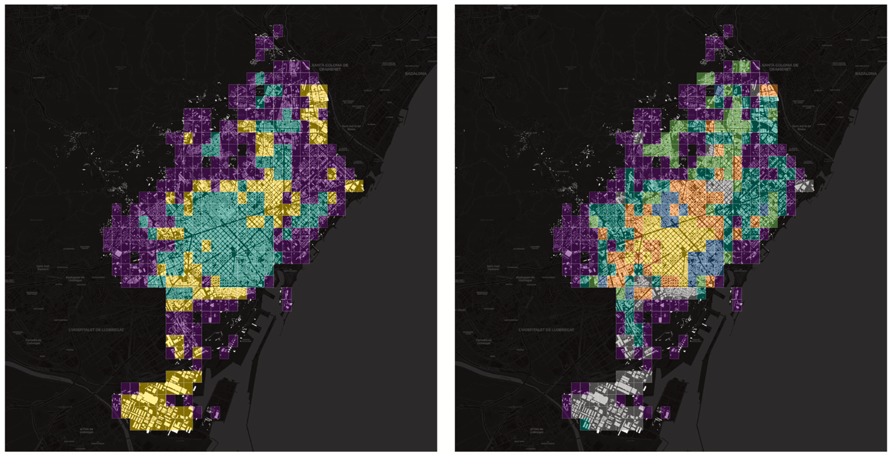
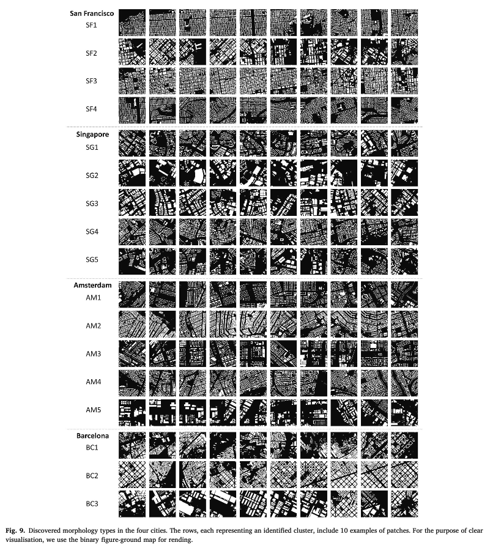
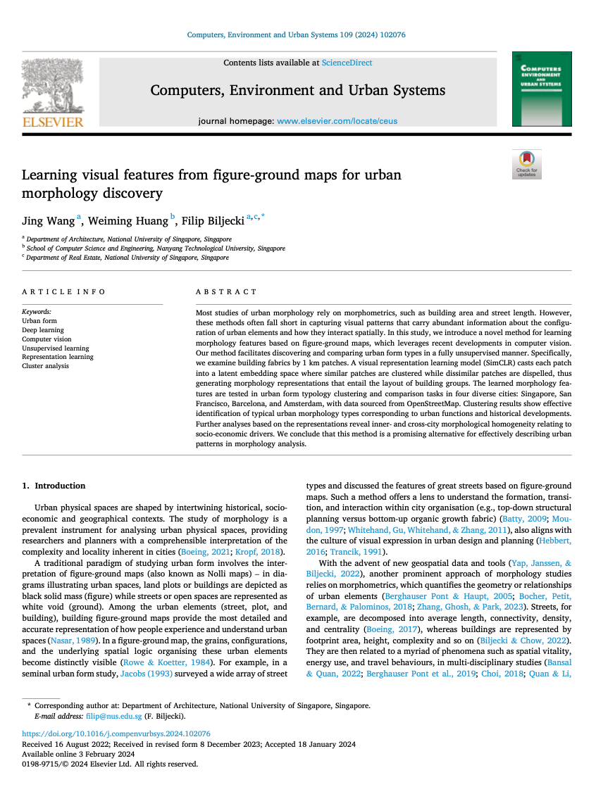

We are glad to share our new paper:

> Wang J, Huang W, Biljecki F (2024): Learning visual features from figure-ground maps for urban morphology discovery. Computers, Environment and Urban Systems, 109: 102076. [<i class="ai ai-doi-square ai"></i> 10.1016/j.compenvurbsys.2024.102076](https://doi.org/10.1016/j.compenvurbsys.2024.102076) [<i class="far fa-file-pdf"></i> PDF](/publication/2024-ceus-urban-form-discovery/2024-ceus-urban-form-discovery.pdf)</i>

This research was led by {}, our Master of Urban Planning graduate.
Congratulations on this important journal publication! :raised_hands: :clap:



The paper is [available freely](https://authors.elsevier.com/a/1iXjH_4XYgisg5) until 2024-03-24.

### Highlights

+ Simulating visual interpretation of urban figure-ground maps with machine eyes
+ Building on visual representation learning while integrating morphological indicators
+ A fully unsupervised approach for learning morphological features, encompassing the spatial layout
+ Inventories of typical urban patterns in four cities globally
+ Inner- and cross-city comparison of morphological homogeneity

### Abstract

The abstract follows.

> Most studies of urban morphology rely on morphometrics, such as building area and street length. However, these methods often fall short in capturing visual patterns that carry abundant information about the configuration of urban elements and how they interact spatially. In this study, we introduce a novel method for learning morphology features based on figure-ground maps, which leverages recent developments in computer vision. Our method facilitates discovering and comparing urban form types in a fully unsupervised manner. Specifically, we examine building fabrics by 1 km patches. A visual representation learning model (SimCLR) casts each patch into a latent embedding space where similar patches are clustered while dissimilar patches are dispelled, thus generating morphology representations that entail the layout of building groups. The learned morphology features are tested in urban form typology clustering and comparison tasks in four diverse cities: Singapore, San Francisco, Barcelona, and Amsterdam, with data sourced from OpenStreetMap. Clustering results show effective identification of typical urban morphology types corresponding to urban functions and historical developments. Further analyses based on the representations reveal inner- and cross-city morphological homogeneity relating to socio-economic drivers. We conclude that this method is a promising alternative for effectively describing urban patterns in morphology analysis.



### Paper 

For more information, please see the [paper](/publication/2024-ceus-urban-form-discovery/).

[](/publication/2024-ceus-urban-form-discovery/)

BibTeX citation:
```bibtex
@article{2024_ceus_urban_form_discovery,
  author = {Wang, Jing and Huang, Weiming and Biljecki, Filip},
  doi = {10.1016/j.compenvurbsys.2024.102076},
  journal = {Computers, Environment and Urban Systems},
  pages = {102076},
  title = {Learning visual features from figure-ground maps for urban morphology discovery},
  volume = {109},
  year = {2024}
}
```
