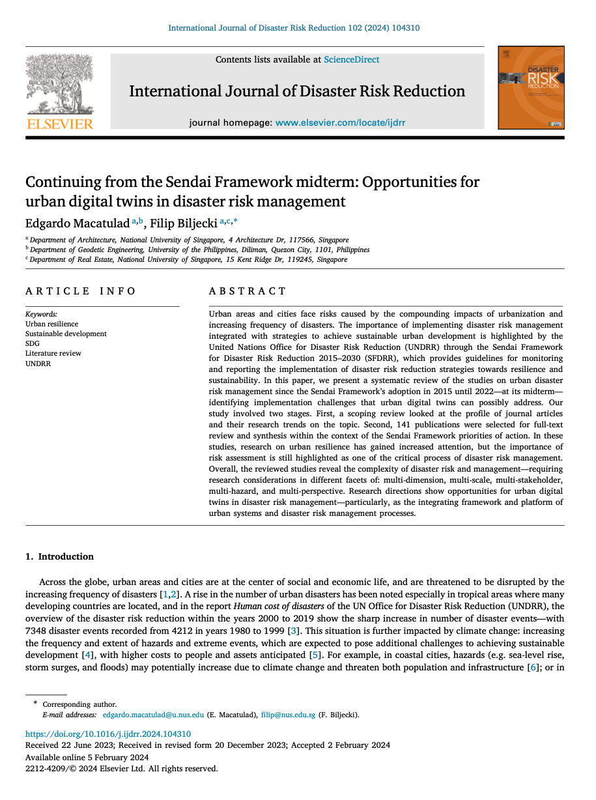

We are glad to share our new paper:

> Macatulad E, Biljecki F (2024): Continuing from the Sendai Framework midterm: Opportunities for urban digital twins in disaster risk management. International Journal of Disaster Risk Reduction, 102: 104310. [<i class="ai ai-doi-square ai"></i> 10.1016/j.ijdrr.2024.104310](https://doi.org/10.1016/j.ijdrr.2024.104310) [<i class="far fa-file-pdf"></i> PDF](/publication/2024-ijdrr-sendai/2024-ijdrr-sendai.pdf)</i>

This research was led by {}.
Congratulations on this journal publication that is part of his PhD research! :raised_hands: :clap:

The paper is [available freely](https://authors.elsevier.com/a/1iYqH7t2zZHCdK) until 2024-03-27.

### Highlights

+ A review of urban disaster risk management research in the Sendai Framework context.
+ Revealing challenges due to multi-faceted characteristic of disaster risk management.
+ Identifying research directions in urban digital twins for disaster risk management.

### Abstract

The abstract follows.

> Urban areas and cities face risks caused by the compounding impacts of urbanization and increasing frequency of disasters. The importance of implementing disaster risk management integrated with strategies to achieve sustainable urban development is highlighted by the United Nations Office for Disaster Risk Reduction (UNDRR) through the Sendai Framework for Disaster Risk Reduction 2015–2030 (SFDRR), which provides guidelines for monitoring and reporting the implementation of disaster risk reduction strategies towards resilience and sustainability. In this paper, we present a systematic review of the studies on urban disaster risk management since the Sendai Framework’s adoption in 2015 until 2022—at its midterm—identifying implementation challenges that urban digital twins can possibly address. Our study involved two stages. First, a scoping review looked at the profile of journal articles and their research trends on the topic. Second, 141 publications were selected for full-text review and synthesis within the context of the Sendai Framework priorities of action. In these studies, research on urban resilience has gained increased attention, but the importance of risk assessment is still highlighted as one of the critical process of disaster risk management. Overall, the reviewed studies reveal the complexity of disaster risk and management—requiring research considerations in different facets of: multi-dimension, multi-scale, multi-stakeholder, multi-hazard, and multi-perspective. Research directions show opportunities for urban digital twins in disaster risk management—particularly, as the integrating framework and platform of urban systems and disaster risk management processes.

### Paper 

For more information, please see the [paper](/publication/2024-ijdrr-sendai/).

[](/publication/2024-ijdrr-sendai/)

BibTeX citation:
```bibtex
@article{2024_ijdrr_sendai,
  author = {Macatulad, Edgardo and Biljecki, Filip},
  doi = {10.1016/j.ijdrr.2024.104310},
  journal = {International Journal of Disaster Risk Reduction},
  pages = {104310},
  title = {Continuing from the Sendai Framework midterm: Opportunities for urban digital twins in disaster risk management},
  volume = {102},
  year = {2024}
}
```
