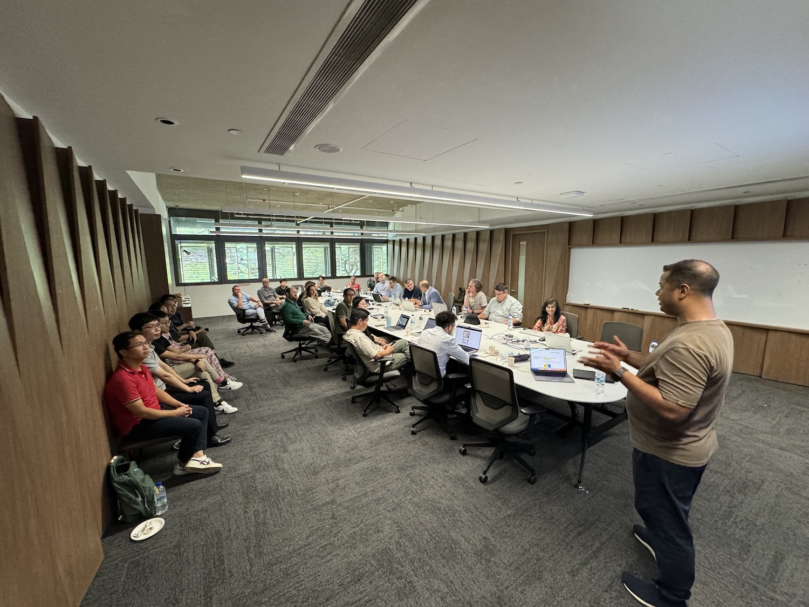
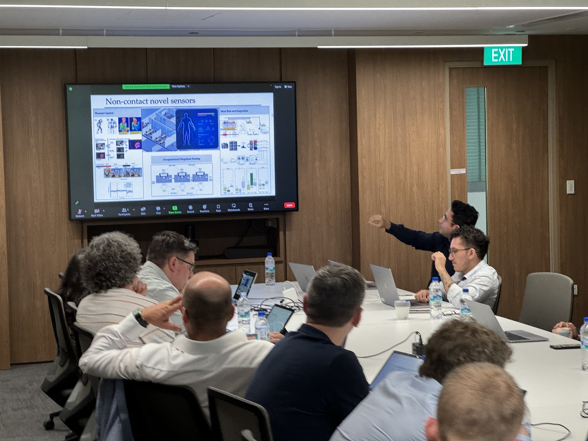
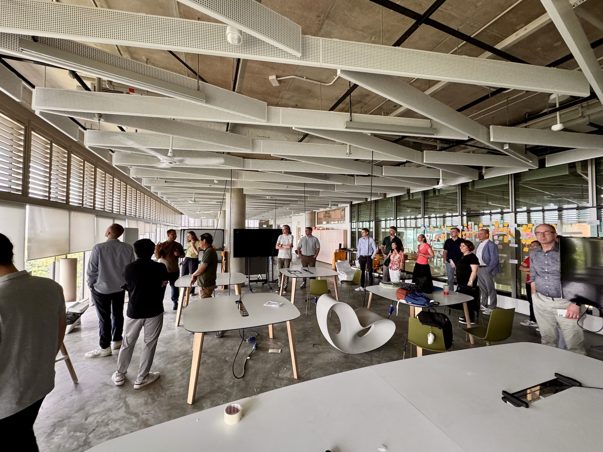
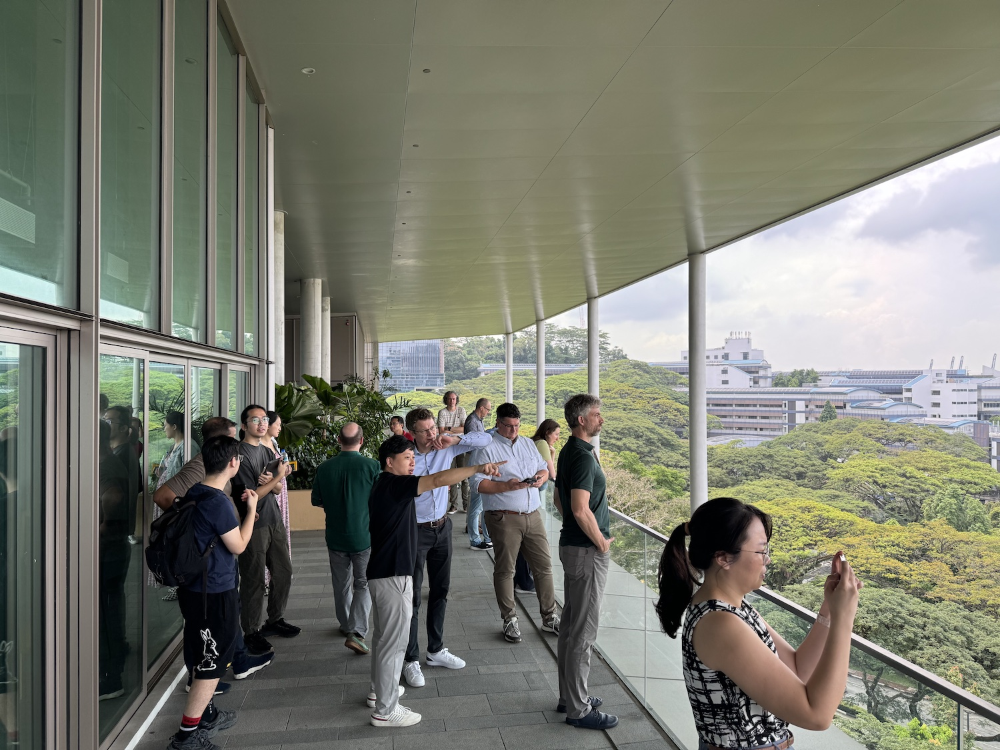

Our Lab hosted government officials of five European cities (Hamburg, Helsinki, Prague, Rotterdam & Vienna) for a visit to our research group to learn more about our efforts in advancing urban digital twins.
A big thank you to the Singapore Land Authority (SLA) who kindly facilitated the visit, as part of the 5 Cities Connect Plus (5CC+) Meeting in Singapore that is hosted by SLA.

5CC+ is a community of local governments of the cities of Helsinki, Hamburg, Prague, Vienna and Rotterdam, and Singapore. 🇩🇪🇫🇮🇨🇿🇳🇱🇦🇹🇸🇬

It also includes companies such as virtualcitySYSTEMS & Future Insight Group.
Its aim is to share knowledge and jointly address challenges related to the implementation of Digital Urban Twins.

The guests have also toured our SDE4, the first newly built net-zero energy building in the country, in which our NUS Urban Analytics Lab is at.
Our sister labs and others contributed to the sharing session as well, presenting ongoing cohesive multi-scale & multidisciplinary efforts on digital twin research at our National University of Singapore. We thank our European guests for visiting us and wish them an enjoyable stay in Singapore and at SLA! 

Many thanks to the contributions by NUS Building Robotics Lab, BEAM initiative, BUDS Lab, Singapore-ETH Centre; and Marcel Ignatius, Matias Quintana, Binyu Lei, Ali Ghahramani, Clayton Miller, and Alakesh Dutta.
NUS Department of Architecture

Looking forward to future collaborations!

